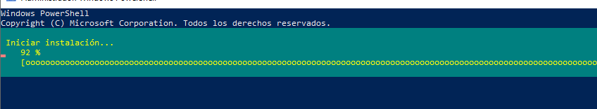
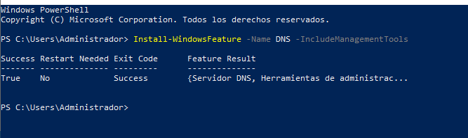
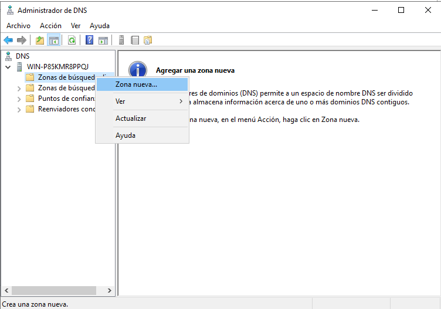
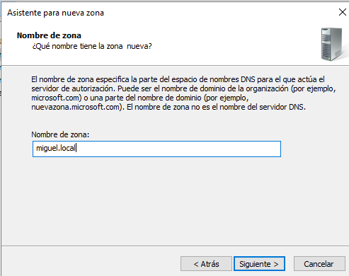
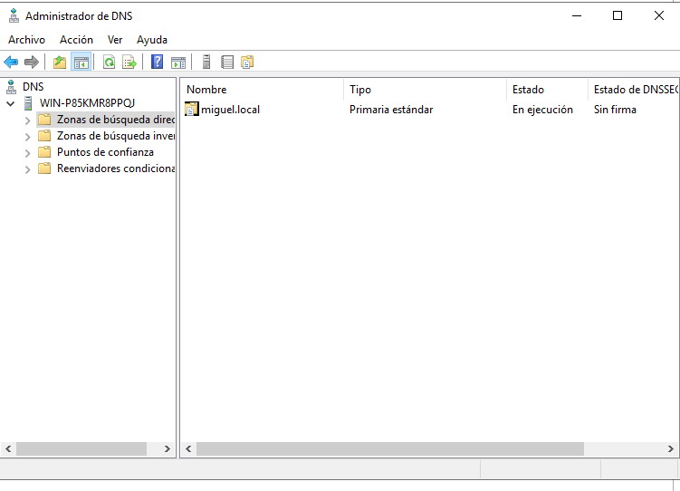
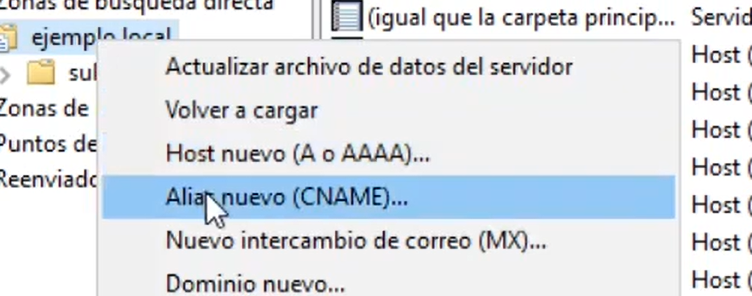
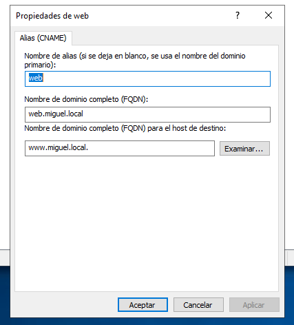
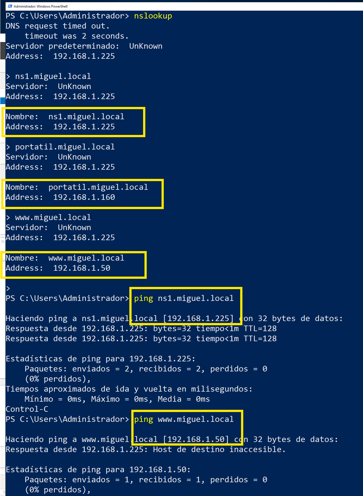

# 🧪 **Práctica 4 — Instalación y puesta en marcha del servicio DNS en Windows Server 2019 — Creación de zona directa y resolución de nombres**

**Módulo:** Servicios en Red
**Unidad de Trabajo:** UT03 – DNS
**Sesión:** 4

[Escenario de trabajo](#escenario-de-trabajo)

[1. Configuración de red en VirtualBox (red interna)](#1-configuración-de-red-en-virtualbox-red-interna)

[2. Configuración de IP estática en Windows Server](#2-configuración-de-ip-estática-en-windows-server)

[3. Instalación del rol DNS](#3-instalación-del-rol-dns)

[4. Comprobación del estado del servicio DNS](#4-comprobación-del-estado-del-servicio-dns)

[5. Primer acceso al Administrador DNS](#5-primer-acceso-al-administrador-dns)

[6. Creación de la zona directa](#6-creación-de-la-zona-directa)

[7. Observación del registro SOA y NS](#7-observación-del-registro-soa-y-ns)

[8. Creación de registros A (hosts)](#8-creación-de-registros-a-hosts)

[9. Creación de un alias (CNAME)](#9-creación-de-un-alias-cname)

[10. Comprobación de la resolución desde un cliente](#5-comprobación-de-la-resolución-desde-un-cliente)

[Qué se evalúa en esta práctica](#qué-se-evalúa-en-esta-práctica)

[Idea clave que debe quedar clara](#idea-clave-que-debe-quedar-clara)

[Capturas que debes conservar de esta práctica](#capturas-que-debes-conservar-de-esta-práctica)

[Qué **no** se hace en esta práctica](#qué-no-se-hace-en-esta-práctica)

---

## Objetivo de la práctica

Instalar el servicio DNS en **Windows Server 2019**, configurar correctamente la **red interna y la IP estática**, y comprobar que el **servicio DNS está operativo**, dejando el servidor preparado para la creación de zonas y registros en las siguientes sesiones.

Crear una **zona de búsqueda directa** en el servidor DNS y añadir **registros básicos coherentes**, comprobando desde un cliente que los nombres definidos se resuelven correctamente.

El objetivo no es “llenar el DNS”, sino **entender que DNS funciona a base de datos bien estructurados**.
---

## Escenario de trabajo

* Una máquina virtual con **Windows Server 2019**.
* VirtualBox.
* Red configurada en **modo Red Interna**.
* No se requiere conexión a Internet.
* Al menos un equipo cliente en la misma red interna.

---

## Tareas a realizar

---

## 1. Configuración de red en VirtualBox (red interna)

Configura la tarjeta de red de la máquina virtual en **modo Red Interna**:

* VirtualBox → Configuración → Red → Adaptador 1 → **Red Interna**

📌 A partir de este momento, **no se cambiará el tipo de red** durante la práctica.

---

## 2. Configuración de IP estática en Windows Server

Configura una dirección IP fija en el servidor, acorde a la red interna que se utilizará durante toda la UT.

Ejemplo de configuración:

* Dirección IP: `192.168.2.1`
* Máscara: `255.255.255.0`
* Puerta de enlace: *(no necesaria en red interna)*
* DNS preferido: `192.168.2.1`

📸 **Captura 1:: 1-ip.png**

* Propiedades de IPv4 mostrando la IP estática configurada.

---

## 3. Instalación del rol DNS

Instala el servicio DNS utilizando **PowerShell**:

```powershell
Install-WindowsFeature -Name DNS -IncludeManagementTools
```


Comprueba que la instalación finaliza correctamente.




---

## 4. Comprobación del estado del servicio DNS

Comprueba que el servicio DNS está instalado y en ejecución:

```powershell
Get-Service -Name DNS
```

El servicio debe aparecer en estado **Running**.

📸 **Captura 2:: 2-instalado.png**

* Salida del comando `Get-Service -Name DNS` mostrando el servicio DNS en ejecución. Se debe ver el nombre de tu máquina virtual.

---

## 5. Primer acceso al Administrador DNS

Abre la consola **Administrador de DNS**:

* Herramientas administrativas → DNS

Observa:

* El nombre del servidor.
* La estructura inicial del servicio.
* Las carpetas de:

  * Zonas de búsqueda directa
  * Zonas de búsqueda inversa

📌 En este punto **no debe existir ninguna zona creada**.


📸 **Captura 3: 3-dns.png**

* Vista del Administrador DNS sin zonas configuradas.


## 6. Creación de la zona directa

En el **Administrador DNS** del servidor:

1. Accede a **Zonas de búsqueda directa**.
2. Crea una nueva zona con las siguientes características:
   * Tipo de zona: **Zona principal**
   * Nombre de la zona:

     ```
     tunombre.local
     ```

> *Crear un archivo nuevo con este nombre...*
>    *No permitir actualizaciones dinámicas.*
Finaliza el asistente y comprueba que la zona aparece creada.







📸 **Captura 4: 4-zona.png**

* Vista de la zona recién creada

---

## 7. Observación del registro SOA y NS

Dentro de la zona `ejemplo.local`, observa los registros creados automáticamente:

* Registro **SOA**
* Registro(s) **NS**

Responde brevemente:

* ¿Por qué estos registros existen aunque no los hayas creado manualmente?
* ¿Qué información general aporta cada uno?

📌 No es necesario modificar estos registros en esta práctica.

📌 En esta práctica **no es necesario modificar manualmente** los registros SOA y NS.

El objetivo en este punto es **identificar su existencia y comprender su función**:
- El registro **SOA** identifica al servidor DNS como autoridad de la zona.
- El registro **NS** indica qué servidor o servidores responden por dicha zona.

En prácticas posteriores se trabajará con mayor detalle su configuración y
su relación con la resolución inversa y la distribución del servicio DNS.

---

## 8. Creación de registros A (hosts)

Añade los siguientes registros **A** dentro de la zona:


| Nombre | Dirección IP                      |
| ------ | --------------------------------- |
| `ns1`  | IP del servidor DNS               |
| `pc1`  | IP de un equipo cliente           |
| `www`  | IP de un equipo (real o ficticio) |

📌 **Importante**

* El registro `ns1` debe apuntar a la IP real del servidor DNS.
* Los demás registros deben ser coherentes con la red interna.
* Dejar *Crear registro del puerto PTR asociado **desactivado**.


---

## 9. Creación de un alias (CNAME)

Crea un registro **CNAME** con las siguientes características:

* Alias:

  ```
  web
  ```
* Nombre canónico:

  ```
  www.ejemplo.local
  ```





*(Creación de registro CNAME)*

📸 **Captura 5: 5-registros.png**

* Vista de la zona recién creada
---

## 5. Comprobación de la resolución desde un cliente

Desde un equipo cliente de la red interna, comprueba la resolución de los siguientes nombres:

* `ns1.ejemplo.local`
* `pc1.ejemplo.local`
* `web.ejemplo.local`

Utiliza herramientas de consulta vistas en sesiones anteriores (`ping`, `nslookup`).



📸 **Captura 6: 6-ping.png**

* Resultado de nslookup consultando todos los registros A creados y ping a todos los nombres.

📌 No es necesario que todos los nombres respondan a `ping`; lo importante es la **resolución DNS**.

---

## Qué se evalúa en esta práctica

* Creación correcta de una zona directa.
* Comprensión de los registros SOA y NS.
* Coherencia en los registros A creados.
* Uso correcto de un alias CNAME.
* Capacidad para comprobar la resolución desde cliente.

---

## Idea clave que debe quedar clara

> *Configurar DNS no es “activar un servicio”,
> es definir correctamente los datos que describen una red.*

---

## Capturas que debes conservar de esta práctica

* 📸 Captura 1 → IP estática configurada
* 📸 Captura 2 → Servicio DNS en ejecución
* 📸 Captura 3 → Administrador DNS (estado inicial)
* 📸 Captura 4 → Vista de la nueva zona
* 📸 Captura 5 → Listado de registros creados
* 📸 Captura 6 → Nslookup y ping a todos los registros

---

## Qué **no** se hace en esta práctica

❌ No se configuran reenviadores
❌ No se configuran servidores secundarios


