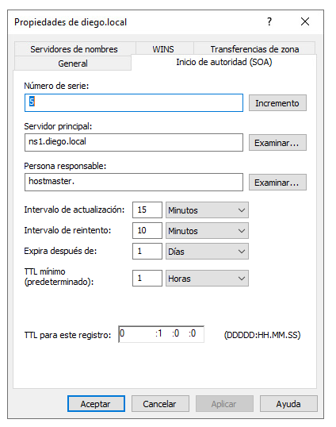
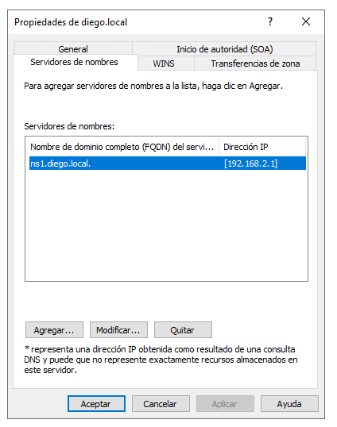
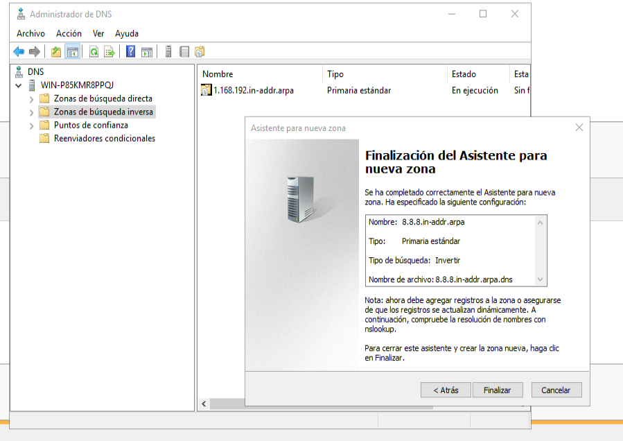
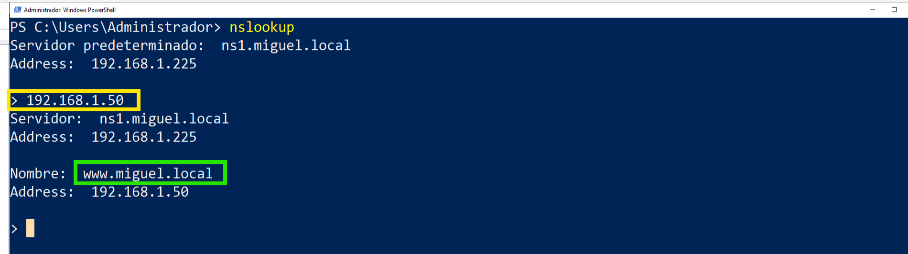
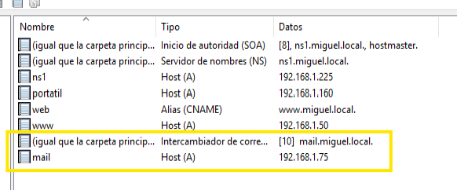
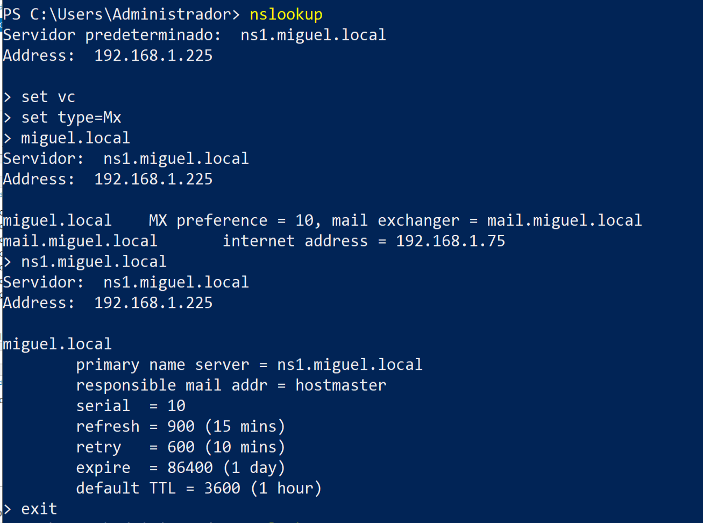

- [🧪 **Práctica 5 — Resolución inversa y registros de servicio (MX)**](#-práctica-5--resolución-inversa-y-registros-de-servicio-mx)
  - [0. Configurar los nombres adecuados del DNS](#0-configurar-los-nombres-adecuados-del-dns)
  - [](#)
  - [1. Creación de la zona de búsqueda inversa](#1-creación-de-la-zona-de-búsqueda-inversa)
  - [2. Asociación directa ↔ inversa (creación de registros PTR)](#2-asociación-directa--inversa-creación-de-registros-ptr)
  - [3. Pruebas de resolución inversa](#3-pruebas-de-resolución-inversa)
    - [Cómo consultar una IP y obtener su nombre](#cómo-consultar-una-ip-y-obtener-su-nombre)
  - [4. Creación de registros MX (introducción al correo)](#4-creación-de-registros-mx-introducción-al-correo)
  - [5. Comprobación del registro MX](#5-comprobación-del-registro-mx)
  - [Instrucciones de entrega](#instrucciones-de-entrega)
  - [Capturas que debes conservar de esta práctica](#capturas-que-debes-conservar-de-esta-práctica)

# 🧪 **Práctica 5 — Resolución inversa y registros de servicio (MX)**

**Módulo:** Servicios en Red
**Unidad de Trabajo:** UT03 – DNS
**Sesión:** 6

---

* Objetivo de la práctica

Crear una **zona de búsqueda inversa**, asociar correctamente registros **A ↔ PTR**, comprobar la **resolución inversa** y crear **registros MX básicos**, comprendiendo que el DNS es un servicio del que dependen otros servicios de red, como el correo electrónico.

---

* Escenario de trabajo

* Servidor DNS con **Windows Server 2019**, con la zona directa `ejemplo.local` creada en la práctica anterior.
* Red configurada en **red interna**.
* Al menos un equipo cliente en la misma red.

---

* Tareas a realizar

## 0. Configurar los nombres adecuados del DNS

Para que el DNS se reconozca a sí mismo.

En el registro SOA y el NS, cambiar el nombre de host por el que tenga en el registro A, probablemnte ns1.ejemplo.local
En SOA,cambiamos el campo "Servidor principal". Se puede examinar para no fallar:



En servidores de nombres, escribimos el nombre y click en resolver. (El DNS lo resuelve porque tengo un registro A asociado y configurada la red para que se use a sí mismo como DNS)

---

## 1. Creación de la zona de búsqueda inversa

En el **Administrador DNS** del servidor:

1. Accede a **Zonas de búsqueda inversa**.
2. Clic derecho → **Nueva zona…**
3. Tipo de zona: **Zona principal**
4. Tipo de IP: **IPv4**
5. Identificador de red:
   * Introduce los octetos correspondientes a la red utilizada
     (por ejemplo, `172.16.20` si trabajas con una red /24).
6. No admitir actualizaciones dinámicas.
7. Finaliza el asistente.

Comprueba que la zona inversa aparece creada correctamente.



---

## 2. Asociación directa ↔ inversa (creación de registros PTR)

Para los registros **A** creados en la práctica anterior (`ns1`, `pc1`, `www`):

**Cómo crear un registro PTR**

1. En el **Administrador DNS**, entra en **Zonas de búsqueda inversa**.
2. Abre la zona inversa creada.
3. Clic derecho → **Nuevo registro de puntero (PTR)**.
4. Introduce:

   * El **último octeto** de la dirección IP.
   * El **nombre completo (FQDN)** del equipo, por ejemplo:

     ```
     ns1.ejemplo.local
     ```
5. Acepta y verifica que el registro aparece en la zona.

Repite el proceso para cada registro A.

📌 El objetivo es que **cada IP tenga su nombre asociado**.

---

## 3. Pruebas de resolución inversa

### Cómo consultar una IP y obtener su nombre

Desde el servidor o desde un cliente, ejecuta:

```powershell
nslookup 172.16.0.4
```

(Sustituye la IP por la correspondiente a cada equipo).



Qué observar

* Si existe un registro PTR, se devuelve el **nombre completo**.
* Si no existe, la IP **no se resuelve a nombre**.

Responde brevemente:

* ¿Qué información aporta la resolución inversa?
* ¿Por qué algunos servicios la utilizan y otros no?

---

## 4. Creación de registros MX (introducción al correo)

**¿Para qué se crea un registro MX?**

Un registro **MX** indica **qué servidor recibe el correo** de un dominio.
Cuando se envía un correo a `usuario@ejemplo.local`, el sistema consulta el DNS para saber **a qué servidor debe entregarlo**.

Sin registro MX:

* El dominio **no puede recibir correo correctamente**.

---

**Cómo crear un registro MX**

1. En el **Administrador DNS**, entra en la zona directa `ejemplo.local`.
2. Clic derecho → **Nuevo registro de intercambio de correo (MX)**.
3. Introduce:

   * Nombre del dominio: *(en blanco o `@`)*
   * Servidor de correo:

     ```
     mail.ejemplo.local
     ```
   * Prioridad: `10`
4. Acepta.

A continuación, crea el registro **A** correspondiente:

* `mail` → IP del servidor de correo (real o ficticia).



---

## 5. Comprobación del registro MX

**Cómo comprobar un registro MX**

Desde el servidor o un cliente, ejecuta:

```powershell
nslookup

> set vc
> set type=MX
> miguel.local

```

**Qué observar**

* Aparece el servidor de correo configurado.
* Se muestra la prioridad del registro MX.



---

## Instrucciones de entrega

* **Práctica obligatoria**.
* **No se entrega de forma independiente**.
* Se entregará **junto con el resto de prácticas de la UT** en una **memoria final**.
* Desde esta práctica debes:

  * Guardar las capturas indicadas.
  * Responder por escrito a las preguntas planteadas.
  * Mantener coherencia con las prácticas anteriores.

## Capturas que debes conservar de esta práctica

* 📸 Captura 1 → Zona inversa creada y con sus registros PTR
* 📸 Captura 2 → Demostración con nslookup del funcionamiento adecuado de los registros inversos
* 📸 Captura 3 → Resgistro MX creado y comprobación de su configuración con nslookup

---

**Qué se evalúa en esta práctica**

* Creación correcta de la zona inversa.
* Asociación coherente entre registros A y PTR.
* Comprobación de la resolución inversa.
* Comprensión del papel del registro MX.
* Relación entre DNS y otros servicios de red.

---

**Idea clave que debe quedar clara**

> *DNS no solo traduce nombres a direcciones IP:
> es un servicio base sobre el que funcionan otros servicios de red.*
