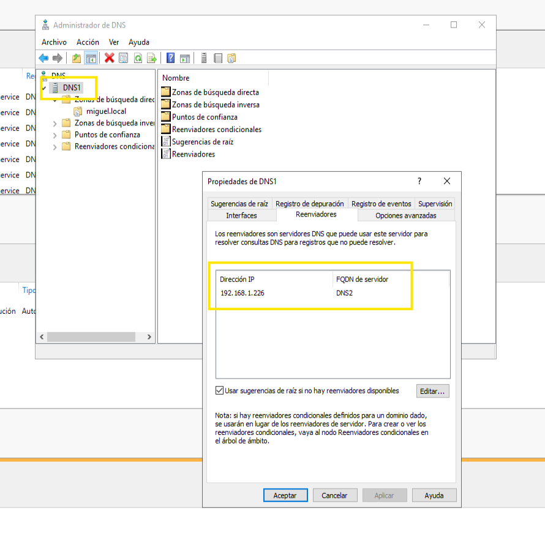

# 🧪 **Práctica 6 — Resolución entre servidores DNS (reenviador interno)**

**Módulo:** Servicios en Red
**Unidad de Trabajo:** UT03 – DNS
**Sesión:** 6

---

**Objetivo de la práctica**

Comprender cómo un servidor DNS puede **resolver nombres que no conoce** reenviando consultas a **otro servidor DNS de la red**, diferenciando claramente entre:

* resolución autoritativa,
* resolución por reenvío,
* y consulta directa a distintos servidores.

---

**Idea clave de la práctica**

> *Un DNS no tiene por qué saberlo todo:
> puede preguntar a otro DNS de la red.*

---

## Escenario de trabajo

* **DNS1** (Windows Server 2019)
  * Zona directa: `alumno.local`
  
* **DNS2** Windows Server 2019, **clonado** y configurado con:
  * nueva Ip, dentro del rango
  * nueva zona directa, SOA, NS, registros A
  * nueva zona inversa, con todos los PTR
  * Zona directa: `externo.local`

<details>
<summary>🔧 Cambio de nombre del servidor (Windows Server 2019). Realiza estos pasos en cada servidor DNS antes de continuar con la práctica.</summary>

#### Opción 1 — Método gráfico

1. Abre **Administrador del servidor**.
2. Accede a **Servidor local**.
3. Haz clic sobre el **Nombre del equipo**.
4. En la ventana **Propiedades del sistema**, pulsa **Cambiar…**.
5. Introduce el nuevo nombre:

   * `DNS1` para el primer servidor.
   * `DNS2` para el segundo servidor.
6. Acepta los cambios.
7. **Reinicia el servidor** para que el cambio tenga efecto.

---

#### Opción 2 — PowerShell

Abre **PowerShell como administrador** y ejecuta:

```powershell
Rename-Computer -NewName DNS1 -Restart
```

En el segundo servidor:

```powershell
Rename-Computer -NewName DNS2 -Restart
```

> El parámetro `-Restart` reinicia automáticamente el sistema para aplicar el cambio de nombre.
</details>

---

  
* Ambos servidores:

  * En la **misma red interna**.
  * Con IP fija.

* El **cliente**: (puedes utilizar el DNS1 original como cliente)

  * Configurado para usar **solo DNS1** como servidor DNS.

⚠️ **No hay conexión a Internet**.
⚠️ No se usarán DNS externos.

---

## Tareas a realizar

## 1. Situación inicial: cada DNS conoce solo su zona

Antes de configurar reenviadores, comprueba desde el **cliente**:

### Consultas que deben funcionar

```cmd
nslookup pc1.alumno.local
```

(DNS1 responde de forma autoritativa).

### Consultas que NO deben funcionar

```cmd
nslookup pc1.externo.local
```

(DNS1 no conoce la zona `externo.local`).

📌 Esto confirma que:

* DNS1 **solo resuelve su propia zona**.
* No hay reenvío configurado todavía.

---

## 2. Configuración del reenviador en DNS1

En el **Administrador DNS** de **DNS1**:

1. Clic derecho sobre el servidor → **Propiedades**.
2. Pestaña **Reenviadores**.
3. Añade como reenviador la **IP de DNS2**.
4. Acepta los cambios.

📌 DNS1 reenviará a DNS2 las consultas que no pueda resolver.



---

## 3. Comprobación de resolución reenviada

Desde el **cliente**, vuelve a ejecutar:

```cmd
nslookup pc1.externo.local
```

Ahora comprueba que:

* DNS1 **sí devuelve respuesta**.
* DNS1 ha reenviado la consulta a DNS2.

📌 El cliente **no conoce DNS2**, solo DNS1.

---

## 4. Consultas dirigidas con `nslookup`

Para observar claramente quién responde, utiliza consultas dirigidas.

### Consulta directa a DNS1

```cmd
nslookup pc1.alumno.local <IP_DNS1>
```

✔️ Respuesta correcta.

```cmd
nslookup pc1.externo.local <IP_DNS1>
```

✔️ Respuesta por **reenvío**.

---

### Consulta directa a DNS2

```cmd
nslookup pc1.externo.local <IP_DNS2>
```

✔️ Respuesta autoritativa.

```cmd
nslookup pc1.alumno.local <IP_DNS2>
```

❌ No responde (no conoce esa zona).

📌 Aquí se ve claramente:

* qué DNS es autoritativo de cada zona,
* y cuál depende del reenvío.

---

## 5. Reflexión guiada

Responde brevemente:

* ¿Por qué el cliente nunca necesita conocer DNS2?
* ¿Qué ventaja tiene este modelo frente a configurar varios DNS en el cliente?
* ¿En qué se diferencia este escenario de una transferencia de zona?

---

## Instrucciones de entrega

* **Práctica obligatoria**.
* Forma parte de la **memoria final de la UT**.
* Guarda las capturas indicadas y responde a las preguntas.
* No se entrega de forma independiente.

## Capturas que debes conservar de esta práctica

* 📸 Captura 1 → Configuración DNS2: zonas y contenido de la zona directa
* 📸 Captura 2 → Configuración en DNS1 de reenviador: DNS2
* 📸 Captura 3 → Demostración con nslookup: solicitud a DNS1 de un nombre que esté en DNS2
* 📸 Captura 4 → Demostración con nslookup: solicitud a DNS2 de un nombre que esté en DNS1 (no debe funcionar)
  
---

## Qué se evalúa en esta práctica

* Configuración correcta del reenviador interno.
* Comprensión de la diferencia entre:

  * resolución autoritativa,
  * resolución reenviada.
* Uso adecuado de `nslookup` para consultas dirigidas.
* Capacidad de razonar el flujo de resolución.

---

## Errores comunes que debes evitar

* Configurar DNS2 directamente en el cliente.
* Pensar que DNS1 “copió” la zona de DNS2.
* Confundir reenvío con servidor secundario.

---

## Idea final que debe quedar clara

> *El cliente solo conoce a su DNS.
> Los servidores DNS colaboran entre sí.*

---

Este guion deja la práctica **muy limpia**, totalmente **controlada**, y prepara de forma natural la **Práctica 8 (servidor secundario y transferencia de zona)**.
Cuando quieras, pasamos a esa última.
