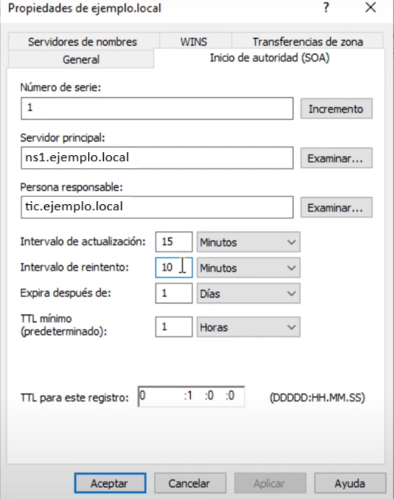

# Configuración de Servidores DNS en Windows Server 2019

Para configurar los tres servidores DNS en Windows Server 2019, debes seguir una serie de pasos detallados para establecer la zona principal, configurar el servidor secundario y delegar la zona del subdominio. A continuación, se presenta un paso a paso claro para cada servidor.

# `1` Configuración del Servidor DNS Primario (Dominio: ejemplo.local)

### 1. Deshabilitar la Recursión

- La recursión permite que el servidor DNS consulte otros servidores DNS si no conoce la respuesta. Para mejorar la seguridad y el rendimiento del servidor autoritativo, deshabilita la recursión.
- Abre la consola de Administración de DNS.
- Haz clic derecho sobre el servidor DNS y selecciona "Propiedades".
- Ve a la pestaña "Avanzado" y desmarca la opción "Habilitar recursión".
  

### 2. Creación de la Zona Directa

- Abre la consola de Administración de DNS.
- Haz clic derecho en "Zonas de búsqueda directa" y selecciona "Nueva zona...".
- Selecciona "Zona principal" y asigna el nombre del dominio: `ejemplo.local`.
- Configura los parámetros de la zona:
  - **Refresh:** 15 minutos.
  - **Retry:** 10 minutos.
  - **Expire:** 1 día.
  - **TTL Mínimo:** 1 hora.
- No admitir actualizaciones dinámicas.

### 3. Configuración de la Zona Inversa

- Crea una nueva zona de búsqueda inversa para la red `172.16.0.x`.
- Introduce solo los dos primeros octetos, ya que se trata de una clase B.
- Los registros inverdos PTR Se podrán añadir automáticamente al darlos de alta en el siguiente paso.

### 4. Configuración del Registro SOA

 

- El registro SOA (Start of Authority) indica la autoridad principal para la zona DNS y contiene información crucial, como el servidor principal, el correo electrónico del administrador y parámetros de control de la zona.
- Abre la consola de Administración de DNS.
- Haz clic derecho sobre la zona `ejemplo.local` y selecciona "Propiedades".
- En la pestaña "SOA", configura los siguientes parámetros:
  - **Servidor principal**: `ns1.ejemplo.local`.
  - **Correo electrónico**: `tic.ejemplo.local`.
  - **Refresh**: 15 minutos.
  - **Retry**: 10 minutos.
  - **Expire**: 1 día.
  - **TTL mínimo**: 1 hora.

### 5. Creación de Registros DNS

 

- Añade los siguientes registros A según la configuración:
  
  **EN PRIMER LUGAR, LOS QUE CORRESONDEN A LOS SERVIDORES DNS**
- 
  - `ns1.ejemplo.local` con IP `172.16.0.4` (servidor primario).
  - `ns2.ejemplo.local` con IP `172.16.0.5` (servidor secundario).
  
**Configura el registro `ns` creado en la zona con los datos de `ns1`.**
  

  > **NO AÑADAS EL DELEGADO SUBDOMINIO TODAVÍA, A PESAR DE QUE LO HACE EN EL VÍDEO**

  - Otros registros `A` como `mailserver1`, `mailserver2`, `www`, `ftp`, y `pc1` según la tabla proporcionada.
  

> Después de dar de alta los registros tipo `A` de los servidores de correo, debes configurar su regitro **MX**.

* A continuación define el alias con CNAME:

  - Después configura el **Servicio de Telnet:** registro nuevo -> registro de servicio -> \_telnet: puerto 23.

 

### Configura la transferencia de zona:
  - Alta de `ns2`: clic derecho -> propiedades -> Servidores de nombres -> Agregar.

  - Propiedades -> Transferencia de zona -> Solo servidores de nombres.

> Antes de pasar a configurar el servidor secundario, asegúrate de que los registros `ns` apuntan a ns1 y ns2, tanto en la zona directa como en la inversa.

# `2` Configuración del Servidor DNS Secundario (Dominio: ejemplo.local)

### 1. Creación de la Zona Secundaria

- Abre la consola de Administración de DNS en el servidor secundario.
- Haz clic derecho en "Zonas de búsqueda directa" y selecciona "Nueva zona...".
- Selecciona "Zona secundaria" y especifica "Búsqueda directa".
- Introduce el nombre del dominio: `ejemplo.local`.
- Como servidor maestro, especifica la IP del servidor primario (`172.16.0.4`).

### 2. Configuración de la Transferencia de Zona

- Asegúrate de que la transferencia de zona esté habilitada en el servidor primario.
- En el servidor primario, abre la configuración de la zona `ejemplo.local`, ve a la pestaña "Transferencias de zona" y selecciona "Permitir transferencias de zona" solo a los servidores que especifiques, agregando la IP `172.16.0.5`.

# `3` Configuración del Servidor Delegado para el Subdominio (Dominio: subdominio.ejemplo.local)

### 1. Creación de la Zona Principal del Subdominio

- Abre la consola de Administración de DNS.
- Crea una nueva zona directa con el nombre `subdominio.ejemplo.local`.
- Configura los parámetros de la zona:
  - **Refresh:** 15 minutos.
  - **Retry:** 10 minutos.
  - **Expire:** 1 día.
  - **TTL Mínimo:** 1 hora.

### 2. Configuración del Registro SOA

- Configura el registro SOA del subdominio de manera similar al del servidor principal.

### 3. Creación de la Zona Inversa

- Crea una zona de búsqueda inversa para el subdominio.

### 4. Creación de Registros DNS para el Subdominio

- Añade los registros A para:
  - `ns1.subdominio.ejemplo.local` con IP `172.16.0.50`.
  - `pc1.subdominio.ejemplo.local` con IP `172.16.0.51`.

## Configuración de Reenviadores

### 1. Configuración de Reenviadores (en el servidor delegado)

 

- Los reenviadores permiten que un servidor DNS envíe consultas a otros servidores DNS específicos cuando no puede resolver un nombre por sí mismo. Esto es útil para mejorar la eficiencia de la resolución y controlar el flujo de consultas DNS.
- Abre la consola de Administración de DNS.
- Haz clic derecho sobre el servidor DNS y selecciona "**Propiedades**".
- Ve a la pestaña "**Reenviadores**".
- Añade los reenviadores `ns1` y `ns2` con sus respectivas direcciones IP (`172.16.0.4` y `172.16.0.5`).
- Asegúrate de que los reenviadores estén configurados correctamente para garantizar una resolución rápida y eficiente de nombres que el servidor no pueda responder directamente.

### 2. Configuración de Reenviador Condicional (en los 3 servidores)

- Un reenviador condicional permite que el servidor DNS envíe consultas específicas a un servidor determinado según el dominio que se está resolviendo.
- En el explorador del DNS, en la carpeta Reenviadores condicionales, **Nuevo reenviador condicional**.

 

- Introduce el dominio `externo.com` y la dirección IP del reenviador condicional (`83.44.227.152`).
- De esta manera, cualquier consulta para `externo.com` se enviará al servidor especificado para resolver el nombre.

### 3. Delegación desde el Servidor Primario

- Crea un registro A para `delegadosubdominio` con la IP `172.16.0.50`.

- En el servidor primario (`ejemplo.local`), abre la configuración de la zona y crea una nueva delegación.

 

- Introduce el nombre del subdominio: `subdominio.ejemplo.local` y especifica la IP del servidor delegado (`172.16.0.50`).

## Configuración de Reenviador a Google y Reenviador Condicional para el Servidor Primario

### 1. Reenviador a Google

- Permite que el servidor DNS consulte a los servidores DNS públicos de Google (`8.8.8.8` y `8.8.4.4`) cuando no tiene la información de un dominio específico. Esto mejora la capacidad de resolución externa.
- Abre la consola de Administración de DNS.
- Haz clic derecho sobre el servidor DNS y selecciona "Propiedades".
- Ve a la pestaña "Reenviadores" y agrega las direcciones IP de Google (`8.8.8.8`, `8.8.4.4`).

### 2. Reenviador Condicional para el Servidor Primario

- Configura un reenviador condicional para un dominio específico (por ejemplo, `externo.com`) para redirigir consultas directamente a un servidor DNS particular.
- Abre la consola de Administración de DNS.
- Haz clic derecho sobre el servidor DNS y selecciona "Propiedades".
- Ve a la pestaña "Reenviadores" y selecciona "Nuevo...".
- Introduce el nombre del dominio (`externo.com`) y la dirección IP del servidor responsable (`83.44.227.152`).

## Verificación de la Configuración

### 1. Comprobación de la Resolución de Nombres

- Utiliza el comando `nslookup` en cada servidor para verificar que todos los nombres de dominio y subdominio se resuelven correctamente.

### 2. Comprobación de Delegación

- Desde un cliente o desde el propio servidor primario, realiza una consulta a un registro del subdominio para confirmar que la delegación está funcionando correctamente.

