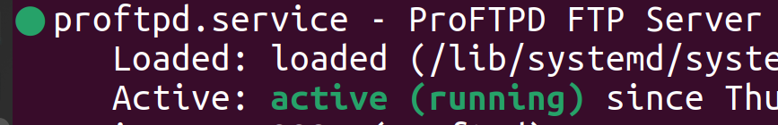

- [SR0400 INSTALACIÓN DE UN SERVICIO FTP EN LINUX](#sr0400-instalación-de-un-servicio-ftp-en-linux)
- [RECURSOS NECESARIOS](#recursos-necesarios)
- [Pasos](#pasos)
    - [1. Actualizar el sistema](#1-actualizar-el-sistema)
    - [2. Instalar ProFTPD](#2-instalar-proftpd)
    - [3. Comprobar el estado del servicio](#3-comprobar-el-estado-del-servicio)
    - [4. Probar la conexión local](#4-probar-la-conexión-local)
  - [💻 **Comandos FTP básicos (puede variar según la aplicación cliente)**](#-comandos-ftp-básicos-puede-variar-según-la-aplicación-cliente)
    - [5. Probar desde otra máquina en la red](#5-probar-desde-otra-máquina-en-la-red)
    - [6. Ver la carpeta raíz del usuario](#6-ver-la-carpeta-raíz-del-usuario)
- [✅ Comprobaciones finales Y ENTREGA: RECUERDA](#-comprobaciones-finales-y-entrega-recuerda)

## SR0400 INSTALACIÓN DE UN SERVICIO FTP EN LINUX

🧩 **Objetivo**

Instalar y comprobar el funcionamiento de un servidor **FTP básico** con **ProFTPD**.

---

## RECURSOS NECESARIOS
- Máquina virtual enlazada linux Ubuntu Descktop, Mint o server para el Servidor
- Máquina virtual enlazada linux Ubuntu Descktop, Mint o server para el cliente
- Red modo NAT para la instalación
- Red virtual interna

## Pasos

(con la red en modo NAT)

#### 1. Actualizar el sistema

```bash
sudo apt update
```

#### 2. Instalar ProFTPD

```bash
sudo apt install proftpd -y
```

Durante la instalación, ***si te pregunta***:

* **Tipo de instalación:** selecciona *independiente (standalone)*

---

#### 3. Comprobar el estado del servicio

```bash
sudo systemctl status proftpd
```

Debe aparecer como `active (running)` y un círculo verde:



Si no, puedes arrancarlo con:

```bash
sudo systemctl start proftpd
```

---

#### 4. Probar la conexión local

Desde la **misma máquina** (Ubuntu):

```bash
ftp localhost
```

Luego inicia sesión con un usuario del sistema:

```
Name: tu_usuario
Password: tu_contraseña
```

### 💻 **Comandos FTP básicos (puede variar según la aplicación cliente)**

| Comando            | Descripción                                                 |
| ------------------ | ----------------------------------------------------------- |
| `open <ip>`        | Conecta con el servidor FTP (por ejemplo, `open localhost`) |
| `user <nombre>`    | Inicia sesión con el usuario indicado                       |
| `ls` / `dir`       | Lista los archivos del directorio actual                    |
| `cd <carpeta>`     | Cambia de carpeta en el servidor                            |
| `get <archivo>`    | Descarga un archivo del servidor                            |
| `put <archivo>`    | Sube un archivo al servidor                                 |
| `delete <archivo>` | Elimina un archivo del servidor                             |
| `quit`             | Cierra la sesión y sale del cliente FTP                     |


---

(con la red en modo puente)

#### 5. Probar desde otra máquina en la red

* Averiguar la IP del servidor:

  ```bash
  ip a
  ```
* Desde otro cliente Linux o WIN:

  ```bash
  ftp <ip_del_servidor>
  ```

---

#### 6. Ver la carpeta raíz del usuario

Por defecto, cada usuario entra en su **directorio personal** (`/home/usuario`).
Puedes comprobarlo creando o subiendo un archivo de prueba:

```bash
touch ~/ftp_prueba.txt
```

y luego haciendo `ls` dentro del cliente FTP.

---


## ✅ Comprobaciones finales Y ENTREGA: RECUERDA

* ***En las capturas, siempre se debe ver el marco de la(s) máquina(s)***
* ***El nombre de la máquina virtual debe reflejar tu nombre, SO, servicio y cliente/servidor***

CAPTURAS EN EL PROPIO SERVIDOR:
* El servicio arranca sin errores: `sudo systemctl status proftpd`
  * Captura: 0400tunombrecompleto1.jpg
* Puedes iniciar sesión con un usuario del sistema: `ftp localhost` y acepta las credenciales.
  * Captura: 0400tunombrecompleto2.jpg
* Puedes listar archivos y salir correctamente.
  * Captura: 0400tunombrecompleto3.jpg

CAPTURAS EN LAS QUE TIENE QUE APARECER EL CLIENTE Y EL SERVIDOR
* Sube un archivo desde el servidor y bájalo desde el cliente.
  * Captura: 0400tunombrecompleto4.jpg
