- [**SR0401b Práctica: Configuración de FTP en WS19 con múltiples usuarios y conexiones**](#sr0401b-práctica-configuración-de-ftp-en-ws19-con-múltiples-usuarios-y-conexiones)
  - [**1. Instalación del Servidor FTP usando PowerShell**](#1-instalación-del-servidor-ftp-usando-powershell)
  - [**2. Crear Usuarios y Grupos Locales (modo gráfico)**](#2-crear-usuarios-y-grupos-locales-modo-gráfico)
  - [**3. Crear los Grupos Locales**](#3-crear-los-grupos-locales)
  - [**4. Crear el Sitio FTP a través de IIS**](#4-crear-el-sitio-ftp-a-través-de-iis)
  - [**5. Configurar Accesos al Servidor FTP**](#5-configurar-accesos-al-servidor-ftp)
  - [**6. Configurar Permisos de la Carpeta en el Sistema Operativo**](#6-configurar-permisos-de-la-carpeta-en-el-sistema-operativo)
  - [**7. Conectar al Servidor FTP desde el CMD del propio servidor**](#7-conectar-al-servidor-ftp-desde-el-cmd-del-propio-servidor)
  - [Qué debo entregar:](#qué-debo-entregar)

# **SR0401b Práctica: Configuración de FTP en WS19 con múltiples usuarios y conexiones**

**Objetivo:**
- Instalar y configurar un servidor FTP en Windows Server 2019, usando PowerShell para la instalación y la interfaz gráfica para la configuración.
- Los alumnos aprenderán a gestionar usuarios, permisos y conexiones de red para garantizar un acceso controlado.

> Consideraciones Adicionales:
> **Seguridad**: Aunque se configure sin SSL, en un entorno real se debería habilitar SSL por seguridad.
> **Documentación**: Anotar los usuarios, ***contraseñas*** y permisos configurados para no olvidarlos.

> 💡 **Importante:**
> Durante la instalación, el servidor necesita **conexión a Internet** para descargar los componentes de IIS y FTP.
> Asegúrate de que la máquina virtual esté configurada en **modo adaptador en puente** (para tener conexión a Internet).
>
> Una vez finalizada la instalación, configura una **IP fija** y cambia a **red interna** para realizar las pruebas de conexión FTP.

**Pasos a seguir**:

## **1. Instalación del Servidor FTP usando PowerShell**
   - Abrir PowerShell como administrador.
   - Ejecutar el siguiente comando para instalar IIS y el servicio FTP:
     ```powershell
     Install-WindowsFeature -name Web-FTP-Server -IncludeManagementTools
     Install-WindowsFeature -name Web-Server -IncludeManagementTools
     ```
   - Verificar que la instalación se ha completado correctamente.
  
  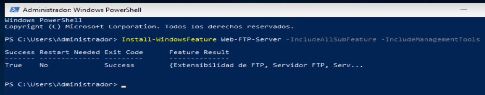

## **2. Crear Usuarios y Grupos Locales (modo gráfico)**
   > Usaremos estos usuarios para probar las conexiones ftp con distintos permisos.
   - Abrir "Administración de Equipos" y navegar hasta "Usuarios y grupos locales".

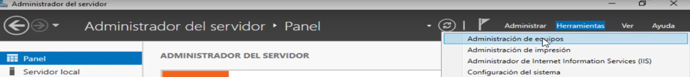

   - Crear los siguientes usuarios locales necesarios para el acceso al FTP:
     - **AdminFTP**
     - **Informático1**
     - **Informático2**
     - **Contable1**
     - **Contable2**
   - Recordar: **No seleccionar que el usuario deba cambiar la contraseña al iniciar sesión**.

> **Introduce contraseñas que no vayas a olvidar...**

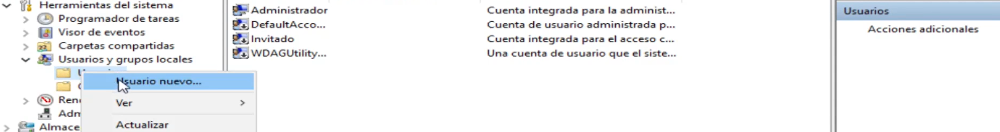

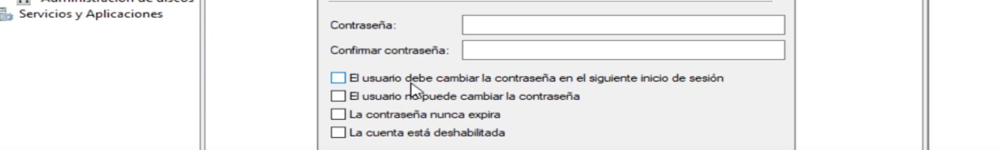

## **3. Crear los Grupos Locales**
   - Crear los siguientes grupos para organizar los usuarios del FTP:
     - **Informáticos** (formado por Informático1 e Informático2).
     - **Contables** (formado por Contable1 y Contable2).
   - Asignar los usuarios correspondientes a cada grupo según sus roles.

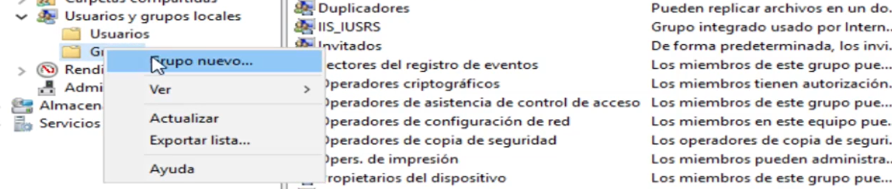

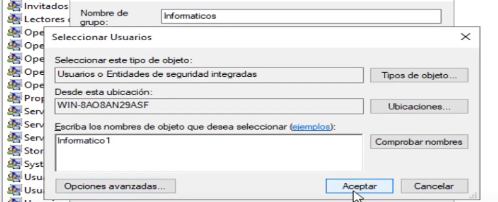

## **4. Crear el Sitio FTP a través de IIS**
   - Crear una carpeta local llamada **INICIALES_LOCAL** (donde INICIALES representa las iniciales del nombre completo del alumno, por ejemplo, FJLM_LOCAL para Francisco Javier López Mota) que servirá de directorio raíz para los archivos.
     - Asegúrate de que los permisos de la carpeta sean compatibles tanto con el sistema operativo como con el servidor FTP.
   
   - **4.1.** Abrir el "Administrador de IIS" y agregar un nuevo sitio FTP.

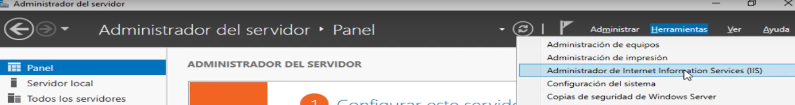

---

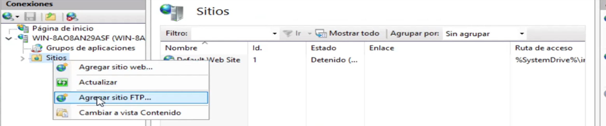
  
   - **4.2.** Dar nombre al sitio FTP ***TunombreFTP***
   - **4.3.** Habilitar los nombres de host virtuales para permitir que diferentes dominios apunten al mismo servidor FTP.
     - ***tunombre.local***
   - **4.4.** Configurar sin SSL (Secure Sockets Layer) para simplificar la configuración en este entorno de prueba.

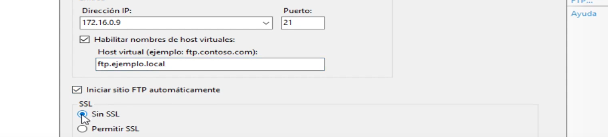

## **5. Configurar Accesos al Servidor FTP**

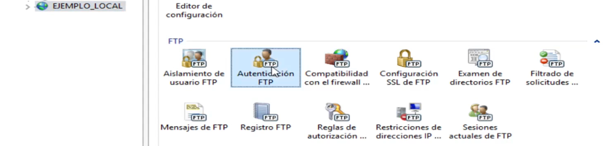

   - **5.1.** Seleccionar "Autenticación Básica" para permitir que los usuarios inicien sesión con nombre de usuario y contraseña.
   - **5.2.** Generar reglas de permisos para definir qué usuarios/grupos pueden leer, escribir o modificar archivos en el FTP:
       - 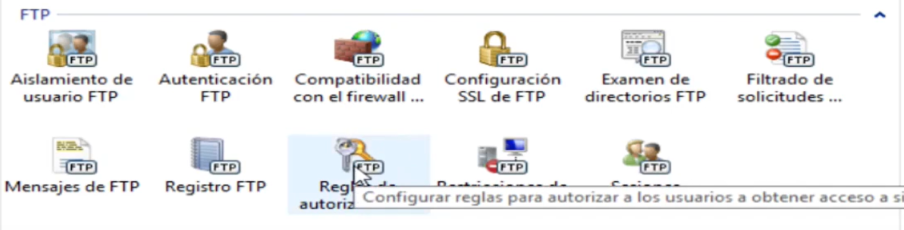
  
     > *Click derecho -> Agregar reglas de permiso*

     - **Lectura y escritura** para:
       - Usuario **AdminFTP**.
       - Grupo **Informáticos**.
     - **Lectura** para:
       - Grupo **Contables**.
       - 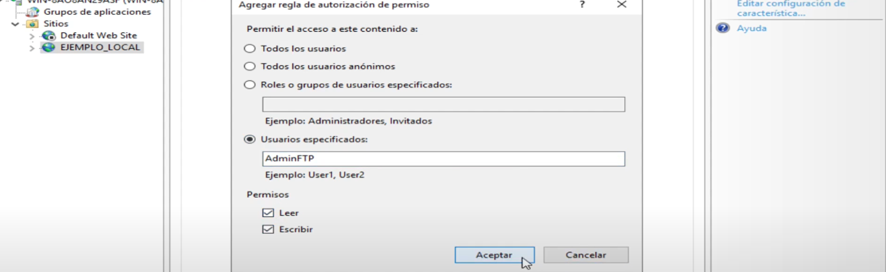

   - **5.3.** Configurar el número máximo de conexiones simultáneas a **50** para limitar la carga en el servidor.
   - 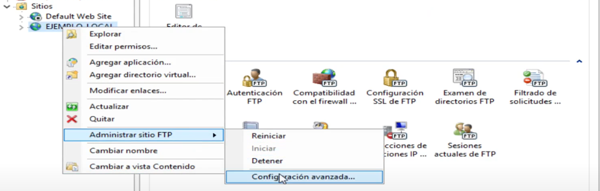
   - 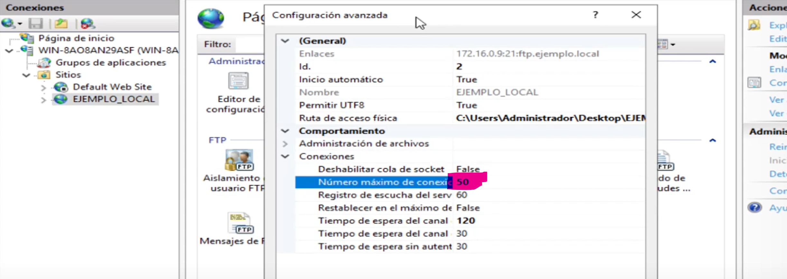
   

## **6. Configurar Permisos de la Carpeta en el Sistema Operativo**
   - Navegar a la carpeta creada en el paso 4.1 (**INICIALES_LOCAL** (donde INICIALES representa las iniciales del nombre completo del alumno, por ejemplo, FJLM_LOCAL para Francisco Javier López Mota)).
   - 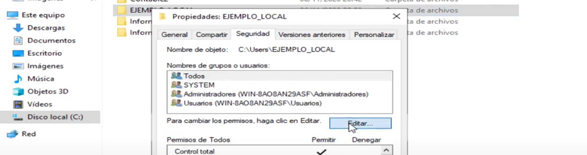
   - 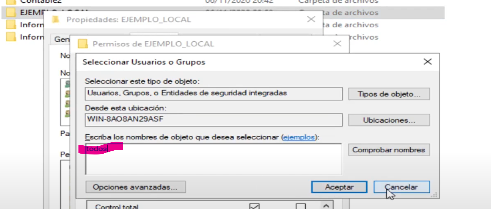
   - Asignar permisos adecuados según los requisitos:
     - **Lectura y escritura** para el usuario **AdminFTP** y el grupo **Informáticos**.
     - **Lectura** para el grupo **Contables**.
   - Asegurarse de que los permisos están alineados con las reglas definidas en el IIS.

## **7. Conectar al Servidor FTP desde el CMD del propio servidor**
   - Abrir el símbolo del sistema (CMD).
   - **7.1.** Crear un directorio de prueba para comprobar el acceso al servidor FTP:
   - 
     ```cmd
     ftp 172.16.X.9
     REM (donde X es el número de lista del alumno, por ejemplo, 43 si el alumno es el número 43)
     Usuario (ip:(none)): nombreFtpVirtual.local|usuario
     REM (donde nombreFtpVirtual.local es el nombre que le has dado a tu ftp virtual y usuario es el nombre de usuario con el que te quieres conectar)
     Contraseña:
     REM introduce la contraseña del usuario con el que te quieres conectar    
     mkdir prueba_directorio
     ```

   - 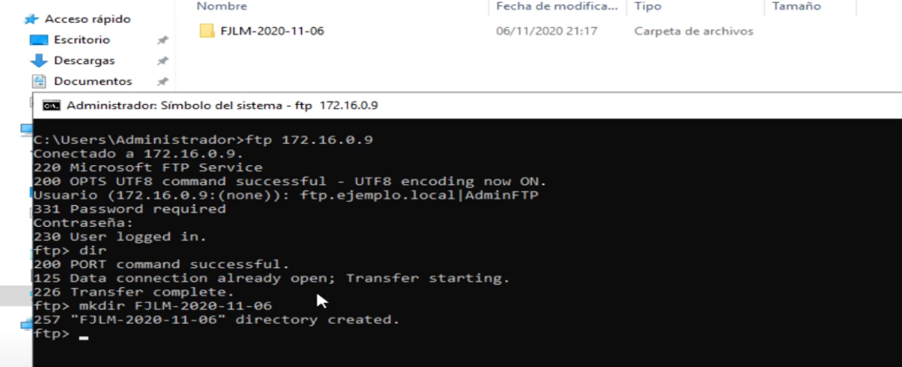
   - Verificar que el directorio ha sido creado exitosamente.


## Qué debo entregar:

- Captura del usuario A