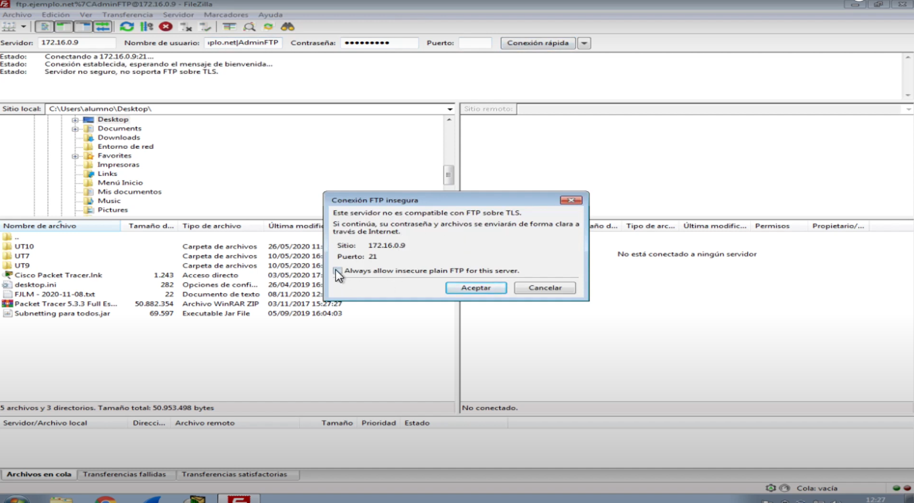
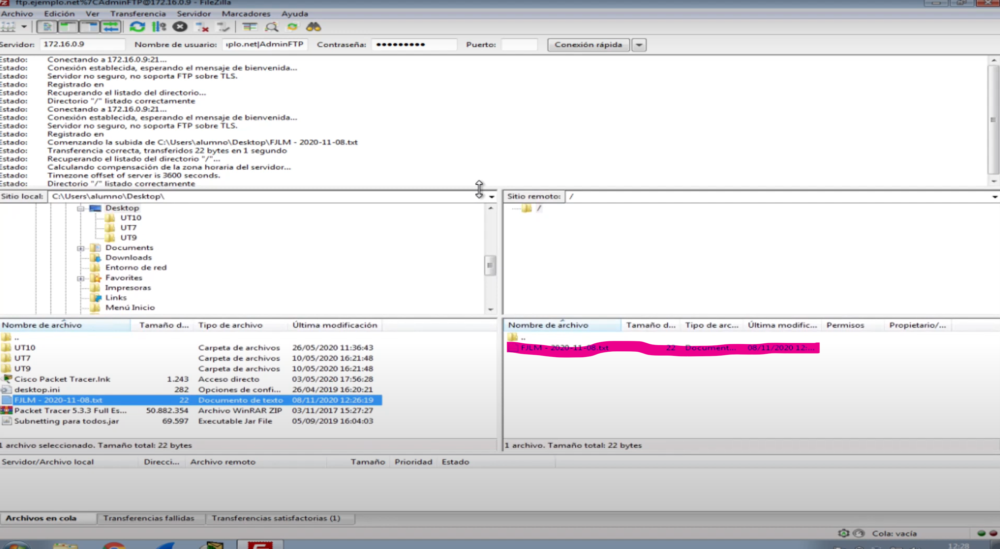

**TAREA ESCENARIO 2: Configuración de un nuevo FTP Virtual en Windows Server 2019**

## Objetivo:
En esta tarea, los alumnos configurarán un segundo servidor FTP virtual en Windows Server 2019. Se aprenderá a crear un sitio FTP adicional, configurar autenticación básica y anónima, y comprobar el acceso utilizando el cliente FTP FileZilla.

## Pasos a seguir:

## **1. Crear un Nuevo Sitio FTP Virtual en IIS en Windows Server 2019**
   - Abrir el "Administrador de IIS" y agregar un nuevo sitio FTP.
   - **1.1.** Configurar los siguientes aspectos del sitio:
     - Crear una carpeta local llamada **INICIALES_NET** (donde INICIALES representa las iniciales del nombre del alumno).
     - Asignar la dirección IP **172.16.X.9** (donde **X** es el número de lista del alumno).
     - Utilizar el puerto **21** (el puerto predeterminado para FTP).
     - Configurar un nombre de host virtual que permita identificar el sitio.
     - No configurar SSL para simplificar esta configuración de prueba.
   - **1.2.** Configurar la autenticación:
     - Habilitar "Autenticación Básica" para el usuario AdminFTP.
     - Habilitar "Autenticación Anónima" para permitir el acceso público limitado.
   - **1.3.** Generar las reglas de autorización:
     - Conceder **lectura y escritura** al usuario **AdminFTP**.
     - Conceder **lectura** para usuarios anónimos (**Todos los usuarios anónimos**).
     - 

   - **1.4.** Configurar el número máximo de conexiones simultáneas a **50**.

## **2. Configurar Usuarios en el Administrador de Usuarios del Servidor**
   - **2.1.** Crear el usuario **Anonymous** si no existe:
     - Abrir "Administración de Equipos" y navegar hasta "Usuarios y grupos locales".
     - Crear el usuario **Anonymous** si no está creado.
   - **2.2.** Asignar permisos completos a **AdminFTP** sobre la carpeta **INICIALES_NET**.
   - **2.3.** Asignar permisos de **lectura y ejecución** al usuario **Anonymous** sobre la carpeta **INICIALES_NET**.

## **3. Comprobar la Configuración con FileZilla**
   - **3.1.** Descargar e instalar el cliente FTP **FileZilla** en una máquina cliente.
     - Visitar la página oficial de **FileZilla** y descargar la versión cliente.
     - Seguir las instrucciones de instalación estándar.
   - **3.2.** Conectar al servidor FTP como **AdminFTP**:
     - Abrir **FileZilla**.
     - En la parte superior de la interfaz, localizar la barra de conexión rápida, donde se introducen los datos del servidor.
       - **Servidor**: Introducir la dirección IP **172.16.X.9** (donde **X** es el número de lista del alumno).
       - **Nombre de Usuario**: Escribir **AdminFTP**.
       - **Contraseña**: Escribir la contraseña correspondiente.
       - **Puerto**: Introducir **21**.
     - Hacer clic en el botón **Conexión rápida**.
     - 
     - Una vez conectado, la estructura de carpetas del servidor aparecerá en la ventana inferior derecha de la interfaz.
     - En la parte izquierda, que representa el sistema local, navegar hasta el archivo de prueba que se desea subir.
     - Arrastrar el archivo desde la parte izquierda a la carpeta **INICIALES_NET** en la parte derecha para subir el archivo.
     - Verificar en la ventana de registro en la parte inferior que el archivo se ha subido correctamente.
     - 
   - **3.3.** Conectar al servidor FTP como **Anonymous**:
     - Abrir **FileZilla**.
     - Utilizar nuevamente la barra de conexión rápida en la parte superior de la interfaz.
       - **Servidor**: Introducir la dirección IP **172.16.X.9**.
       - **Nombre de Usuario**: Escribir **Anonymous**.
       - **Contraseña**: Dejar el campo vacío o escribir cualquier valor.
       - **Puerto**: Introducir **21**.
     - Hacer clic en el botón **Conexión rápida**.
     - Una vez conectado, navegar hasta la carpeta **INICIALES_NET** en la ventana del servidor (parte derecha).
     - Localizar el archivo subido previamente y arrastrarlo a la parte izquierda (sistema local) para descargarlo.
     - Verificar en la ventana de registro que el archivo se ha descargado correctamente.

## Consideraciones Adicionales:
- **Seguridad**: La autenticación anónima debe ser limitada y controlada. En un entorno real, se debe restringir el acceso para evitar vulnerabilidades.
- **Documentación**: Anotar cada paso realizado, incluyendo capturas de pantalla de la configuración y resultados de las pruebas con FileZilla.

## Objetivo de Evaluación:
- Verificar que los alumnos son capaces de crear un servidor FTP virtual adicional, gestionar los permisos de usuarios y configurar autenticaciones distintas, así como probar el acceso al servidor con usuarios diferentes mediante un cliente FTP.

