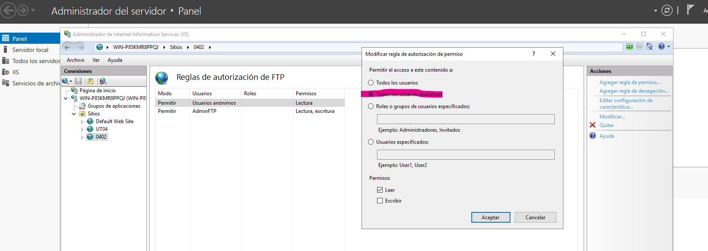
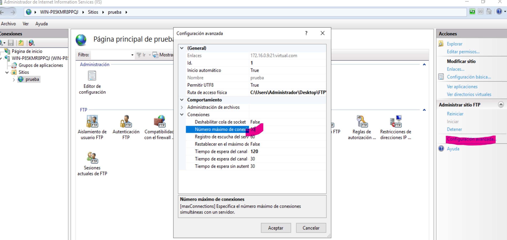
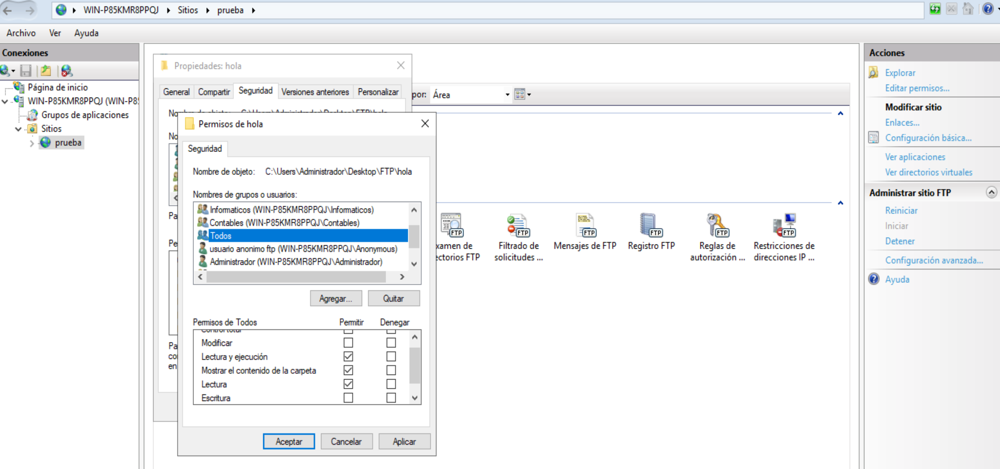

- [**SR0402 Práctica: Configuración de un nuevo FTP Virtual en Windows Server 2019**](#sr0402-práctica-configuración-de-un-nuevo-ftp-virtual-en-windows-server-2019)
  - [Comprobar los requisitos de entrega](#comprobar-los-requisitos-de-entrega)
  - [**1. Crear un Nuevo Sitio FTP Virtual en IIS en Windows Server 2019**](#1-crear-un-nuevo-sitio-ftp-virtual-en-iis-en-windows-server-2019)
    - [**1.2.** Configurar la autenticación BÁSICA y ANÓNIMA:](#12-configurar-la-autenticación-básica-y-anónima)
    - [**1.3.** Generar las reglas de autorización para cada USUARIO:](#13-generar-las-reglas-de-autorización-para-cada-usuario)
  - [**2. Configurar permisos a nivel de Sistema Operativo**](#2-configurar-permisos-a-nivel-de-sistema-operativo)
    - [**OP. Comprobar el funcionamiento desde CMD**](#op-comprobar-el-funcionamiento-desde-cmd)
  - [**3. Comprobar la Configuración con FileZilla**](#3-comprobar-la-configuración-con-filezilla)
      - [- **3.2.** Conectar al servidor FTP con un usuario autorizado:](#--32-conectar-al-servidor-ftp-con-un-usuario-autorizado)
      - [- **3.3.** Conectar al servidor FTP como **Anonymous**:](#--33-conectar-al-servidor-ftp-como-anonymous)
  - [**Qué debo entregar**](#qué-debo-entregar)

# **SR0402 Práctica: Configuración de un nuevo FTP Virtual en Windows Server 2019**

**Objetivo**:
En esta tarea, los alumnos configurarán un segundo servidor FTP virtual en Windows Server 2019. Se aprenderá a crear un **sitio FTP adicional**, configurar autenticación **básica** y **anónima**, y comprobar el acceso utilizando el cliente FTP **FileZilla**.

**Objetivo de Evaluación:**
- Verificar que los alumnos son capaces de crear un servidor FTP virtual adicional, gestionar los permisos de usuarios y configurar autenticaciones distintas, así como probar el acceso al servidor con usuarios diferentes mediante un cliente FTP.

## Comprobar los requisitos de entrega

  - [Qué debo entregar](#qué-debo-entregar)
  - **Planificar** los nombres de usuario, directorios, nombres de FTP, nombres de host virtuales que vas a **necesitar**

## **1. Crear un Nuevo Sitio FTP Virtual en IIS en Windows Server 2019**
   - Abrir el "Administrador de IIS" y agregar un nuevo sitio FTP: **FTP-ini-ANONIMO**.
   - **1.1.** Configurar los siguientes aspectos del sitio:
     - Crear una carpeta local llamada **DIR_ini_ANONIMO** (donde **ini** representa las iniciales del nombre del alumno).
     - Asignar esta carpeta al servicio FTP.
     - Asignar la dirección IP **INDICADA** en la pregunta.
     - Utilizar el puerto **21** (el puerto predeterminado para FTP).
     - Configurar un nombre de host virtual que permita identificar el sitio. (por ejemplo *ftp.iniciales.net*)
     - No configurar SSL para simplificar esta configuración de prueba.
### **1.2.** Configurar la autenticación BÁSICA y ANÓNIMA:
  - En el icono **Autenticación FTP**:
    - Habilitar "Autenticación Básica" para permitir el acceso con nombre y contraseña.
    - Habilitar "Autenticación Anónima" para permitir el acceso público limitado.
  
### **1.3.** Generar las reglas de autorización para cada USUARIO:
  - Conceder **lectura y escritura** al usuario **tuNOmbre**.
  - Conceder **lectura** para **Todos losusuarios anónimos:**
  

   - **1.4.** Configurar el número máximo de conexiones simultáneas a **50**:

## **2. Configurar permisos a nivel de Sistema Operativo**

   - **2.1.** Acceder a las propiedades del directorio asignado al servicio FTP.
   - **2.2.** Asignar permisos completos al usuario adecuado sobre la carpeta configurada para el FTP.
   - **2.3.** Asignar permisos de **lectura y ejecución** al grupo de usuarios **Todos** sobre la carpeta del FTP.

### **OP. Comprobar el funcionamiento desde CMD**

Es el momento ideal para comprobar que el servicio FTP funciona correctamente conectándote desde el CMD de tu propio servidor.

## **3. Comprobar la Configuración con FileZilla**
   - **3.1.** Descargar e instalar el cliente FTP **FileZilla** en una máquina cliente.
     - Visitar la página oficial de **FileZilla** y descargar la versión cliente.
     - Seguir las instrucciones de instalación estándar.
 ####  - **3.2.** Conectar al servidor FTP con un usuario autorizado:
  - Abrir **FileZilla**.
     - En la parte superior de la interfaz, localizar la barra de conexión rápida, donde se introducen los datos del servidor.
       - **Servidor**: Introducir la dirección IP **del servidor**.
       - **Nombre de Usuario**: Escribir `nombreHostVirtual|usuario`.
       - **Contraseña**: Escribir la contraseña correspondiente.
       - **Puerto**: Introducir **21**.
     - Hacer clic en el botón **Conexión rápida**.
     
     - Una vez conectado, la estructura de carpetas del servidor aparecerá en la ventana inferior derecha de la interfaz.
     - En la parte izquierda se representa el sistema local.
     - Se puede arrastrar y soltar desde el servidor al cliente (get) o desde el cliente al servidor (put).
     - Verificar en la ventana de registro que los archivos se han movido correctamente.
     - 
  
  #### - **3.3.** Conectar al servidor FTP como **Anonymous**:

  - Abrir **FileZilla**.
     - Utilizar nuevamente la barra de conexión rápida en la parte superior de la interfaz.
       - **Servidor**: Introducir la dirección IP.
       - **Nombre de Usuario**: Escribir `nombreHostVirtual|Anonymous`.
       - **Contraseña**: Dejar el campo vacío o escribir cualquier valor.
       - **Puerto**: Introducir **21**.
     - Hacer clic en el botón **Conexión rápida**.
     - Una vez conectado, navegar hasta la carpeta **del servicio FTP** en la ventana del servidor (parte derecha).
     - Se puede arrastrar y soltar desde el servidor al cliente (get) pero **NO** desde el cliente al servidor (put).
     - Verificar en la ventana de registro que los archivos se han movido correctamente.

**Consideraciones Adicionales:**
- **Seguridad**: La autenticación anónima debe ser limitada y controlada. En un entorno real, se debe restringir el acceso para evitar vulnerabilidades.
- **Documentación**: Es recomendable anotar cada paso realizado, incluyendo capturas de pantalla de la configuración y resultados de las pruebas con FileZilla para estudiar.

## **Qué debo entregar**

1. Captura del gestor de FTP de WS19 en la que se muestre que tienes dos sitios FTP creados, llama a la captura nombre1.png
2. Captura de una conexión desde FileZilla utilizando un usuario llamado como tú, a uno de los sitios. También se debe apreciar cómo puedes subir un archivo al servidor FTP, llama a la captura nombre2.png 
3. Captura de una conexión desde FileZilla utilizando el usuario anónimo. También se debe apreciar cómo **NO** puedes subir un archivo al servidor FTP, llama a la captura nombre3.png