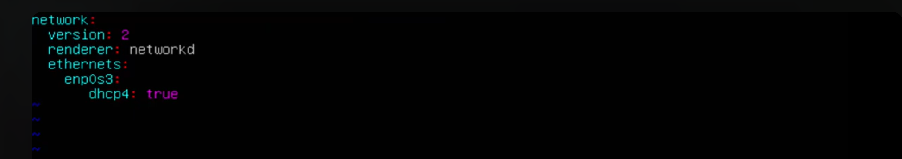
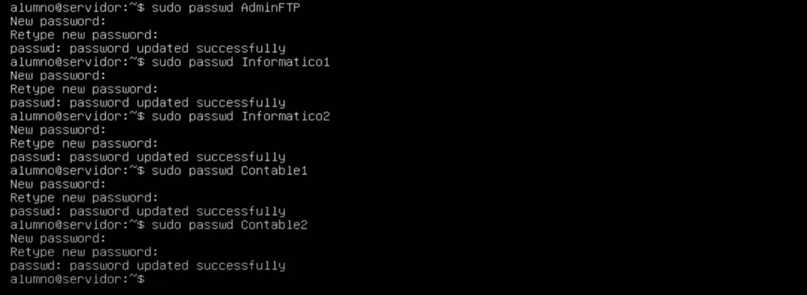
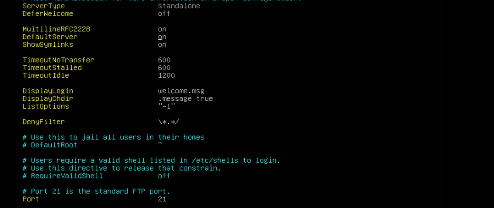
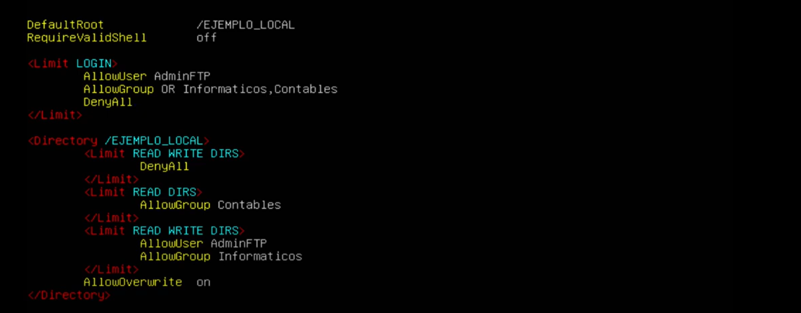
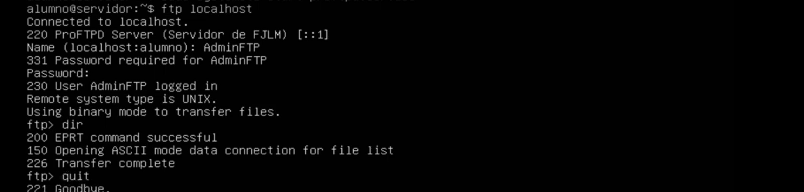

- [**Guion para la Instalación del Servicio FTP con ProFTPD en Ubuntu Server 20.04**](#guion-para-la-instalación-del-servicio-ftp-con-proftpd-en-ubuntu-server-2004)
- [**Paso 1: Preparación del Entorno**](#paso-1-preparación-del-entorno)
- [**Paso 2: Instalación del Servicio FTP (ProFTPD)**](#paso-2-instalación-del-servicio-ftp-proftpd)
- [**Paso 3: Configuración de Usuarios y Carpetas Compartidas**](#paso-3-configuración-de-usuarios-y-carpetas-compartidas)
- [**Paso 4: Configuración del Servidor ProFTPD**](#paso-4-configuración-del-servidor-proftpd)
- [**Paso 5: Pruebas del Servicio FTP**](#paso-5-pruebas-del-servicio-ftp)
- [**Paso 6: Consideraciones Finales**](#paso-6-consideraciones-finales)

### **Guion para la Instalación del Servicio FTP con ProFTPD en Ubuntu Server 20.04**

**Objetivo de la tarea**: Configurar un servidor FTP en Ubuntu Server utilizando ProFTPD, siguiendo las instrucciones indicadas, para gestionar el intercambio de archivos en una red local. Se deben personalizar algunos aspectos del servidor para que sea único para cada alumno.

> **nota**: La modificación de los archivos de cofiguración en linux es delicada. Recuerda:
> Se cuidadoso con la tabulación.
> Si después de modificar el archivo, el servidor ftp no funciona, comprueba el contenido del final del archivo `/var/log/syslog`.

---

### **Paso 1: Preparación del Entorno**

1. **Máquina Virtual**: Asegúrate de que tienes una máquina virtual con Ubuntu Server 20.04 instalada.

   - Antes de instalar los paquetes, asegúrate de que la máquina está en **modo NAT** para poder acceder a Internet y descargar los paquetes necesarios.

   - **Archivo de configuración de red (para modo NAT)**:

     
     Archivo: `/etc/netplan/00-installer-config.yaml`

     Contenido:
     ```yaml
     network:
       version: 2
       ethernets: 
         ens33: ; aquí el nombre de tu interfaz
           dhcp4: true
     ```




2. **Actualiza los paquetes** de Ubuntu antes de proceder:

   ```sh
   sudo apt update
   ```

---

### **Paso 2: Instalación del Servicio FTP (ProFTPD)**

1. **Instalar ProFTPD**:
   - Ejecuta el siguiente comando para instalar el servicio:
     ```sh
     sudo apt install proftpd-basic -y
     ```

   Una vez descargados los paquetes, recuerda volver a cambiar la configuración a **modo red interna**.

   - Apaga la máquina virtual y cambia la configuración de red a interna.

    - Modifica el archivo de configuración de US:

       - **Archivo de configuración de red (para modo red interna con IP estática)**:

     Archivo: `/etc/netplan/00-installer-config.yaml`

     Contenido:
     ```yaml
     network:
       version: 2
       ethernets:
         ens33:
           addresses:
             - 172.16.43.10/24
           gateway4: 172.16.43.1
           nameservers:
             addresses:
               - 8.8.8.8
               - 8.8.4.4
     ```
     Este archivo configura la máquina en la red interna con una IP estática acorde al escenario de la tarea.

---

### **Paso 3: Configuración de Usuarios y Carpetas Compartidas**

1. **Crear Grupos y Usuarios**:
   - Crea un grupo y los usuarios necesarios para el servicio FTP:
 - 
     ```sh
    sudo groupadd Informaticos
    sudo groupadd Contables
    sudo useradd AdminFtp -s /bin/false -M -N
    sudo useradd Informatico1 -s /bin/false -M -N -g Informaticos
    sudo useradd Informatico2 -s /bin/false -M -N -g Informaticos
    sudo useradd Contable1 -s /bin/false -M -N -g Contables
    sudo useradd Contable2 -s /bin/false -M -N -g Contables
     ```

2. **Adjudicar las contraseñas a los usuarios**


    
    sudo passwd AdminFTP
    sudo passwd Informatico1
    sudo passwd Informatico2
    sudo passwd Contable1
    sudo passwd Contable2

3. **Crear la Carpeta Compartida**:
   - Crea la carpeta que se va a compartir mediante FTP:
     ```sh
     sudo mkdir /srv/ftp/FJLM_LOCAL
     ```
   - **Nota**: Sustituye "FJLM" por las iniciales de tu nombre completo. Este es uno de los cambios obligatorios especificados en la tarea.
   - Ajusta los permisos de la carpeta para que el usuario FTP pueda acceder:

- 


     ```sh
     sudo chmod -R 755 /srv/ftp/FJLM_LOCAL
     ```

---

### **Paso 4: Configuración del Servidor ProFTPD**

1. **Edición del Archivo de Configuración**:
   - Edita el archivo `/etc/proftpd/proftpd.conf` para ajustar la configuración del servidor.
   - Añade la configuración resumida proporcionada en el documento de la tarea, asegurándote de que:
   

```apache
ServerName                      "Servidor Escenario EJEMPLO LOCAL."
ServerType                      standalone
DefaultServer                   on
Port                            21
Umask                           000
MaxInstances                    500
User                            proftpd
Group                           nogroup
DefaultRoot                     /EJEMPLO_LOCAL
RequireValidShell               off

<Limit LOGIN>
  AllowUser AdminFTP
  AllowGroup OR Informaticos, Contables
  DenyAll
</Limit>

<Directory /EJEMPLO_LOCAL>
  <Limit READ WRITE DIRS>
    DenyAll
  </Limit>

  <Limit READ DIRS>
    AllowGroup Contables
  </Limit>

  <Limit READ WRITE DIRS>
    AllowUser AdminFTP
    AllowGroup Informaticos
  </Limit>

  AllowOverwrite                on
</Directory>
```

**A Continuación se explica detalladamente el contenido del archivo:**

```apache
ServerName                      "EJEMPLO FTP Server"       # Establece el nombre que se muestra a los clientes cuando se conectan al servidor FTP.

ServerType                      Standalone                 # Define el modo en que se ejecuta el servidor. "Standalone" significa que se ejecuta como un proceso independiente.

DefaultServer                   On                          # Indica que este será el servidor predeterminado si hay múltiples configuraciones.

DefaultRoot                     ~                           # Limita a los usuarios a su directorio de inicio. El `~` indica que los usuarios solo pueden acceder a su propio directorio de inicio (chroot jail), lo cual es una medida de seguridad para evitar acceso fuera de sus carpetas.

RequireValidShell               off                         # Permite el acceso a usuarios incluso si no tienen un shell válido asignado en `/etc/shells`. Esto es útil para cuentas que no se conectan normalmente al sistema de forma interactiva.

<Limit LOGIN>
  AllowUser AdminFTP                                       # Permite solo al usuario "AdminFTP" realizar una conexión de inicio de sesión al servidor FTP.
  DenyALL                                                  # Niega el acceso de inicio de sesión a todos los demás usuarios que no sean "AdminFTP".
</Limit>

Port                            21                          # Puerto en el cual escucha el servidor FTP (el puerto predeterminado de FTP es el 21).

MaxInstances                    50                          # Número máximo de conexiones simultáneas permitidas al servidor. Esto previene sobrecargar el sistema con demasiadas conexiones.

User                            proftpd                     # Define el usuario con el que correrá el proceso del servidor. Este usuario debe tener permisos limitados para garantizar la seguridad.

Group                           nogroup                     # Define el grupo bajo el cual se ejecutará el servidor. Normalmente se asigna a "nogroup" o un grupo sin privilegios para seguridad.

Umask                           000                         # Máscara de permisos aplicada a los archivos y directorios creados. `000` significa que no se aplica ninguna restricción, es decir, los archivos creados tendrán permisos `777`. Esto puede ser un riesgo de seguridad, ya que permite acceso total a todos, por lo que suele ser mejor utilizar un umask más restrictivo como `022`.

UseIPv6                         off                         # Desactiva el uso de IPv6 para el servidor. Solo se usará IPv4, lo cual simplifica la configuración si no tienes soporte para IPv6.
```






### **Paso 5: Pruebas del Servicio FTP**

1. **Arranque del Servicio**:
   - Inicia el servicio ProFTPD:
     ```sh
     sudo systemctl start proftpd
     ```
   - Verifica que el servicio está activo:
     ```sh
     sudo systemctl status proftpd
     ```

2. **Conexión desde Consola Local**:
   - Conéctate al servidor FTP desde la misma máquina para verificar que funciona correctamente:
     ```sh
     ftp localhost
     ```
   - Realiza una captura de pantalla mostrando la conexión exitosa del usuario **AdminFTP**. El nombre del servidor debe ser el correspondiente a tus iniciales (p. ej., "Servidor de FJLM").



3. **Prueba de Conectividad con FileZilla**:
   - Desde una máquina con **FileZilla Client**, conéctate al servidor FTP utilizando la IP del servidor configurada en la red interna.
   - Realiza una transferencia de un archivo **.png** al servidor y asegúrate de que el archivo se visualiza correctamente en el lado del servidor.
   - Realiza una captura de pantalla mostrando los mensajes de conexión y la transferencia exitosa.

---

### **Paso 6: Consideraciones Finales**

- **Capturas de Pantalla**: Recuerda sustituir las capturas de pantalla propuestas en la tarea con las tuyas propias, asegurándote de cumplir con las modificaciones especificadas (nombre del servidor y red).
- **Entrega**: Asegúrate de que todas las configuraciones son correctas y de incluir ambas capturas de pantalla en tu informe final.

---

