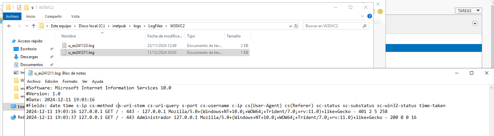

- [Guion para la Instalación de un Servidor Web en Windows Server 2019](#guion-para-la-instalación-de-un-servidor-web-en-windows-server-2019)
    - [1. Instalar IIS con PowerShell](#1-instalar-iis-con-powershell)
    - [2. Crear un Usuario de Windows](#2-crear-un-usuario-de-windows)
    - [3. Crear Directorios para los Sitios Web en wwwroot](#3-crear-directorios-para-los-sitios-web-en-wwwroot)
    - [4. Crear Archivos HTML para Cada Sitio Web](#4-crear-archivos-html-para-cada-sitio-web)
    - [5. Crear un Certificado Autofirmado ***para el Sitio con Seguridad***](#5-crear-un-certificado-autofirmado-para-el-sitio-con-seguridad)
    - [6. Crear el Sitio Web HTTPS en IIS](#6-crear-el-sitio-web-https-en-iis)
    - [7. Crear el Sitio Web HTTP en IIS](#7-crear-el-sitio-web-http-en-iis)
    - [8. Configurar Autenticación para HTTPS (sitio1.local)](#8-configurar-autenticación-para-https-sitio1local)
    - [9. Configurar Autenticación para HTTP (sitio2.net)](#9-configurar-autenticación-para-http-sitio2net)
    - [10. Modificar el Archivo de Hosts](#10-modificar-el-archivo-de-hosts)
    - [11. Pruebas de Conexión](#11-pruebas-de-conexión)
      - [**11.1. Pruebas con `curl` (línea de comandos)**](#111-pruebas-con-curl-línea-de-comandos)
      - [**11.2. Pruebas con navegador web**](#112-pruebas-con-navegador-web)
      - [**11.3. Pruebas desde otro cliente de la red**](#113-pruebas-desde-otro-cliente-de-la-red)
        - [**a) Comprobación de resolución de nombres**](#a-comprobación-de-resolución-de-nombres)
        - [**b) Pruebas con `curl` desde el otro equipo**](#b-pruebas-con-curl-desde-el-otro-equipo)
        - [**c) Pruebas con navegador desde el otro equipo**](#c-pruebas-con-navegador-desde-el-otro-equipo)
    - [12. Comprobar el registro de conexiones](#12-comprobar-el-registro-de-conexiones)
    - [QUÉ DEBO ENTREGAR 📸:](#qué-debo-entregar-)

# Guion para la Instalación de un Servidor Web en Windows Server 2019

### 1. Instalar IIS con PowerShell
>Asegúrate de que tienes conexión a internet
   - Abre PowerShell como administrador.
   - Ejecuta el siguiente comando para instalar el servidor web (IIS):
     ```powershell
     Install-WindowsFeature -Name Web-Server -IncludeManagementTools -IncludeAllSubFeature
     ```

### 2. Crear un Usuario de Windows
   - Abre **Administración de Equipos**.
   - Ve a **Usuarios y Grupos Locales** y crea un nuevo usuario con tus INICIALES.
   - Establece una contraseña y configura el usuario con permisos básicos para fines de administración.
  

### 3. Crear Directorios para los Sitios Web en wwwroot
   - Abre el explorador de archivos y navega a la carpeta `C:\inetpub\wwwroot`.
   - Crea dos subdirectorios dentro de `wwwroot`: `sitio1` y `sitio2`.

### 4. Crear Archivos HTML para Cada Sitio Web

(**Como alternativa más sencilla, puedes copiar los archivos en VSC y subirlos al servidor mediante FTP**)

> Utilizando el bloc de notas

   - En la carpeta `sitio1`, crea un archivo llamado `index.html` con el siguiente contenido:
     ```html
        <!DOCTYPE html>
        <html lang="en">
        <head>
            <meta charset="UTF-8">
            <meta name="viewport" content="width=device-width, initial-scale=1.0">
            <title>AUTENTICADO</title>
        </head>
        <body>
            <h1>www.INICIALES.local</h1>
            <h1>ACCESO AUTENTICADO con https</h1>
            <h1>Creado por: <strong>INICIALES</strong> el <em>fecha actual</em></h1>
        </body>
        </html>
     ```

> Debes seleccionar **Todos los archivos** cuando guardes el documento.


> Comprueba que el archivo aparece con un icono de internet explores y que, al abrirlo, el navedador lo renderiza adecuadamente


   - Repite el proceso en la carpeta `sitio2`, creando otro `index.html` con el siguiente contenido:
     ```html
        <!DOCTYPE html>
        <html lang="en">
        <head>
            <meta charset="UTF-8">
            <meta name="viewport" content="width=device-width, initial-scale=1.0">
            <title>ANÓNIMO</title>
        </head>
        <body>
            <h1>www.INICIALES.net</h1>
            <h1>ACCESO <strong>ANÓNIMO</strong> con http</h1>
            <h1>Creado por: <strong>INICIALES</strong> el <em>fecha actual</em></h1>
        </body>
        </html>
     ```

### 5. Crear un Certificado Autofirmado ***para el Sitio con Seguridad***
(Solo se utilizará para configurar el sitio HTTPS)
   - Abre **Administrador de IIS**.
   - Ve a **Certificados del Servidor** y selecciona **Crear Certificado Autofirmado** en el panel derecho.
   - Introduce el nombre del certificado, por ejemplo, `sitio1.local` y haz clic en **Aceptar** para generar el certificado.


### 6. Crear el Sitio Web HTTPS en IIS
   - En **Administrador de IIS**, haz clic derecho sobre **Sitios** y selecciona **Agregar sitio web**.
   - Introduce los siguientes detalles:
     - **Nombre del Sitio**: `sitio1`
     - **Ruta Física**: `C:\inetpub\wwwroot\sitio1` (la que corresponda a tu equipo)
     - **Tipo**: `https`
     - **IP**: `All Unassigned`
     - **Puerto**: `443`
     - **Host name**: `sitio1.local`
     - Asocia el certificado autofirmado creado previamente.


### 7. Crear el Sitio Web HTTP en IIS
   - Haz clic derecho sobre **Sitios** y selecciona **Agregar sitio web**.
   - Introduce los siguientes detalles:
     - **Nombre del Sitio**: `sitio2`
     - **Ruta Física**: `C:\inetpub\wwwroot\sitio2` (la que corresponda a tu equipo)
     - **Tipo**: `http`
     - **IP**: `All Unassigned`
     - **Puerto**: `80`
     - **Host name**: `sitio2.net`


### 8. Configurar Autenticación para HTTPS (sitio1.local)
   - Selecciona `sitio1` en **Administrador de IIS**.
   - Haz clic en **Autenticación** y desactiva **Autenticación Anónima**.
   - Activa **Autenticación básica** para que solo los usuarios del servidor puedan acceder.


### 9. Configurar Autenticación para HTTP (sitio2.net)
   - Selecciona `sitio2` en **Administrador de IIS**.
   - Haz clic en **Autenticación** y asegúrate de que **Autenticación Anónima** esté activada, permitiendo acceso público sin necesidad de credenciales.


### 10. Modificar el Archivo de Hosts
   - Abre el archivo `hosts` ubicado en `C:\Windows\System32\drivers\etc\hosts` con **permisos de administrador**.
   - Añade las siguientes líneas: (con los nombres de host que correspondan a tu escenario)
     ```plaintext
     127.0.0.1   sitio1.local 
     127.0.0.1   sitio2.net
     ```


### 11. Pruebas de Conexión

Una vez configurados ambos sitios, es necesario realizar varias comprobaciones para asegurarse de que el servidor web funciona correctamente. Se deben realizar pruebas tanto con **curl** como mediante un **navegador web**.

---

#### **11.1. Pruebas con `curl` (línea de comandos)**

Estas pruebas permiten verificar el funcionamiento del servidor sin depender del navegador y ayudan a detectar errores de autenticación o configuración de puertos.

**a) Acceso al sitio HTTPS autenticado (`sitio1.local`)**

Ejecuta en PowerShell o CMD:

```cmd
curl -u USUARIO:PASSWORD https://sitio1.local
```

* Debe pedir credenciales si no se proporcionan.
* Tras autenticarse correctamente, debe mostrar el contenido del archivo `index.html`.
* Si aparece un aviso de certificado no confiable, es normal porque el certificado es autofirmado.

**b) Acceso al sitio HTTP anónimo (`sitio2.net`)**

```cmd
curl http://sitio2.net
```

* Debe mostrar el contenido del `index.html` sin pedir credenciales.
* Si no aparece salida, revisa el puerto 80, el hostname y el archivo `hosts`.

---

#### **11.2. Pruebas con navegador web**

Ahora comprueba el funcionamiento desde el propio servidor utilizando un navegador.

**a) Acceso a `https://sitio1.local`**

* El navegador debe advertir sobre el certificado autofirmado (comportamiento normal).
* Tras continuar, debe solicitar usuario y contraseña.
* Una vez autenticado, debe mostrarse la página del sitio1.

**b) Acceso a `http://sitio2.net`**

* Debe mostrarse directamente la página del sitio2 sin pedir credenciales.
* Debes comprobar que el contenido coincide con el HTML que creaste.


#### **11.3. Pruebas desde otro cliente de la red**

Para comprobar que los sitios web no funcionan únicamente en local, es necesario realizar las mismas pruebas desde **otro equipo conectado a la misma red** (Windows, Linux o incluso otra máquina virtual).

##### **a) Comprobación de resolución de nombres**

Ejecuta:

```cmd
ping sitio1.local
ping sitio2.net
```

* Deben resolver a la IP del servidor.
* No importa si el ping no recibe respuesta: lo importante es que el nombre se resuelva.

Opcionalmente:

```cmd
nslookup sitio1.local
```

---

##### **b) Pruebas con `curl` desde el otro equipo**

**HTTPS con autenticación:**

```cmd
curl -u USUARIO:PASSWORD https://sitio1.local
```

**HTTP anónimo:**

```cmd
curl http://sitio2.net
```

Si todo está bien configurado:

* `sitio1.local` debe requerir credenciales.
* `sitio2.net` debe responder sin autenticación.

---

##### **c) Pruebas con navegador desde el otro equipo**

**Acceso HTTPS autenticado:**

* Abrir `https://sitio1.local`
* Continuar pese al aviso de certificado no confiable.
* Introducir usuario y contraseña.
* Ver la página del sitio1.

**Acceso HTTP anónimo:**

* Abrir `http://sitio2.net`
* Ver la página sin autenticación.


### 12. Comprobar el registro de conexiones

En el directorio `C:\inetpub\logs\LogFiles` encontrarás los archivos de log agrupados por nombre del sitio y fecha.




1. **Navegar a la carpeta:**
   - Ve a la ruta identificada (por defecto `C:\inetpub\logs\LogFiles`).

2. **Abrir el archivo de log más reciente:**
   - Busca los archivos con nombres como `u_exYYYYMMDD.log`, donde `YYYYMMDD` representa la fecha.

3. **Interpretar los encabezados del log:**
   Los archivos están en formato **W3C** y contienen columnas clave:
   - **`date`**: Fecha de la solicitud (formato AAAA-MM-DD).
   - **`time`**: Hora exacta de la solicitud (formato HH:MM:SS en UTC).
   - **`c-ip`**: Dirección IP del cliente que realizó la solicitud.
   - **`cs-method`**: Método HTTP utilizado (como GET, POST, etc.).
   - **`cs-uri-stem`**: Recurso solicitado (por ejemplo, `/index.html` o `/api/data`).
   - **`sc-status`**: Código de estado HTTP de la respuesta (200 para éxito, 404 para no encontrado, etc.).
   - **`sc-bytes`**: Número de bytes enviados al cliente.
   - **`cs-bytes`**: Número de bytes recibidos del cliente.
   - **`time-taken`**: Tiempo (en milisegundos) que el servidor tardó en procesar la solicitud.

---

### QUÉ DEBO ENTREGAR 📸: 

Cada captura debe llamarse:
**`nombreAlumnoX.png`**
donde **X** es el número de la captura según aparece en esta lista.

---

**Certificado autofirmado**

**1.** Captura del **Administrador de IIS → Certificados del servidor** mostrando el certificado autofirmado creado.
**Archivo:** `nombreAlumno1.png`

---

**Sitio HTTPS**

**2.** Captura de la ventana **Agregar sitio web** del `sitio1`, donde se vea:

* Puerto 443
* Tipo HTTPS
* Host `sitio1.local`
* Certificado asignado
* Ruta física correcta

**Archivo:** `nombreAlumno2.png`

**3.** Captura del sitio `sitio1` ya creado y visible en la lista de sitios de IIS.
**Archivo:** `nombreAlumno3.png`

---

itio HTTP**

**4.** Captura de la ventana **Agregar sitio web** del `sitio2`, donde se vea:

* Puerto 80
* Tipo HTTP
* Host `sitio2.net`
* Ruta física correcta

**Archivo:** `nombreAlumno4.png`

**5.** Captura del sitio `sitio2` ya creado y visible en la lista de sitios de IIS.
**Archivo:** `nombreAlumno5.png`

---

**Pruebas con navegador (servidor)**

**6.** Captura del navegador accediendo a `https://sitio1.local` mostrando **el cuadro de autenticación**.
**Archivo:** `nombreAlumno6.png`

**7.** Captura del navegador mostrando la página **tras autenticarse** en `sitio1`.
**Archivo:** `nombreAlumno7.png`

**8.** Captura del navegador accediendo a `http://sitio2.net` mostrando la página sin autenticación.
**Archivo:** `nombreAlumno8.png`

---

**Pruebas desde otro cliente**

(PC, máquina virtual o cualquier otro equipo de la red)

**9.** Captura de `ping sitio1.local` y `ping sitio2.net` mostrando que resuelven el nombre.
**Archivo:** `nombreAlumno9.png`

**10.** Captura del navegador desde otro equipo accediendo a `https://sitio1.local`.
**Archivo:** `nombreAlumno10.png`

**11.** Captura del navegador desde otro equipo accediendo a `http://sitio2.net`.
**Archivo:** `nombreAlumno11.png`

---

**Logs del servidor web**

**12.** Captura abriendo el **archivo de log más reciente** (u_exYYYYMMDD.log), donde se vea al menos una entrada `GET` hacia alguno de los sitios.
**Archivo:** `nombreAlumno12.png`

