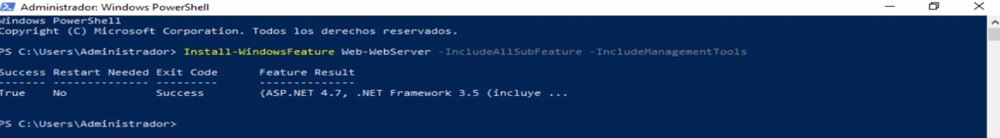
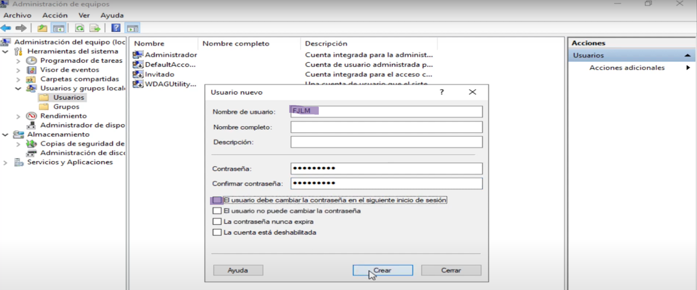
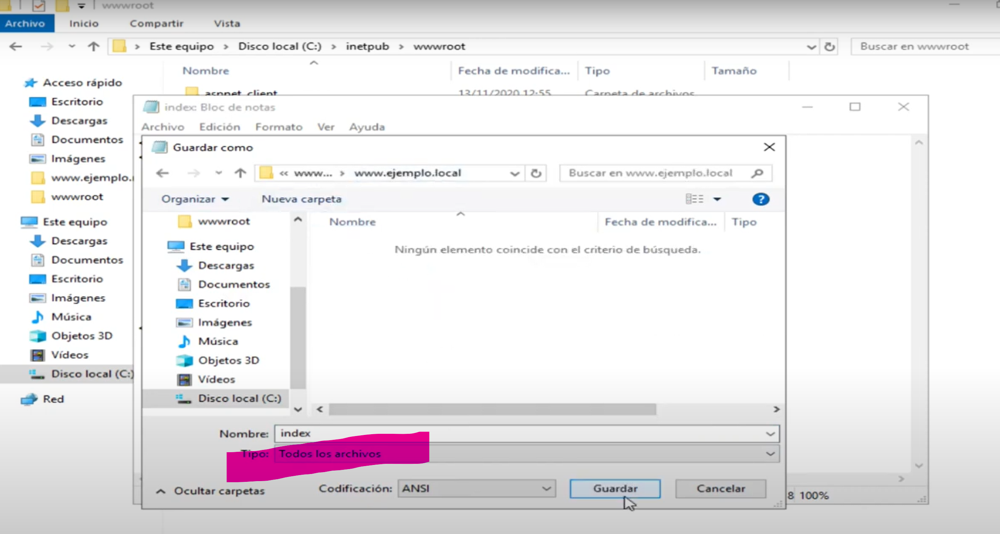
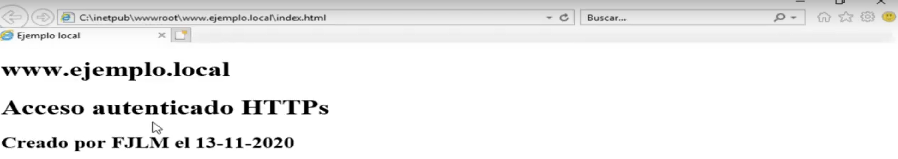

# Guion para la Instalación de un Servidor Web en Windows Server 2019

### 1. Instalar IIS con PowerShell
>Asegúrate de que tienes conexión a internet
   - Abre PowerShell como administrador.
   - Ejecuta el siguiente comando para instalar el servidor web (IIS):
     ```powershell
     Install-WindowsFeature -Name Web-Server -IncludeManagementTools -IncludeAllSubFeature
     ```

### 2. Crear un Usuario de Windows
   - Abre **Administración de Equipos**.
   - Ve a **Usuarios y Grupos Locales** y crea un nuevo usuario con tus INICIALES.
   - Establece una contraseña y configura el usuario con permisos básicos para fines de administración.
  

### 3. Crear Directorios para los Sitios Web en wwwroot
   - Abre el explorador de archivos y navega a la carpeta `C:\inetpub\wwwroot`.
   - Crea dos subdirectorios dentro de `wwwroot`: `sitio1` y `sitio2`.

### 4. Crear Archivos HTML para Cada Sitio Web

> Utilizando el bloc de notas

   - En la carpeta `sitio1`, crea un archivo llamado `index.html` con el siguiente contenido:
     ```html
        <!DOCTYPE html>
        <html lang="en">
        <head>
            <meta charset="UTF-8">
            <meta name="viewport" content="width=device-width, initial-scale=1.0">
            <title>AUTENTICADO</title>
        </head>
        <body>
            <h1>www.INICIALES.local</h1>
            <h1>ACCESO AUTENTICADO con https</h1>
            <h1>Creado por: <strong>INICIALES</strong> el <em>fecha actual</em></h1>
        </body>
        </html>
     ```

> Debes seleccionar **Todos los archivos** cuando guardes el documento.



> Comprueba que el archivo aparece con un icono de internet explores y que, al abrirlo, el navedador lo renderiza adecuadamente




   - Repite el proceso en la carpeta `sitio2`, creando otro `index.html` con el siguiente contenido:
     ```html
        <!DOCTYPE html>
        <html lang="en">
        <head>
            <meta charset="UTF-8">
            <meta name="viewport" content="width=device-width, initial-scale=1.0">
            <title>ANÓNIMO</title>
        </head>
        <body>
            <h1>www.INICIALES.local</h1>
            <h1>ACCESO <strong>ANÓNIMO</strong> con https</h1>
            <h1>Creado por: <strong>INICIALES</strong> el <em>fecha actual</em></h1>
        </body>
        </html>
     ```

### 5. Crear un Certificado Autofirmado para el Sitio con Seguridad
   - Abre **Administrador de IIS**.
   - Ve a **Certificados del Servidor** y selecciona **Crear Certificado Autofirmado** en el panel derecho.
   - Introduce el nombre del certificado, por ejemplo, `sitio1.local` y haz clic en **Aceptar** para generar el certificado.


### 6. Crear el Sitio Web HTTPS en IIS
   - En **Administrador de IIS**, haz clic derecho sobre **Sitios** y selecciona **Agregar sitio web**.
   - Introduce los siguientes detalles:
     - **Nombre del Sitio**: `sitio1`
     - **Ruta Física**: `C:\inetpub\wwwroot\sitio1` (la que corresponda a tu equipo)
     - **Tipo**: `https`
     - **IP**: `All Unassigned`
     - **Puerto**: `443`
     - **Host name**: `sitio1.local`
     - Asocia el certificado autofirmado creado previamente.


### 7. Crear el Sitio Web HTTP en IIS
   - Haz clic derecho sobre **Sitios** y selecciona **Agregar sitio web**.
   - Introduce los siguientes detalles:
     - **Nombre del Sitio**: `sitio2`
     - **Ruta Física**: `C:\inetpub\wwwroot\sitio2` (la que corresponda a tu equipo)
     - **Tipo**: `http`
     - **IP**: `All Unassigned`
     - **Puerto**: `80`
     - **Host name**: `sitio2.net`

### 8. Configurar Autenticación para HTTPS (sitio1.local)
   - Selecciona `sitio1` en **Administrador de IIS**.
   - Haz clic en **Autenticación** y desactiva **Autenticación Anónima**.
   - Activa **Autenticación básica** para que solo los usuarios del servidor puedan acceder.


### 9. Configurar Autenticación para HTTP (sitio2.net)
   - Selecciona `sitio2` en **Administrador de IIS**.
   - Haz clic en **Autenticación** y asegúrate de que **Autenticación Anónima** esté activada, permitiendo acceso público sin necesidad de credenciales.

### 10. Modificar el Archivo de Hosts
   - Abre el archivo `hosts` ubicado en `C:\Windows\System32\drivers\etc\hosts` con permisos de administrador.
   - Añade las siguientes líneas: (con los nombres de host que correspondan a tu escenario)
     ```plaintext
     127.0.0.1   sitio1.local 
     127.0.0.1   sitio2.net
     ```

### 11. Probar Conexión con el Navegador
   - Abre un navegador web en el servidor.
   - Accede a `https://sitio1.local` y verifica que solo se pueda acceder con las credenciales del servidor.
   - Accede a `http://sitio2.net` y verifica que el acceso sea anónimo.


---


