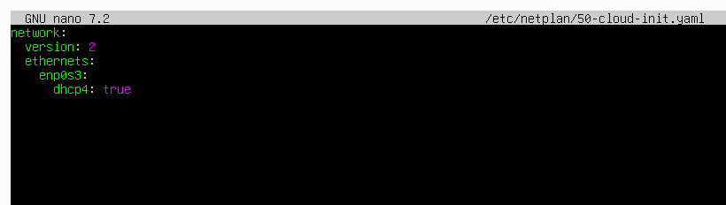
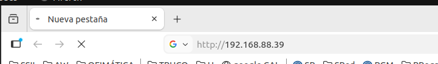
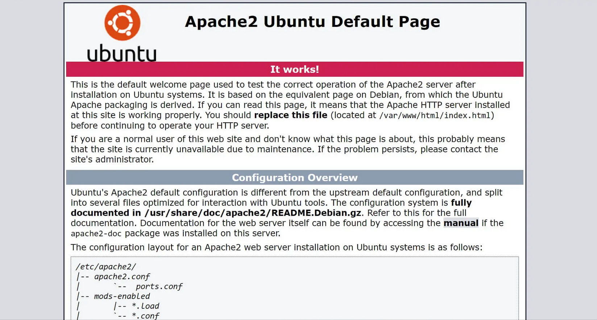
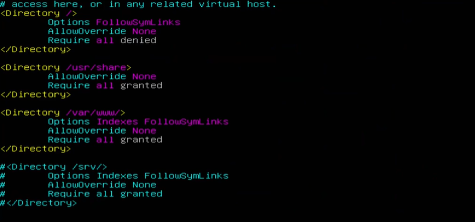
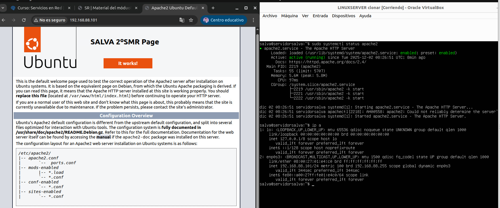
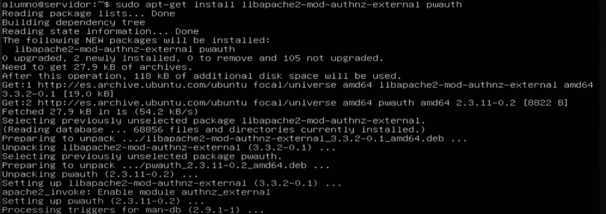
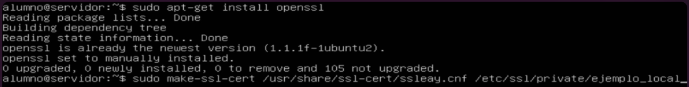
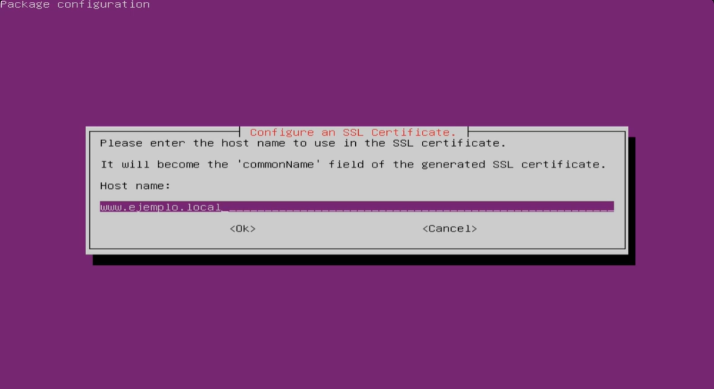

- [📝 **Guion para la práctica: Instalación de Apache y configuración de dos sitios virtuales en Ubuntu Server**](#-guion-para-la-práctica-instalación-de-apache-y-configuración-de-dos-sitios-virtuales-en-ubuntu-server)
- [**PARTE 1 — Instalación de Apache y personalización del sitio por defecto**](#parte-1--instalación-de-apache-y-personalización-del-sitio-por-defecto)
  - [1. **Configuración previa de red en la máquina virtual**](#1-configuración-previa-de-red-en-la-máquina-virtual)
    - [1.1. **Configuración de red por DHCP (modo puente en VirtualBox)**](#11-configuración-de-red-por-dhcp-modo-puente-en-virtualbox)
  - [2. **Instalación del servidor web Apache**](#2-instalación-del-servidor-web-apache)
  - [3. **Comprobación del servicio**](#3-comprobación-del-servicio)
  - [Aquí tienes más información sobre la configuración de apache](#aquí-tienes-más-información-sobre-la-configuración-de-apache)
  - [4. **Personalización del sitio por defecto**](#4-personalización-del-sitio-por-defecto)
- [**PARTE 2 — Convivencia de dos sitios virtuales**](#parte-2--convivencia-de-dos-sitios-virtuales)
- [**PARTE 2a — Sitio con acceso anónimo (HTTP)**](#parte-2a--sitio-con-acceso-anónimo-http)
  - [5. **Creación del directorio y contenido del sitio anónimo**](#5-creación-del-directorio-y-contenido-del-sitio-anónimo)
  - [6. **Creación del VirtualHost del sitio anónimo**](#6-creación-del-virtualhost-del-sitio-anónimo)
  - [7. **Habilitar este sitio y desactivar el sitio por defecto**](#7-habilitar-este-sitio-y-desactivar-el-sitio-por-defecto)
- [**PARTE 2b — Sitio con acceso autenticado y HTTPS**](#parte-2b--sitio-con-acceso-autenticado-y-https)
  - [8. **Creación del directorio y contenido del sitio autenticado**](#8-creación-del-directorio-y-contenido-del-sitio-autenticado)
  - [9. **Instalación de módulos de autenticación externa**](#9-instalación-de-módulos-de-autenticación-externa)
  - [10. **Creación del certificado digital autofirmado**](#10-creación-del-certificado-digital-autofirmado)
  - [11. **Creación del sitio autenticado (HTTPS + Basic Auth + pwauth)**](#11-creación-del-sitio-autenticado-https--basic-auth--pwauth)
  - [12. **Habilitar el sitio autenticado**](#12-habilitar-el-sitio-autenticado)
  - [13. **Consulta de sitios y comprobación de errores**](#13-consulta-de-sitios-y-comprobación-de-errores)
  - [14. **Configuración del archivo hosts en el cliente**](#14-configuración-del-archivo-hosts-en-el-cliente)
  - [15. **Conexión desde cliente web en consola (lynx)**](#15-conexión-desde-cliente-web-en-consola-lynx)
  - [16. **Revisión de logs de Apache**](#16-revisión-de-logs-de-apache)
  - [17. **Volver a red estática en red interna (resumen)**](#17-volver-a-red-estática-en-red-interna-resumen)
    - [1) **Restaurar la copia del archivo original (recomendado)**](#1-restaurar-la-copia-del-archivo-original-recomendado)
    - [2) **Si no hay copia, reescribir el archivo con IP estática**](#2-si-no-hay-copia-reescribir-el-archivo-con-ip-estática)


# 📝 **Guion para la práctica: Instalación de Apache y configuración de dos sitios virtuales en Ubuntu Server**

---

# **PARTE 1 — Instalación de Apache y personalización del sitio por defecto**

---

## 1. **Configuración previa de red en la máquina virtual**

Antes de instalar Apache, configura la red para permitir acceso a Internet y pruebas desde otra máquina.

### 1.1. **Configuración de red por DHCP (modo puente en VirtualBox)**

* Configura la red de la MV en **modo puente** para recibir IP desde el router.
* Edita el archivo de *netplan*:
* (El nombre de archivo `01-netcfg.yaml` puede ser distinto, comprueba previamente cómo se llama en tu máquina)

```bash
ls /etc/netplan/ #comprueba cómo se llama el archivo .yaml en tu caso
sudo cp /etc/netplan/50-cloud.init.yaml /etc/netplan/archivo.DHCP.ORIGINAL
sudo nano /etc/netplan/50-cloud.init.yaml
```

**Contenido para DHCP:**

```yaml
network:
  version: 2
  renderer: networkd
  ethernets:
    enp1s0:
      dhcp4: true
```

Aplica:

```bash
sudo netplan apply
```

Comprueba:

```bash
ip a
ping 8.8.8.8
```

---

## 2. **Instalación del servidor web Apache**

```bash
sudo apt update
sudo apt install apache2 -y
```

---

## 3. **Comprobación del servicio**

Verifica que Apache está instalado:

```bash
ls /etc/apache2
sudo systemctl status apache2
```


Accede al sitio por defecto a través del navedador:



Revisa el archivo de configuración GENERAL DE **APACHE**:

```
sudo nano /etc/apache2/apache2.conf
```



[Aquí tienes más información sobre la configuración de apache](../../SR05WEB/SR0506_config_apache2.md)
---

## 4. **Personalización del sitio por defecto**

El sitio por defecto se sirve desde:

```
/var/www/html/index.html
```

Haz una copia:

```bash
sudo cp /var/www/html/index.html /var/www/html/index.html.ORIGINAL
```

Edita:

```bash
sudo nano /var/www/html/index.html
```

Añade tu nombre, fecha o un mensaje personalizado para comprobar el funcionamiento.

> Entrega una captura similar a esta:




# **PARTE 2 — Convivencia de dos sitios virtuales**

En esta segunda parte crearás **dos sitios web**:

* **Sitio 1 (HTTP, acceso anónimo)**
* **Sitio 2 (HTTPS, acceso autenticado)**

Ambos coexistirán en el mismo servidor Apache.

---

# **PARTE 2a — Sitio con acceso anónimo (HTTP)**

---

## 5. **Creación del directorio y contenido del sitio anónimo**

Creamos la raíz del sitio:

```bash
sudo mkdir -p /var/www/sitio1
```

Creamos su página principal:

```bash
sudo nano /var/www/sitio1/index.html
```

Contenido sugerido:

```html
<!DOCTYPE html>
<html lang="es">
<head>
    <meta charset="UTF-8">
    <title>Sitio Anónimo</title>
</head>
<body>
    <h1>Sitio con acceso anónimo</h1>
    <p>Alumno: [Nombre]</p>
    <p>Fecha: [Fecha]</p>
</body>
</html>
```

---

## 6. **Creación del VirtualHost del sitio anónimo**

Creamos el archivo:

```bash
sudo nano /etc/apache2/sites-available/sitio1.conf
```

Contenido:

```apache
<VirtualHost *:80>
    ServerName sitio1.local
    ServerAdmin admin@sitio1.local

    DocumentRoot /var/www/sitio1

    <Directory /var/www/sitio1>
        Require all granted
    </Directory>
</VirtualHost>
```

---

## 7. **Habilitar este sitio y desactivar el sitio por defecto**

```bash
sudo a2ensite sitio1.conf
sudo a2dissite 000-default.conf
sudo systemctl reload apache2
```

Comprueba que no hay errores:

```bash
sudo systemctl status apache2
```
> Entrega dos capturas:
> 1. Archivo de configuración del sisito
> 2. Acceso al sitio desde un cliente en la misma red (a un lado el servidor, con `systemctl status` y mostrando la ip y, al otro lado, el acceso desde el cliente y mostrando la ip)
>
> .

# **PARTE 2b — Sitio con acceso autenticado y HTTPS**

---

## 8. **Creación del directorio y contenido del sitio autenticado**

```bash
sudo mkdir -p /var/www/sitio2
sudo nano /var/www/sitio2/index.html
```

Contenido:

```html
<!DOCTYPE html>
<html lang="es">
<head>
    <meta charset="UTF-8">
    <title>Sitio Autenticado</title>
</head>
<body>
    <h1>Sitio con acceso autenticado</h1>
    <p>Alumno: [Nombre]</p>
    <p>Fecha: [Fecha]</p>
</body>
</html>
```

---

## 9. **Instalación de módulos de autenticación externa**

```bash
sudo apt install libapache2-mod-authnz-external pwauth -y
```



Activa módulos:

```bash
sudo a2enmod auth_basic
sudo a2enmod authnz_external
```


Crea un usuario local para probar:

```bash
sudo adduser usuario1
```

---

## 10. **Creación del certificado digital autofirmado**

Instala OpenSSL:

```bash
sudo apt install openssl -y
```

Genera certificado autofirmado usando el método clásico de Ubuntu:

```bash
sudo make-ssl-cert /usr/share/ssl-cert/ssleay.cnf /etc/ssl/private/sitio2_cert
```




Activa SSL:

```bash
sudo a2enmod ssl
```


---

## 11. **Creación del sitio autenticado (HTTPS + Basic Auth + pwauth)**

Archivo:

```bash
sudo nano /etc/apache2/sites-available/sitio2.conf
```

Contenido:

```apache
<VirtualHost *:443>
    ServerName sitio2.local
    ServerAdmin admin@sitio2.local

    DocumentRoot /var/www/sitio2

    # Autenticación con pwauth
    DefineExternalAuth pwauth pipe /usr/sbin/pwauth

    <Directory "/var/www/sitio2">
        AuthType Basic
        AuthName "Sitio protegido - Introduzca usuario y clave"
        AuthBasicProvider external
        AuthExternal pwauth
        Require valid-user
    </Directory>

    # Activación SSL
    SSLEngine on
    SSLCertificateFile /etc/ssl/private/sitio2_cert
</VirtualHost>
```


---

## 12. **Habilitar el sitio autenticado**

```bash
sudo a2ensite sitio2.conf
sudo systemctl reload apache2
```

Verifica:

```bash
sudo apache2ctl -M
```

---

## 13. **Consulta de sitios y comprobación de errores**

Consultar sitios disponibles:

```
ls /etc/apache2/sites-available
```

En caso de error:

```bash
journalctl -xe
```


---

## 14. **Configuración del archivo hosts en el cliente**

En Linux:

```bash
sudo nano /etc/hosts
```

En Windows:

Editar:

```
C:\Windows\System32\drivers\etc\hosts
```

Añadir:

```
[IP] sitio1.local
[IP] sitio2.local
```

---

## 15. **Conexión desde cliente web en consola (lynx)**

Instala:

```bash
sudo apt install lynx -y
```

Conecta:

```bash
lynx http://sitio1.local

# Para la web cifrada modificamos el comando para que acepte el certificado autofirmado:
lynx -accept_insecure_https https://sitio2.local

```

---

## 16. **Revisión de logs de Apache**

[ampliacion](../../SR05WEB/SR0504_USwebLog.md)

Aquí tienes **solo lo esencial**, tal como pides, sin pasos adicionales.

---

## 17. **Volver a red estática en red interna (resumen)**

Cuando cambies la MV a **Red interna**, debes **restaurar la configuración de IP estática** en *netplan*.
Hay dos opciones:

---

### 1) **Restaurar la copia del archivo original (recomendado)**

Si hiciste copia antes:

```bash
sudo cp /etc/netplan/01-netcfg.yaml.ESTATICA.ORIGINAL /etc/netplan/01-netcfg.yaml
sudo netplan apply
```

---

### 2) **Si no hay copia, reescribir el archivo con IP estática**

Editar:

```bash
sudo nano /etc/netplan/01-netcfg.yaml
```

Contenido recomendado:

```yaml
network:
  version: 2
  renderer: networkd
  ethernets:
    enp1s0:
      dhcp4: false
      addresses:
        - 192.168.50.10/24
      gateway4: 192.168.50.1
      nameservers:
        addresses:
          - 1.1.1.1
          - 8.8.8.8
```

Aplicar cambios:

```bash
sudo netplan apply
```

---

Esto es lo único imprescindible para retornar la máquina a red estática en red interna.
