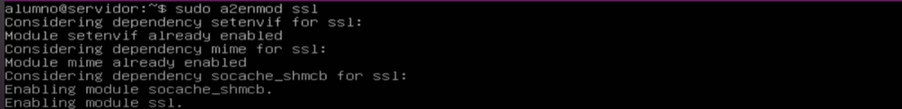

### Guion para la práctica: Instalación de Apache y configuración de dos sitios virtuales en Ubuntu Server

---

#### 1. **Configuración previa de la máquina virtual**
   - Configura la red en modo puente en la máquina virtual para permitir que obtenga una dirección IP desde el servidor DHCP.
   - Habilita DHCP en Ubuntu Server editando el archivo de configuración de red de *netplan*:
     1. Abre el archivo de configuración:
        ```bash
        sudo nano /etc/netplan/01-netcfg.yaml
        ```
     2. Ajusta el contenido para activar DHCP:
        ```yaml
        network:
          version: 2
          renderer: networkd
          ethernets:
            enp1s0:
              dhcp4: true
        ```
     3. Aplica los cambios:
        ```bash
        sudo netplan apply
        ```
   - Comprueba que la máquina ha obtenido una dirección IP válida:
     ```bash
     ip a
     ping 8.8.8.8
     ```

---

#### 2. **Instalación del servidor web Apache**
   - Instala Apache en Ubuntu Server:
     ```bash
     sudo apt update
     sudo apt install apache2 -y
     ```

---

#### 3. **Comprobación de que se ha instalado el servicio web**
   - Verifica que Apache dispone de un directorio y está activo:
     ```bash
     ls /etc/apache2
     sudo systemctl status apache2
     ```
   - Comprueba que la página por defecto es accesible desde el navegador (utiliza la dirección IP de la máquina virtual en el navegador de otra máquina).
   - Explora el archivo de configuración:
    ```bash
     vim /etc/apache2/apache2.conf
     ```
   - 

---

#### 4. **Creación de directorios y recursos de los sitios web**
   - Crea los directorios para los sitios web:
     ```bash
     sudo mkdir -p /var/www/ejemplo.local /var/www/ejemplo.net
     ```
   - Crea un archivo `index.html` básico para cada sitio usando un editor de texto como nano o vim:
     - **Para ejemplo.local (Acceso autenticado):**
       Abre el archivo con un editor de texto:
       ```bash
       sudo nano /var/www/ejemplo.local/index.html
       ```
       Inserta el siguiente código HTML:
        ```html
            <!DOCTYPE html>
            <html lang="es">
            <head>
                <meta charset="UTF-8">
                <meta name="viewport" content="width=device-width, initial-scale=1.0">
                <meta name="description" content="Sitio con acceso autenticado">
                <meta name="author" content="[Nombre del autor o institución]">
                <title>Bienvenido a www.ejemplo.local</title>
            </head>
            <body>
                <h1>Bienvenido a www.ejemplo.local</h1>
                <p>Sitio con acceso autenticado https sobre ubuntu</p>
                <p>Alumno: [Nombre]</p>
                <p>Fecha: [Fecha]</p>
            </body>
            </html>
       ```
     - **Para ejemplo.net (Acceso autenticado):**
       Abre el archivo con un editor de texto:
       ```bash
       sudo nano /var/www/ejemplo.net/index.html
       ```
       Inserta el siguiente código HTML:
        ```html
            <!DOCTYPE html>
            <html lang="es">
            <head>
                <meta charset="UTF-8">
                <meta name="viewport" content="width=device-width, initial-scale=1.0">
                <meta name="description" content="Sitio con acceso anónimo">
                <meta name="author" content="[Nombre del autor o institución]">
                <title>Bienvenido a www.ejemplo.net</title>
            </head>
            <body>
                <h1>Bienvenido a www.ejemplo.net</h1>
                <p>Sitio con acceso anónimo sobre ubuntu</p>
                <p>Alumno: [Nombre]</p>
                <p>Fecha: [Fecha]</p>
            </body>
            </html>
        ```
       

---

#### 5. **Instalación del módulo de autenticación externa**
   - Instala el módulo necesario para autenticación externa:
     ```bash
     sudo apt install libapache2-mod-authnz-external pwauth -y
     ```

    - Activa los módulos de autenticacion básica y externa:
  
  - 
    ```bash
    sudo a2enmod auth_basic
    sudo s2enmod authnz_external
    ```


---

#### 6. **Creación de certificado digital autofirmado para conexiones seguras**

   - Instala openssl el certificado:
     ```bash
     sudo apt install openssl
     ```
   - Crea el certificado:
     ```bash
     sudo make-ssl-cert /usr/share/ssl-cert/ssleay.cnf /etc/ssl/private/ejemplo_local
     ```

> ## Cambiar www.ejemplo.local por el nombre de vuestro sitio
> 


- Activar el módulo de ssl
  ```bash
  sudo a2enmod ssl  
  ```
  
---

#### 7. **Creación de los sitios virtuales (VirtualHosts)**
   - Crea los archivos de configuración para cada sitio virtual:
     - **www.ejemplo.net:**
       ```bash
      LEER DE RECORTE
       </VirtualHost>
       ```

     - **www.ejemplo.local (SSL y autenticación):**
       ```bash
       sudo nano /etc/apache2/sites-available/ejemplo.local.conf
       ```
       Contenido:
       ```apache
       <VirtualHost *:443>
          LEER DE RECORTE
       </VirtualHost>
       ```
       

---

#### 8. **Habilitación y deshabilitación de sitios virtuales**
   - Habilita los sitios creados y desactiva el sitio por defecto:
     ```bash
     sudo a2ensite ejemplo.local.conf ejemplo.net.conf
     sudo a2dissite 000-default.conf
     sudo systemctl reload apache2
     ```

---

#### 9. **Conexión desde el navegador en una máquina remota**
   - Edita el archivo `hosts` en la máquina cliente para acceder a los sitios virtuales:
     - **En Linux:**
       ```bash
       sudo nano /etc/hosts
       ```
     - **En Windows:**
       Edita el archivo `C:\Windows\System32\drivers\etc\hosts`.
     - Añade estas líneas:
       ```
       [IP de la MV] www.ejemplo.local
       [IP de la MV] www.ejemplo.net
       ```

---

#### 10. **Conexión desde un cliente web en modo consola**
   - Instala *lynx*:
     ```bash
     sudo apt install lynx -y
     ```
   - Conéctate a los sitios:
     ```bash
     lynx www.ejemplo.local
     lynx https://www.ejemplo.net
     ```

---

