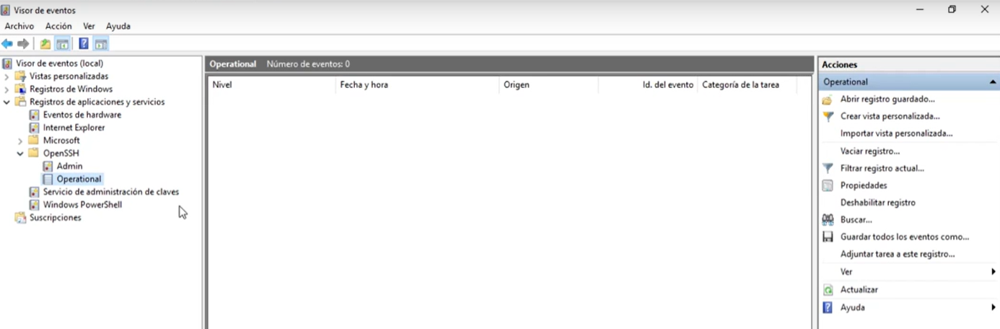
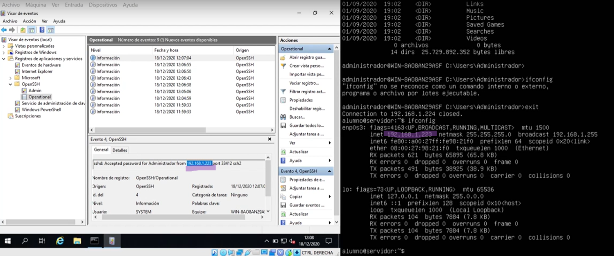

- [🧪 PRÁCTICA GUIADA — CONFIGURACIÓN Y PRUEBA DE SSH](#-práctica-guiada--configuración-y-prueba-de-ssh)
  - [🎯 OBJETIVO DE LA PRÁCTICA](#-objetivo-de-la-práctica)
  - [📘 1 SSH EN UBUNTU SERVER](#-1-ssh-en-ubuntu-server)
    - [1️⃣ Comprobar red y conexión a Internet](#1️⃣-comprobar-red-y-conexión-a-internet)
    - [2️⃣ Actualizar el sistema](#2️⃣-actualizar-el-sistema)
    - [3️⃣ Instalar el servidor SSH](#3️⃣-instalar-el-servidor-ssh)
    - [4️⃣ Comprobar que el servicio está activo](#4️⃣-comprobar-que-el-servicio-está-activo)
    - [5️⃣ Permitir SSH en el firewall](#5️⃣-permitir-ssh-en-el-firewall)
    - [6️⃣ Ver los registros de acceso](#6️⃣-ver-los-registros-de-acceso)
    - [**Comprobar conexiones activas:**](#comprobar-conexiones-activas)
  - [📘 2 — SSH EN WINDOWS SERVER](#-2--ssh-en-windows-server)
    - [7️⃣ Comprobar si SSH está instalado](#7️⃣-comprobar-si-ssh-está-instalado)
    - [8️⃣ Instalar OpenSSH (si no está instalado al comprobar en 7️⃣)](#8️⃣-instalar-openssh-si-no-está-instalado-al-comprobar-en-7️⃣)
    - [9️⃣ Activar el servicio SSH](#9️⃣-activar-el-servicio-ssh)
    - [🔟 Revisar los eventos del servicio](#-revisar-los-eventos-del-servicio)
  - [🔗 CONEXIÓN ENTRE UBUNTU Y WINDOWS](#-conexión-entre-ubuntu-y-windows)
    - [1️⃣1️⃣ Conectar desde Ubuntu a Windows](#1️⃣1️⃣-conectar-desde-ubuntu-a-windows)
    - [1️⃣2️⃣ Comprobar el registro en Windows](#1️⃣2️⃣-comprobar-el-registro-en-windows)
    - [1️⃣3️⃣ Conectar desde Windows a Ubuntu](#1️⃣3️⃣-conectar-desde-windows-a-ubuntu)
    - [1️⃣4️⃣ Ver usuarios conectados en Ubuntu](#1️⃣4️⃣-ver-usuarios-conectados-en-ubuntu)
  - [📸 CAPTURAS A ENTREGAR](#-capturas-a-entregar)
  - [📷 **CAPTURA 1 — CONEXIÓN SSH A SERVIDOR LINUX (UBUNTU SERVER)**](#-captura-1--conexión-ssh-a-servidor-linux-ubuntu-server)
  - [📷 **CAPTURA 2 — CONEXIÓN SSH A SERVIDOR WINDOWS SERVER**](#-captura-2--conexión-ssh-a-servidor-windows-server)
  - [� **CAPTURA 3 — CONEXIÓN SSH A SERVIDOR ssh DE UN COMPAÑERO utilizando la IP**](#-captura-3--conexión-ssh-a-servidor-ssh-de-un-compañero-utilizando-la-ip)
  - [📷 **CAPTURA 4 — CONEXIÓN SSH A SERVIDOR ssh DE UN COMPAÑERO utilizando un nombre de dominio**](#-captura-4--conexión-ssh-a-servidor-ssh-de-un-compañero-utilizando-un-nombre-de-dominio)
  - [📌 CONCLUSIÓN](#-conclusión)
# 🧪 PRÁCTICA GUIADA — CONFIGURACIÓN Y PRUEBA DE SSH

## 🎯 OBJETIVO DE LA PRÁCTICA

Aprender a **acceder remotamente de forma segura** a un sistema informático utilizando **SSH**, comprendiendo:

* qué equipo actúa como **cliente** y cuál como **servidor**
* qué papel juegan los **servicios**, el **firewall** y los **usuarios**
* cómo **verificar** que una conexión se ha realizado correctamente

---

🧠 IDEA CLAVE

> **SSH permite controlar un equipo remoto desde la línea de comandos**, pero para que funcione:
>
> * el equipo remoto debe tener **un servicio SSH activo**
> * la red debe permitir la comunicación
> * el usuario debe existir en el sistema remoto

---

## 📘 1 SSH EN UBUNTU SERVER

### 1️⃣ Comprobar red y conexión a Internet

1. Comprueba que el equipo tiene dirección IP:

   ```
   ip a
   ```

   * Anota la dirección IP asignada.

2. Comprueba la **salida a Internet** haciendo un ping a un servidor externo:

   ```
   ping -c 3 8.8.8.8
   ```

> 🧠 **Interpretación de resultados:**
>
> * Si `ip a` no muestra IP → problema de red local.
> * Si `ping 8.8.8.8` falla → no hay salida a Internet.

Si falla la conexión a internet:[Configura netplan en DHCP](../../linux/SR005netplan.md)

> ❗ **Sin conexión a Internet no se puede instalar software con `apt`.**


### 2️⃣ Actualizar el sistema

```
sudo apt update
```

(Si el sistema lo pide, acepta las actualizaciones).

---

### 3️⃣ Instalar el servidor SSH

```
sudo apt install openssh-server -y
```

> 📌 *Ubuntu será el **servidor SSH***.

---

### 4️⃣ Comprobar que el servicio está activo

```
sudo systemctl status ssh
```

* El servicio debe aparecer como **active (running)**.

> ❗ Si el servicio no está activo, **no se puede conectar nadie**.

---

### 5️⃣ Permitir SSH en el firewall

1. Permitir el servicio:

   ```
   sudo ufw allow ssh
   ```
2. Activar el firewall:

   ```
   sudo ufw enable
   ```
3. Comprobar el estado:

   ```
   sudo ufw status
   ```

> 🧠 *El firewall controla qué conexiones entran o salen del sistema.*

---

### 6️⃣ Ver los registros de acceso

```
sudo grep sshd /var/log/auth.log
```

> 📌 Aquí se guardarán los intentos de conexión SSH.

### **Comprobar conexiones activas:**

```
who
```


---

## 📘 2 — SSH EN WINDOWS SERVER

### 7️⃣ Comprobar si SSH está instalado

1. Abre **PowerShell como administrador**.
2. Ejecuta:

   ```
   Get-WindowsCapability -Online | Where-Object Name -like "OpenSSH*"
   ```
3. Mira los resultados, Comprueba si **Client** y **Server** están en estado `Installed`.

---

> ⚠️ Este proceso requiere **conexión a Internet**.

### 8️⃣ Instalar OpenSSH (si no está instalado al comprobar en 7️⃣)

```
Add-WindowsCapability -Online -Name OpenSSH.Client~~~~0.0.1.0
Add-WindowsCapability -Online -Name OpenSSH.Server~~~~0.0.1.0
```

> ⚠️ Este proceso requiere **conexión a Internet**.

Reinicia el servidor cuando termine.

---

### 9️⃣ Activar el servicio SSH

```
Set-Service -Name sshd -StartupType Automatic
Start-Service sshd
```

Comprueba el estado:

```
Get-Service sshd
```

---

### 🔟 Revisar los eventos del servicio

1. Abre el **Visor de eventos**.
2. Accede a:

   ```
   Registros de aplicaciones y servicios > OpenSSH > Operational
   ```


3. Observa los eventos registrados.

> 📌 Aquí quedará constancia de las conexiones SSH.



---

## 🔗 CONEXIÓN ENTRE UBUNTU Y WINDOWS

> ⚠️ Ambos equipos deben estar **en la misma red**.

---

### 1️⃣1️⃣ Conectar desde Ubuntu a Windows

Desde Ubuntu:

```
ssh usuario_windows@IP_windows
```

* Introduce la contraseña del usuario de Windows.

Ejecuta:

```
dir
```

> ✔️ Si ves archivos, la conexión es correcta.

---

### 1️⃣2️⃣ Comprobar el registro en Windows

* Revisa el visor de eventos OpenSSH.
* Debe aparecer un acceso entrante.



---

### 1️⃣3️⃣ Conectar desde Windows a Ubuntu

Desde PowerShell:

```
ssh usuario_ubuntu@IP_ubuntu
```

Introduce la contraseña del usuario de Ubuntu.

---

### 1️⃣4️⃣ Ver usuarios conectados en Ubuntu

```
who
```

> ✔️ Debe aparecer la sesión SSH activa.

  

## 📸 CAPTURAS A ENTREGAR

El alumno deberá entregar **DOS capturas de pantalla**, claramente identificadas como **REM1tuNombre** y **REM2tuNombre**.
Cada captura debe mostrar **simultáneamente** la información indicada.

---

## 📷 **CAPTURA 1 — CONEXIÓN SSH A SERVIDOR LINUX (UBUNTU SERVER)**

🔹 SERVIDOR (Ubuntu Server)

La captura debe mostrar:

* Servicio activo:

  ```
  sudo systemctl status ssh
  ```

* La **dirección IP del servidor Linux**, obtenida con:

  ```
  ip a
  ```
* El comando:

  ```
  who
  ```

  donde se vea claramente **la sesión SSH activa del cliente**.

---

🔹 CLIENTE (equipo que se conecta al servidor Linux)

En la **misma captura** debe verse:

* La **dirección IP del cliente**, obtenida con:

  ```
  ip a
  ```

  o

  ```
  ipconfig
  ```
* El comando de conexión SSH:

  ```
  ssh usuario@IP_servidor_linux
  ```
* La conexión establecida correctamente (terminal operativo).

> 📌 Esta captura demuestra que:
>
> * el servicio SSH está activo en Linux
> * el cliente se conecta correctamente al servidor

---

## 📷 **CAPTURA 2 — CONEXIÓN SSH A SERVIDOR WINDOWS SERVER**

🔹 SERVIDOR (Windows Server)

La captura debe mostrar:

* La **dirección IP del servidor Windows**, obtenida con:

  ```
  ipconfig
  ```
* El **Visor de eventos**, en la ruta:

  ```
  Registros de aplicaciones y servicios > OpenSSH > Operational
  ```

  donde se observe **el evento de conexión SSH del cliente**.

---

🔹 CLIENTE (equipo que se conecta al servidor Windows)

En la **misma captura** debe verse:

* La **dirección IP del cliente**, obtenida con:

  ```
  ip a
  ```

  o

  ```
  ipconfig
  ```
* El comando:

  ```
  ssh usuario@IP_servidor_windows
  ```
* La conexión SSH establecida correctamente.

> 📌 Esta captura demuestra que:
>
> * el servicio SSH está instalado y activo en Windows Server
> * el servidor registra correctamente las conexiones entrantes

---

## 📷 **CAPTURA 3 — CONEXIÓN SSH A SERVIDOR ssh DE UN COMPAÑERO utilizando la IP**
## 📷 **CAPTURA 4 — CONEXIÓN SSH A SERVIDOR ssh DE UN COMPAÑERO utilizando un nombre de dominio**

⚠️ CONDICIONES IMPORTANTES

* Las capturas deben ser **claras y legibles**.
* Debe verse **completo el terminal o ventana**, no recortes parciales.
* Las IP del cliente y del servidor deben ser **coherentes con la red**.
* Si falta alguno de los elementos indicados, **la captura no se considera válida**.

## 📌 CONCLUSIÓN

Con esta práctica has aprendido que:

* SSH es un **servicio**, no solo un comando.
* Una conexión remota depende de **red, servicio y usuario**.
* Un administrador **no solo conecta**, también **verifica**.

