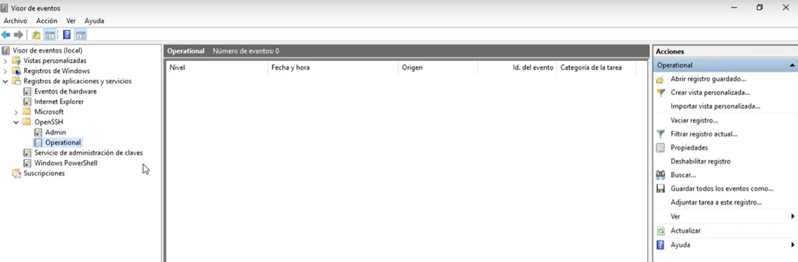
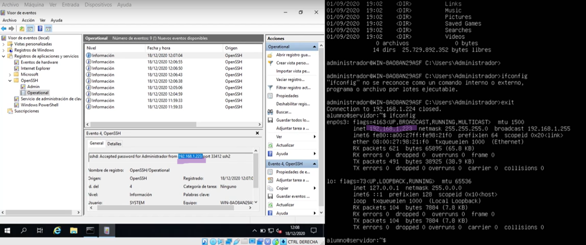
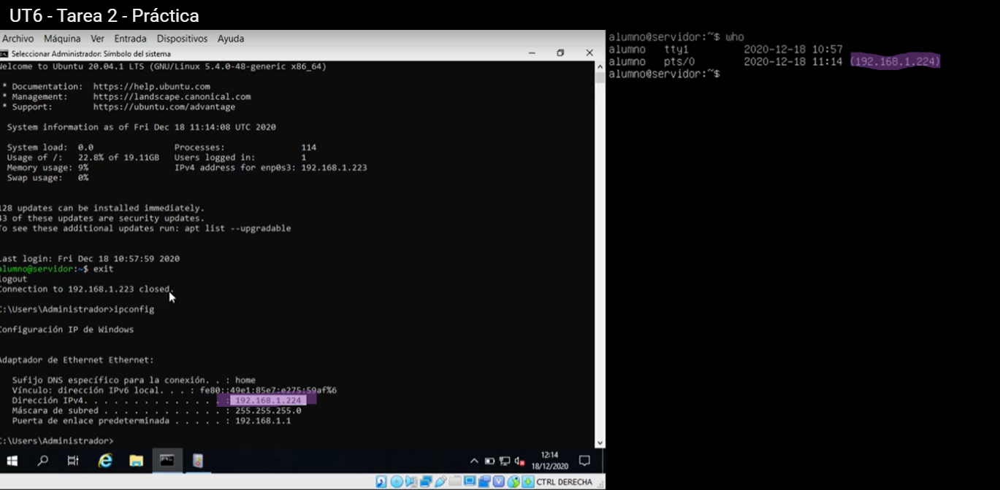

**PRÁCTICA DE CONFIGURACIÓN Y PRUEBA DE SSH ENTRE WINDOWS SERVER Y UBUNTU SERVER**

## **WINDOWS SERVER**

1. **Comprobar si SSH está disponible:**

   - Abrir PowerShell como administrador.
   - Ejecutar el comando: `Get-WindowsCapability -Online | ? Name -like "OpenSSH*"`
   - Verificar si está instalado el cliente y servidor SSH.

2. **Instalar componentes faltantes (si es necesario):**

   - Cliente SSH: `Add-WindowsCapability -Online -Name OpenSSH.Client~~~~0.0.1.0`
   - Servidor SSH: `Add-WindowsCapability -Online -Name OpenSSH.Server~~~~0.0.1.0`

      - *puede tardar un bastante dependiendo del estado de los servidores de microsof*t
   - ALTERNATIVA: `DISM /Online /Add-Capability /CapabilityName:OpenSSH.Server~~~~0.0.1.0`
   - REINICIAR

3. **Configurar arranque automático:**

   - Activar y configurar el servicio OpenSSH:
     ```
     Set-Service -Name sshd -StartupType Automatic
     Start-Service sshd
     ```
   - Activar y configurar el cliente SSH-Agent:
     ```
     Set-Service -Name ssh-agent -StartupType Automatic
     Start-Service ssh-agent
     ```
   - Verificar el estado:
     ```
     Get-Service sshd
     Get-Service ssh-agent
     ```

4. **Explorar el visor de eventos:**

   - Abrir el Visor de Eventos.
   - Navegar a **Applications and Services Logs / Registro de operaciones y servicios** > **OpenSSH** > **Operational**.
   - Observar los eventos relacionados con SSH.




## **UBUNTU SERVER**

5. **Configurar Ubuntu Server en DHCP:**

   - Confirmar que la interfaz de red esté configurada para obtener dirección IP automáticamente.
     - - [guía](https://miguitel.github.io/SR/linux/SR00linux.html#configuraci%C3%B3n-de-red-con-netplan-ampliaci%C3%B3n)
   - Editar el archivo de configuración de red (ejemplo para Netplan):
     ```
     sudo nano /etc/netplan/01-netcfg.yaml
     ```
   - Configurar `dhcp4: true` para la interfaz correspondiente y aplicar cambios:
     ```
     sudo netplan apply
     ```

6. **Actualizar repositorios:**

   ```
   sudo apt update && sudo apt upgrade -y
   ```

7. **Instalar OpenSSH:**

   ```
   sudo apt install openssh-server -y
   ```

8. **Habilitar el firewall:**

   - Permitir conexiones SSH:
     ```
     sudo ufw allow ssh
     sudo ufw enable
     ```

9. **Comprobar el estado del servicio SSH:**

   ```
   sudo systemctl status ssh
   ```

10. **Verificar el archivo de log:**

    - Filtrar eventos relacionados con SSH en el archivo `auth.log`:
      ```
      sudo grep sshd /var/log/auth.log
      ```

11. **Comprobar conexiones activas:**

    ```
    who
    ```


**CONECTAR ENTRE ELLOS**

Deben formar parte de la misma RED.

12. **Conectar desde Ubuntu Server a Windows Server:**

    ```
    ssh usuario@direccion_ip_windows
    ```

    - Introducir la contraseña del usuario de Windows Server.
    - Ejecuta DIR y comprueba que ves el contenido del Servidor Windows.

13. **Comprobar eventos en el visor de Windows Server:**

    - Revisar el Visor de Eventos > OpenSSH para registrar la conexión entrante.



14. **Conectar desde Windows Server a Ubuntu Server:**

    - Desde PowerShell:
      ```
      ssh usuario@direccion_ip_ubuntu
      ```
    - Introducir la contraseña del usuario de Ubuntu Server.

15. **Verificar la conexión en Ubuntu Server:**

    ```
    who
    ```

    - Confirmar que la sesión SSH del usuario de Windows Server está activa.
  
  

**NOTAS ADICIONALES:**

- Para fortalecer la seguridad, configurar la autenticación basada en claves SSH.
- En caso de problemas, verificar configuraciones de firewall, puertos y servicios.
- Asegurarse de que los puertos 22 (Ubuntu) y 22/SSH (Windows Server) estén abiertos en las respectivas configuraciones de firewall.

