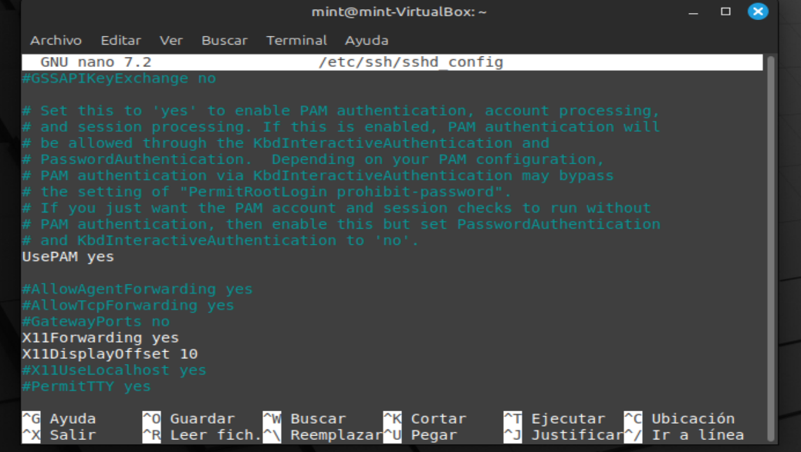
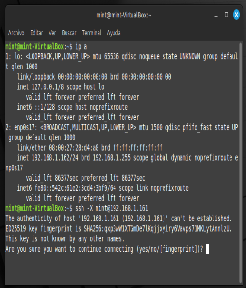
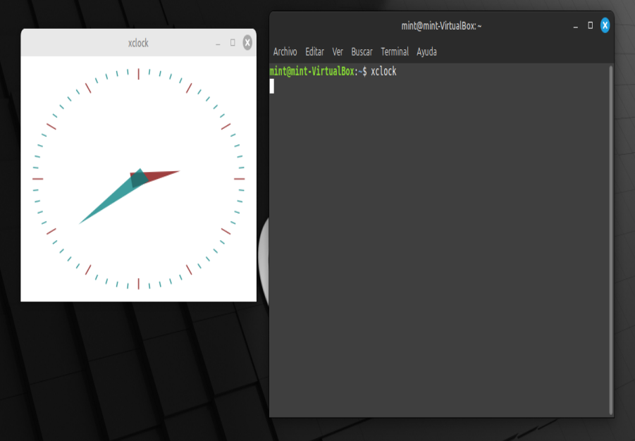
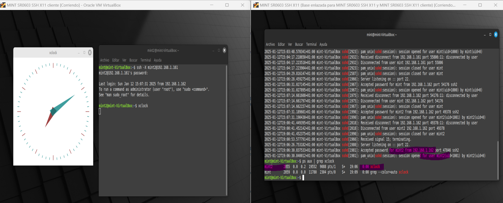
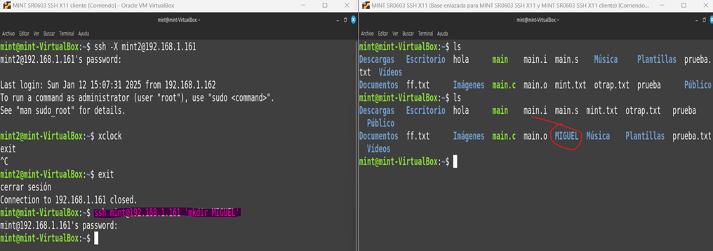

# Práctica: Uso de SSH con Reenvío X11 en Ubuntu Desktop

## Introducción
En esta práctica, los alumnos configurarán un servidor SSH en Ubuntu Desktop para probar el reenvío de aplicaciones gráficas mediante X11. El objetivo es comprender cómo funciona esta funcionalidad y probar su rendimiento en diferentes condiciones.

---

## **Pasos a seguir**

### 1. Instalar y configurar un servidor SSH en Ubuntu Desktop
- **Objetivo**: Tener un servidor SSH funcional.
- Pasos:
  1. Instalar el paquete `openssh-server` en el servidor:
     ```bash
     sudo apt update && sudo apt install openssh-server
     ```
  2. Verificar que el servicio está activo:
     ```bash
     sudo systemctl status ssh
     ```


### 2. Habilitar el reenvío de X11 en la configuración del servidor SSH
- **Objetivo**: Configurar el servidor SSH para permitir aplicaciones gráficas.
- Pasos:
  1. Editar el archivo de configuración del servidor SSH:
     ```bash
     sudo nano /etc/ssh/sshd_config
     ```
  2. Asegurarse de que las siguientes opciones están activadas (o descomentarlas):
     ```
     X11Forwarding yes
     X11DisplayOffset 10
     ```
  
  
  3. Reiniciar el servicio SSH para aplicar los cambios:
     ```bash
     sudo systemctl restart ssh
     ```

### 3. Configurar el cliente SSH para permitir el reenvío de X11
- **Objetivo**: Preparar el cliente SSH para aceptar aplicaciones gráficas del servidor.
- Pasos:
  1. Verificar que el cliente tiene instalado el paquete `ssh`:
     ```bash
     sudo apt update && sudo apt install openssh-client
     ```
  2. Verificar que el directorio `~/.ssh/` existe: (si no existe, lo crea)
     ```bash
     mkdir -p ~/.ssh/
     ```
  3. Comprobar que el reenvío X11 está habilitado de forma predeterminada. Editar o crear el archivo `~/.ssh/config` si es necesario:
     ```
     Host *
         ForwardX11 yes
     ```

### 4. Verificar que el servidor X11 está activo y configurado correctamente en el cliente
- **Objetivo**: Confirmar que el cliente puede recibir aplicaciones X11.
- Pasos:
  1. Instalar un servidor X si es necesario (normalmente ya está configurado en Ubuntu Desktop).
  2. Asegurarse de que la variable de entorno `DISPLAY` está configurada:
     ```bash
     echo $DISPLAY
     > 0:
     ```
     Si no hay salida, iniciar sesión en un entorno gráfico o configurar el servidor X manualmente.

### 5. Probar la conexión SSH con reenvío de X11 desde el cliente al servidor
- **Objetivo**: Verificar que la conexión SSH permite ejecutar aplicaciones gráficas.
- Pasos:
  1. Conectarse al servidor SSH desde el cliente con el reenvío de X11 habilitado:
     ```bash
     ssh -X usuario@direccion_ip_del_servidor
     ```
  
  
  2. Comprobar que la variable `DISPLAY` está configurada en la sesión remota:
     ```bash
     echo $DISPLAY
     > 10:0 (o similar)
     ```

### 6. Ejecutar y verificar la aplicación gráfica en el servidor remoto

#### 6.1 Ejecutar la aplicación gráfica
- **Objetivo**: Probar que las aplicaciones gráficas funcionan a través del reenvío X11.
- Pasos:
  1. Ejecutar una aplicación gráfica, como un editor de texto o un navegador:
     ```bash
     xclock
     ```
  2. Verificar que la aplicación se abre en el cliente local.



#### 6.2 Verificar la ejecución en el servidor remoto
- **Objetivo**: Confirmar que la aplicación gráfica está siendo ejecutada en el servidor remoto.
- Pasos:
  1. En el servidor, usar el comando:
     ```bash
     grep 'sshd' /var/log/auth.log
     ```
  4. Verificar que aparece una conexión desde la ip del cliente con el nombre del usuario utilizado.
  3. En el servidor remoto, usar el comando:
     ```bash
     ps aux | grep xclock
     ```
  4. Verificar que aparece un proceso relacionado con la aplicación ejecutada.



### 7. Ejecutar comandos directamente, sin establecer conexión

Es posible ejecutar comandos que actúen en el servidor directamente desde el cliente, sin necesidad de establecer una conexión.

Para ello, utilizamos la siguiente sintaxis:

   ```bash
   ssh -X usuario@ipdelservidor comando

   # ejemplo: (crea un directorio en el servidor)
   
   ssh -X miguel@172.100.50.25 mkdir 'NUEVO'   
   ```

### (OPCIONAL) 8. Analizar el tráfico generado y su rendimiento en diferentes condiciones de red
### 7. Ejecutar comandos directamente, sin establecer conexión

Es posible ejecutar comandos que actúen en el servidor directamente desde el cliente, sin necesidad de establecer una conexión.

Para ello, utilizamos la siguiente sintaxis:

   ```bash
   ssh -X usuario@ipdelservidor comando

   # ejemplo: (crea un directorio en el servidor)
   
   ssh -X miguel@172.100.50.25 mkdir 'NUEVO'   
   ```


### (OPCIONAL) 8. Analizar el tráfico generado y su rendimiento en diferentes condiciones de red
- **Objetivo**: Entender el impacto del reenvío X11 en el rendimiento de la red.
- Pasos:
  1. Usar herramientas como `iftop` o `nload` para analizar el tráfico generado:
     ```bash
     sudo apt install iftop
     sudo iftop -i <interfaz_de_red>
     ```
  2. Cambiar la red a una conexión de baja velocidad (simulada) y repetir la prueba.

### (OPCIONAL) 9. Deshabilitar el reenvío de X11 y comprobar que las aplicaciones gráficas dejan de funcionar
- **Objetivo**: Validar el efecto de deshabilitar el reenvío X11 en SSH.
- Pasos:
  1. *SERVIDOR:* Editar el archivo de configuración del servidor SSH:
     ```bash
     sudo nano /etc/ssh/sshd_config
     ```
  2. Cambiar la opción `X11Forwarding` a `no`. Esto deshabilitará el reenvío X11, impidiendo que las aplicaciones gráficas del servidor se muestren en el cliente local.
  3. Reiniciar el servicio SSH:
     ```bash
     sudo systemctl restart ssh
     ```
  4. *CLIENTE:* Cerrar la conexión SSH actual:
     ```bash
     exit
     ```
  5. Reconectar al servidor SSH con una nueva sesión y verificar que no es posible ejecutar aplicaciones gráficas.

---


