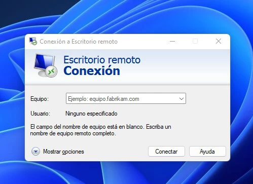
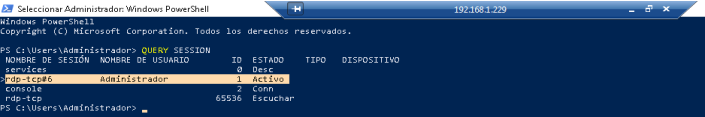

## - [**Tarea: Configuración de RDP en Windows Server 2019 y Pruebas desde Clientes Windows y Ubuntu**](#tarea-configuración-de-rdp-en-windows-server-2019-y-pruebas-desde-clientes-windows-y-ubuntu)
- [- **Tarea: Configuración de RDP en Windows Server 2019 y Pruebas desde Clientes Windows y Ubuntu**](#--tarea-configuración-de-rdp-en-windows-server-2019-y-pruebas-desde-clientes-windows-y-ubuntu)
  - [Introducción](#introducción)
  - [Parte 1: Configuración de RDP en Windows Server 2019](#parte-1-configuración-de-rdp-en-windows-server-2019)
  - [Parte 2: Pruebas de conexión desde los clientes](#parte-2-pruebas-de-conexión-desde-los-clientes)
    - [2.1. Cliente Windows 10](#21-cliente-windows-10)
    - [2.2. Cliente Ubuntu Desktop](#22-cliente-ubuntu-desktop)
  - [✅ Captura 1: Conexión desde cliente Windows](#-captura-1-conexión-desde-cliente-windows)
  - [✅ Captura 2: Conexión desde cliente Ubuntu](#-captura-2-conexión-desde-cliente-ubuntu)

### Introducción

El objetivo de esta tarea es aprender a configurar el servicio de acceso remoto mediante el protocolo RDP (Remote Desktop Protocol) en un entorno Windows Server 2019 y probar su funcionamiento desde dos clientes distintos: uno con Windows 10 y otro con Ubuntu Desktop. Al finalizar, serás capaz de establecer conexiones remotas de manera segura y eficiente entre diferentes sistemas operativos.

---

### Parte 1: Configuración de RDP en Windows Server 2019

1. **Activación del servicio RDP**

   - Habilita el servicio de Escritorio Remoto en Windows Server 2019 desde:
     - Interfaz gráfica: "Propiedades del sistema" → "Acceso remoto" → Activar "Permitir conexiones remotas a este equipo".
     - Línea de comandos (PowerShell):
       ```powershell
       Set-ItemProperty -Path 'HKLM:\System\CurrentControlSet\Control\Terminal Server' -Name "fDenyTSConnections" -Value 0
       Enable-NetFirewallRule -DisplayGroup "Escritorio Remoto"
       ```

2. **Creación de un usuario autorizado**

   - Crea un nuevo usuario en el servidor:
     1. Abre "Administración de equipos" → "Usuarios y grupos locales" → "Usuarios".
     2. Haz clic derecho en "Usuarios" y selecciona "Nuevo usuario".
     3. Introduce un nombre de usuario, contraseña y desmarca "El usuario debe cambiar la contraseña en el siguiente inicio de sesión" si lo prefieres.
     4. Haz clic en "Crear" y luego en "Cerrar".

   - Añade el usuario al grupo "Usuarios de Escritorio Remoto":
     1. Ve a "Administración de equipos" → "Usuarios y grupos locales" → "Grupos".
     2. Haz doble clic en el grupo "Usuarios de Escritorio Remoto".
     3. Haz clic en "Agregar" y escribe el nombre del usuario creado.
     4. Haz clic en "Aceptar" para guardar los cambios.

3. **Configuración de red**
   - Asegúrate de que el servidor tiene asignada una dirección IP fija o que puedes localizarlo mediante su nombre en la red.
   - Verifica la conectividad desde los clientes mediante un comando `ping` hacia la dirección IP del servidor.

4. **Prueba del servicio**
   - Desde el servidor, comprueba que el servicio de Escritorio Remoto está habilitado y activo.
   - Realiza una prueba inicial de conexión local para verificar que el servicio funciona correctamente.



---

### Parte 2: Pruebas de conexión desde los clientes

#### 2.1. Cliente Windows 10
1. **Iniciar la conexión desde Windows**:
   - Abre la herramienta "Conexión a Escritorio Remoto" (mstsc).
   - Introduce la dirección IP del servidor configurado.
   - Introduce las credenciales de usuario del servidor.

2. **Verificación**:
   - Comprueba que puedes interactuar con el servidor de manera fluida.


#### 2.2. Cliente Ubuntu Desktop

1. **Instalación del cliente RDP en Ubuntu**

   * Instala la herramienta `remmina`, uno de los clientes de escritorio remoto más utilizados en entornos Linux:

     ```bash
     sudo apt-get update -y
     sudo apt-get install remmina remmina-plugin-rdp -y
     ```

2. **Conexión al servidor**

   * Abre **Remmina**.
   * Crea una nueva conexión o usa la conexión rápida.
   * Selecciona el protocolo **RDP**.
   * Introduce la dirección IP o el nombre del servidor.
   * Indica el usuario y la contraseña del servidor y conecta.

3. **Verificación**

   * Comprueba que puedes acceder correctamente al escritorio remoto del servidor Windows Server 2019 y trabajar sobre él.

4. **Alternativa**

   * Como alternativa, puedes utilizar la herramienta `vinagre`, que también permite realizar conexiones mediante RDP.


---

> Recuerda, en las capturas se debe ver la ventana completa y el nombre de la máquina virtual

### ✅ Captura 1: Conexión desde cliente Windows

Una única captura donde se muestre:

* En el **cliente Windows 10**:

  * Conexión activa por Escritorio Remoto al servidor Windows Server 2019.

* En el **servidor Windows Server 2019**:

  * Ejecución del comando `query session`, donde se vea claramente la sesión remota activa y el usuario conectado.

---

### ✅ Captura 2: Conexión desde cliente Ubuntu

Una única captura donde se muestre:

* En el **cliente Ubuntu Desktop**:

  * Conexión RDP activa al servidor Windows Server 2019.

* En el **servidor Windows Server 2019**:

  * Ejecución del comando `query session`, donde se vea claramente la sesión remota activa desde el cliente Ubuntu.
---

.

.

.

.

> Aspecto de la salida del comando `query session`:
> 