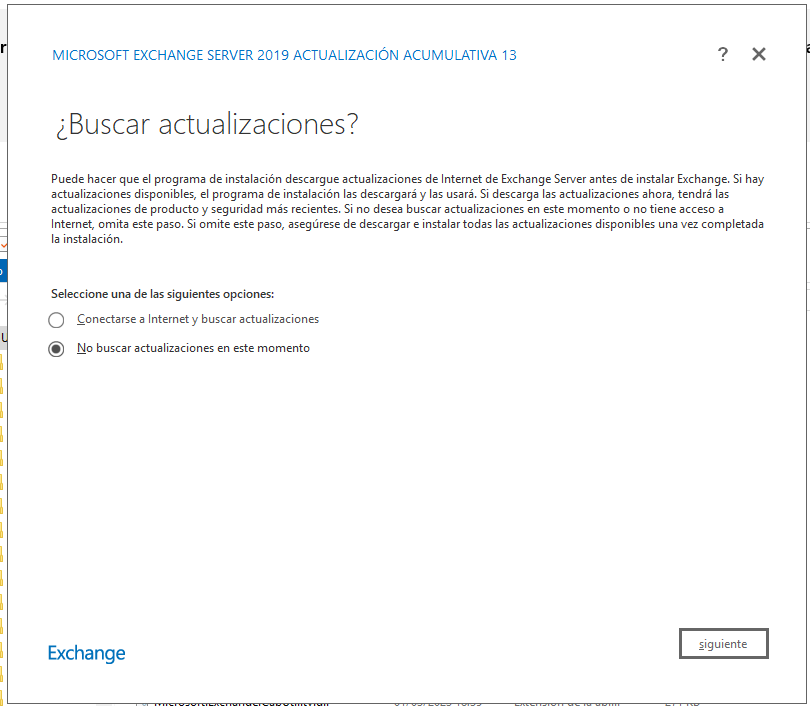
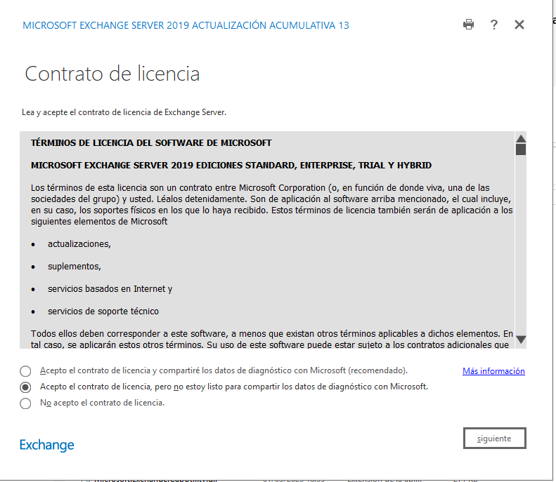
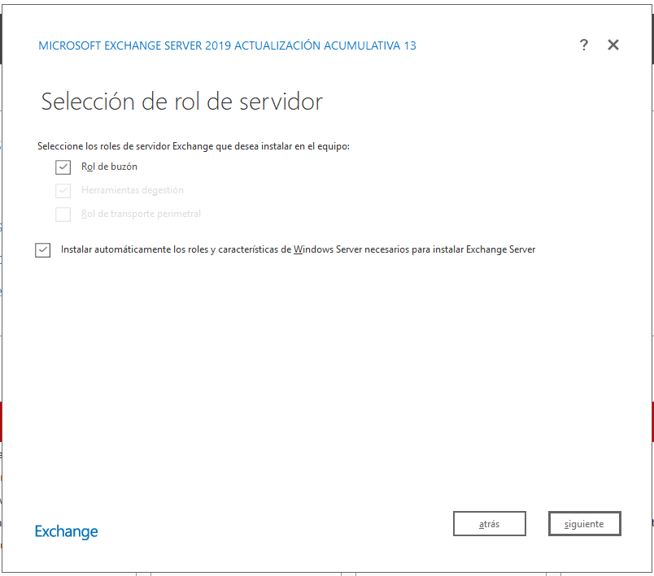
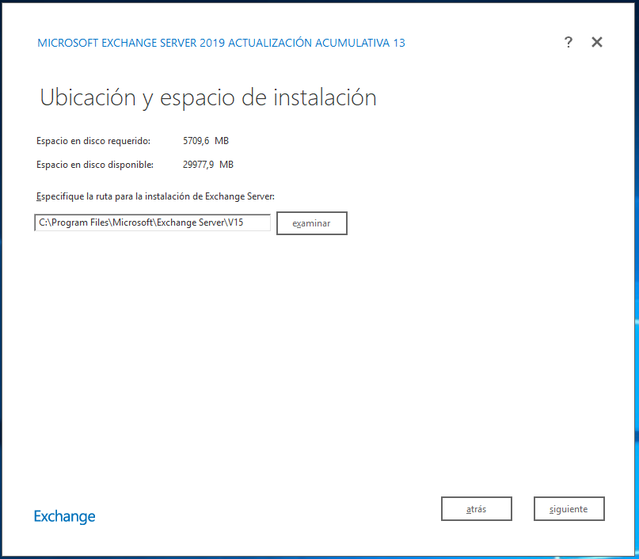
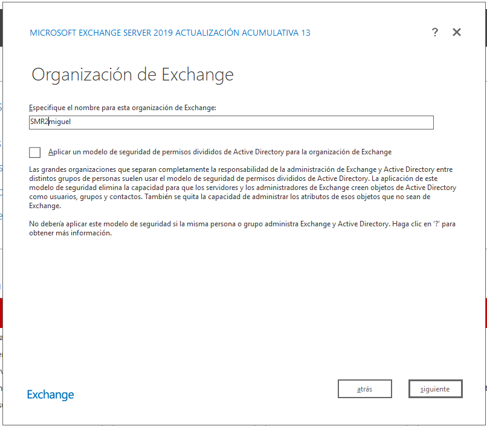

# **Guía: Instalación y Configuración de un Servidor de Correo Exchange en Windows Server 2019 (Sin Active Directory)**

## **1. Requisitos Previos**
Para la instalación en un entorno **EMPRESARIAL**:

### **1.1. Hardware Requerido**
- **CPU:** Procesador de 64 bits compatible con Intel VT o AMD-V.
- **RAM:**
  - **Servidor de buzón:** 128 GB recomendado, 64 GB mínimo.
  - **Servidor Edge Transport:** 64 GB recomendado, 32 GB mínimo.
- **Espacio en Disco:**
  - Unidad del sistema: **30 GB mínimo**.
  - **500 MB** de espacio en la unidad que aloja la base de datos de Exchange.
  - **200 MB** en la unidad donde se almacenan los logs de Exchange.

### **1.2. Software Necesario**
- **Windows Server 2019 (Edición Estándar o Datacenter).**
- **Certificado SSL para comunicaciones seguras (opcional, pero recomendado).**
- **.NET Framework 4.8** y **Visual C++ 2013 Redistributable Package**.
- **Windows Management Framework 5.1**.
- **ACTIVE DIRECTORY ACTIVO** [Si no tienen AD instlado, sigue esta otra guía](./SR0701_ADparaEXC.md)

---

## **2. Instalación de los Requisitos Previos**
Ejecuta los siguientes comandos en **PowerShell** con privilegios de administrador para instalar los roles y características necesarias:

```powershell
Install-WindowsFeature -Name ADLDS, RSAT-AD-Tools, NET-Framework-45-Features, Windows-Identity-Foundation
```

Luego, instala **Media Foundation** (requerido para Exchange Server 2019):

```powershell
Install-WindowsFeature Server-Media-Foundation
```

Después de esto, **reinicia el servidor**.

## **2.bis Instala los requisitos previos si aún no están instalados:**
    - **.NET Framework 4.8:** Descarga desde [este enlace](https://support.microsoft.com/kb/4503548) e instálalo.
    - **UCMA 4.0:** Descarga desde [este enlace](http://go.microsoft.com/fwlink/?LinkId=260990) e instálalo.
    - **Visual C++ Redistributable 2013:** Descarga la versión **x64** desde [aquí](https://www.microsoft.com/download/details.aspx?id=40784) e instálala.
    - **Módulo de Reescritura de URL de IIS:** Descarga desde [Microsoft IIS](https://www.iis.net/downloads/microsoft/url-rewrite) e instálalo. Luego reinicia IIS con:
      ```powershell
      iisreset /restart
      ```

---

## **3. Instalación de Exchange Server 2019**

1. **Descarga el instalador de Exchange Server 2019** desde el sitio web de Microsoft.
   1. [Descarga](https://www.microsoft.com/en-us/download/details.aspx?id=105180)
2. **Montar la ISO**
   - Haz doble clic en el archivo **ExchangeServer2019-x64-CU13.iso**
   - Esto creará una unidad virtual con la ISO montada.

3. **Ejecutar la instalación desde la ISO**
   - Abre **Explorador de Archivos** y accede a la unidad virtual creada.
   - Ejecuta `Setup.exe` desde la raíz de la unidad montada.
   - Elige **NO** buscar actualizaciones ahora.
   - 
4. Introducción: Click en **siguiente**.
5. Acepta los términos de licencia.
   - 
6. Aceptas la configuración recomendada
7. Selecciona el Rol del Servidor
   1. Rol de buzón 
8. **Elige la ruta de instalación** (se recomienda dejar la predeterminada).
   1. 
9. Ponemos nombre a la organización: **SMR2tunombre**
   1.  
10. **No habilites la Protección contra Malware** (opcional).
11. **Espera a que se complete la instalación**.

---

## **4. Configuración Inicial de Exchange**

### **4.1. Acceso al Centro de Administración de Exchange**
1. Abre un navegador y accede a la URL:
   ```
   https://localhost/ecp
   ```
2. Inicia sesión con la cuenta de administrador local de Windows Server.

### **4.2. Configuración de Conectores de Envío y Recepción**
#### **Conector de Recepción**
1. Ve a **Configuración del Servidor** > **Conectores de Recepción**.
2. Crea un nuevo conector de recepción:
   - **Nombre:** ConectorInterno
   - **Tipo:** Internet
   - **Dirección IP:** 0.0.0.0-255.255.255.255 (para permitir todos los envíos)
   - **Protocolos habilitados:** SMTP

#### **Conector de Envío**
1. Ve a **Configuración del Servidor** > **Conectores de Envío**.
2. Crea un nuevo conector:
   - **Nombre:** ConectorSMTP
   - **Servidor de destino:** smtp.outlook.com (si se usa Exchange híbrido con O365)
   - **Puerto:** 25

---

## **5. Creación de Cuentas de Usuario y Buzones sin Active Directory**
Dado que no estamos usando Active Directory, los buzones deben gestionarse con cuentas locales.

1. **Abre la Consola de Administración de Exchange**.
2. Ve a **Destinatarios > Buzones** y selecciona **Nuevo Buzón**.
3. Introduce la información del usuario.
4. **Asigna credenciales manualmente**.
5. Guarda los cambios y **prueba enviando correos entre cuentas**.

---

## **6. Configuración del Cliente de Correo (Outlook)**
Para que los usuarios accedan al correo en **Outlook**, sigue estos pasos:

1. Abre Outlook y selecciona **Agregar cuenta**.
2. Introduce el correo electrónico del usuario.
3. **Outlook detectará automáticamente la configuración de Exchange**.
4. Ingresa la contraseña de la cuenta.
5. Espera a que se complete la configuración y **prueba enviando un correo**.

---

## **7. Configuración de un Cliente Webmail con OWA**
Exchange incluye un cliente de correo web llamado **Outlook Web Access (OWA)**:

1. Accede a:
   ```
   https://mail.tudominio.com/owa
   ```
2. Inicia sesión con una cuenta configurada.
3. **Prueba el envío y recepción de correos**.

---

## **8. Seguridad y Mantenimiento**
- **Habilitar SSL**: Configura un certificado SSL en Exchange para cifrar el tráfico SMTP y OWA.
- **Monitoreo de Exchange**: Usa el **Centro de Administración de Exchange** para revisar logs y solucionar problemas.
- **Copias de Seguridad**: Usa **Windows Server Backup** para respaldar buzones y configuraciones.

---

## **9. Pruebas Finales**
1. **Verificar conexión SMTP**:
   ```powershell
   Test-SmtpConnectivity -Identity "servidor.exchange.local"
   ```
2. **Revisar la cola de correo**:
   ```powershell
   Get-Queue
   ```
3. **Verificar usuarios activos**:
   ```powershell
   Get-Mailbox
   ```

---

## **Conclusión**
Esta guía proporciona un servidor de correo Exchange funcional sin la necesidad de Active Directory. En una futura tarea, podemos extender la configuración para usar Active Directory como gestor de usuarios y mejorar la administración de cuentas.

