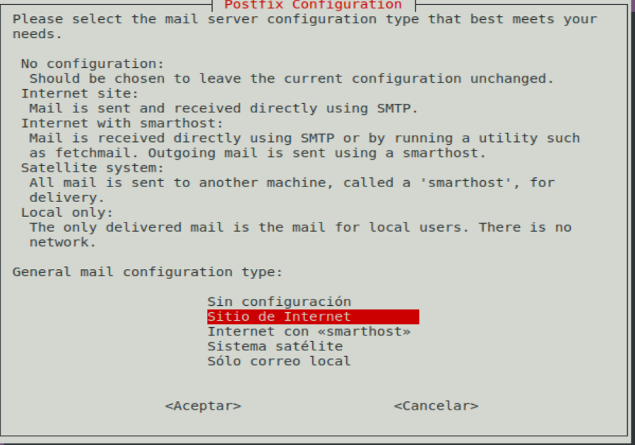
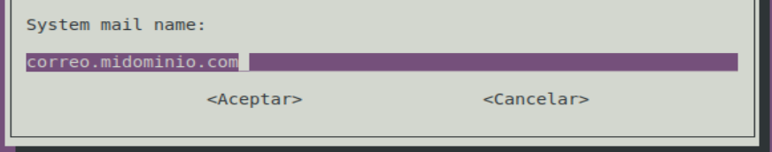
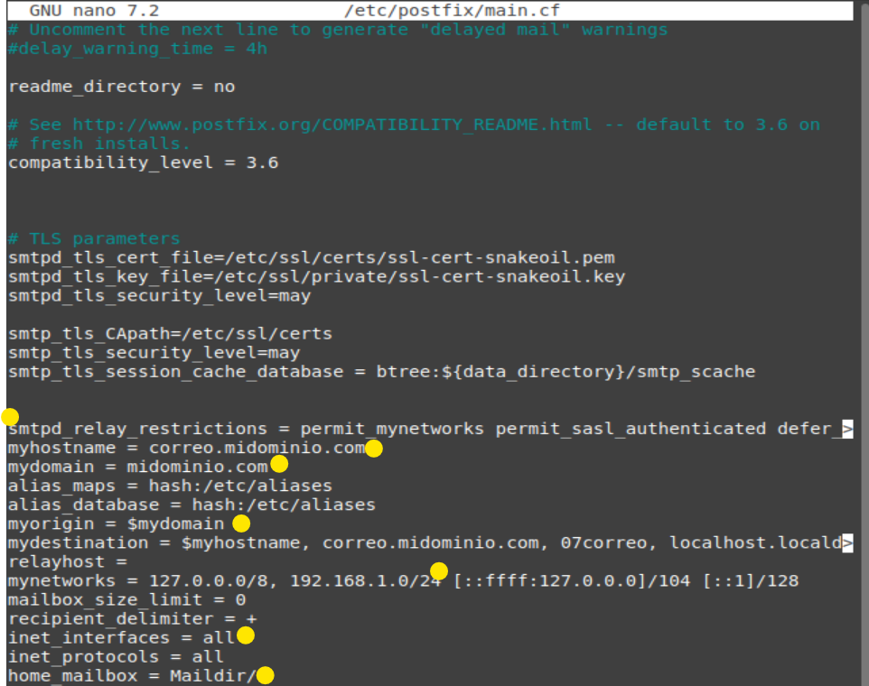
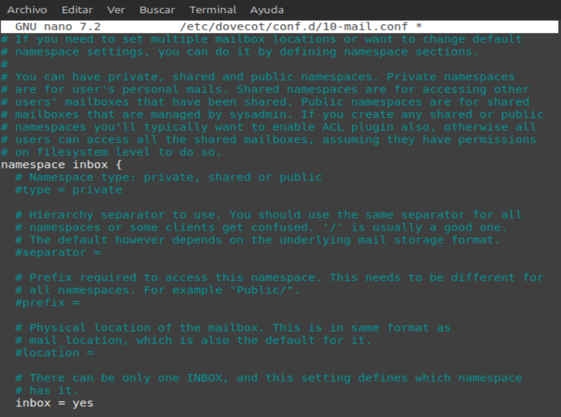
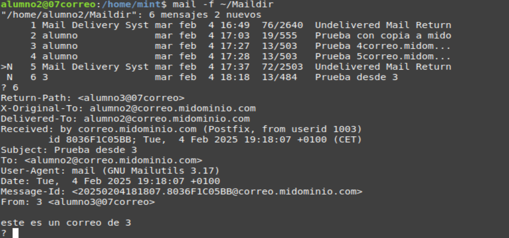

# [01](../SR0701_mailinux/SR0701_lin.md) - [02](../SR0702_MUA/SR0702_mutt.md) - [03](../SR0703_cliente/SR0703_CliSer.md)
# **01.** Instalación y Configuración de un Servidor de Correo en Linux

📌 **Objetivo:**  
En esta práctica, los alumnos instalarán y configurarán un servidor de correo en **Ubuntu Server** utilizando **Postfix** como servidor SMTP y **Dovecot** como servidor IMAP/POP3. Se configurará un servicio de correo **interno**, sin necesidad de dominios públicos ni certificados SSL, permitiendo a los alumnos enviar y recibir correos dentro de la red local.  

---

## **1️⃣ Requisitos previos**
🔹 **Material necesario:**  
- Una máquina virtual o servidor físico con **Ubuntu Server 22.04 LTS**.
- Conectividad en red con los clientes.
- Acceso como usuario con privilegios `sudo`.

📌 **Puntos clave a aprender en la práctica:**  
- Configuración básica de un servidor de correo.
- Funcionamiento de los protocolos **SMTP (envío)**, **IMAP/POP3 (recepción)**.
- Gestión de cuentas de usuario en Linux para correo.

---

## **2️⃣ Instalación de Postfix y Dovecot**
Postfix se usará para **enviar correos**, mientras que Dovecot permitirá **recibir y gestionar los buzones de correo**.  

Ejecutar en el servidor:
```bash
sudo apt update
sudo apt install postfix
sudo apt install dovecot-core
sudo apt install dovecot-imapd
sudo apt install dovecot-pop3d
sudo apt install mailutils
```

Durante la instalación de **Postfix**, aparecerá un menú de configuración. Elegir:  
- **Tipo de configuración**: `Sitio de Internet`   
- **Nombre del sistema**: `correo.midominio.com` *(puede ser un dominio ficticio o un nombre de red local, como `correo.mi-red.local`)*     

> 💡 **Nota:** Si el asistente de configuración no aparece o queremos modificar la configuración más adelante, se puede lanzar de nuevo con:
> ```bash
> sudo dpkg-reconfigure postfix
> ```

---

## **3️⃣ Configuración básica de Postfix (SMTP - Envío de correo)**
Editar el archivo principal de configuración:
```bash
sudo nano /etc/postfix/main.cf
```
Asegurarse de que incluya las siguientes líneas:

```ini
# Nombre del servidor (modifica correo.midominio.com con tu info)
myhostname = correo.midominio.com
# Nombre de tu dominio (modifica midominio.com con tu info)
mydomain = midominio.com
# Comprueba que está igual:
myorigin = $mydomain

# Interfaces activas (todas las direcciones de red)
inet_interfaces = all

# Formato de las direcciones de correo
mydestination = $myhostname, $mydomain, localhost.localdomain, localhost

# Redes permitidas para enviar correos sin autenticación (ajustar según la RED)
mynetworks = 127.0.0.0/8, 192.168.1.0/24

# Ubicación de los buzones de los usuarios (Maildir)
home_mailbox = Maildir/

# Desactivar restricciones avanzadas para pruebas internas
smtpd_relay_restrictions = permit_mynetworks, permit_sasl_authenticated, defer_unauth_destination
```


📌 **Reiniciar el servicio para aplicar los cambios:**  
```bash
sudo systemctl restart postfix
```

---

## **4️⃣ Configuración de Dovecot (IMAP/POP3 - Recepción de correo)**
Dovecot gestionará el almacenamiento y la consulta de los correos electrónicos.

Editar la configuración de buzones:
```bash
sudo nano /etc/dovecot/conf.d/10-mail.conf
```
Reemplazar el contenido del archivo por lo siguiente:

```ini
mail_location = maildir:~/Maildir

namespace inbox {
  inbox = yes
}

mail_privileged_group = mail

protocol !indexer-worker {
}
```

📌 **Validar configuración antes de reiniciar:**
```bash
sudo dovecot -n
```
Si no hay errores, reiniciar el servicio:
```bash
sudo systemctl restart dovecot
```
Y verificar que esté activo:
```bash
sudo systemctl status dovecot
```

---

## **5️⃣ Creación de usuarios de correo**
Cada usuario del sistema tendrá una cuenta de correo asociada. Se crean de la siguiente forma:
```bash
sudo adduser alumno1
```
Se solicita una contraseña y algunos datos opcionales. Luego, hay que crear manualmente la estructura de buzón Maildir:
```bash
sudo -u alumno1 mkdir -p /home/alumno1/Maildir
sudo -u alumno1 maildirmake.dovecot /home/alumno1/Maildir
```
Repetir este paso para cada usuario.

---

## **6️⃣ Prueba de envío y recepción de correos**
📌 **Enviar un correo desde la terminal**  
Desde el usuario `alumno1`, probar el envío de un correo a `alumno2`:
```bash
echo "Este es un correo de prueba" | mail -s "Prueba de correo" alumno2@midominio.com

# también funciona alumno2@correo.midominio.com (nombre del host en postfix)
```
📌 **Leer correos desde la terminal**  
El usuario `alumno2` puede revisar su correo con:
```bash
mail -f ~/Maildir
```

---


# [01](../SR0701_mailinux/SR0701_lin.md) - [02](../SR0702_MUA/SR0702_mutt.md) - [03](../SR0703_cliente/SR0703_CliSer.md)