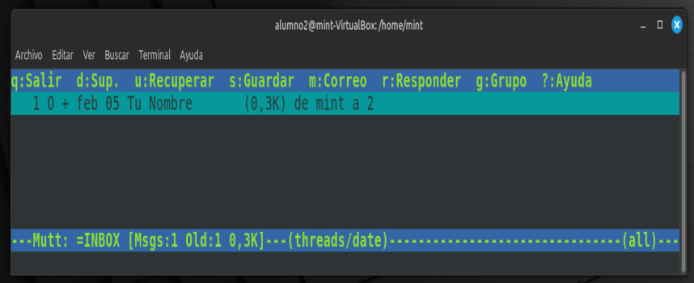
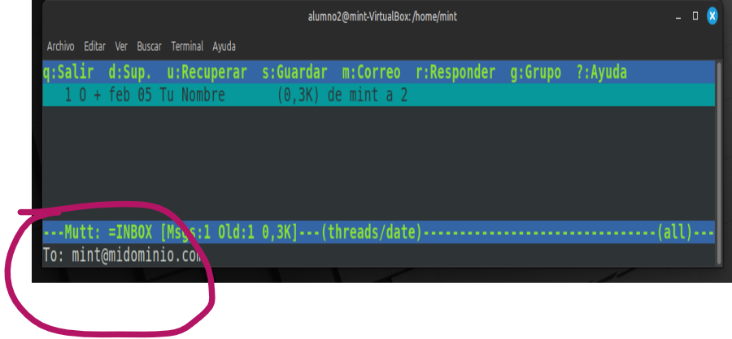
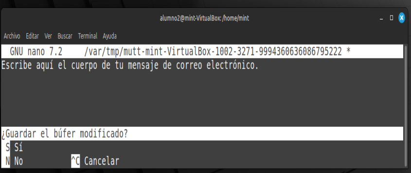
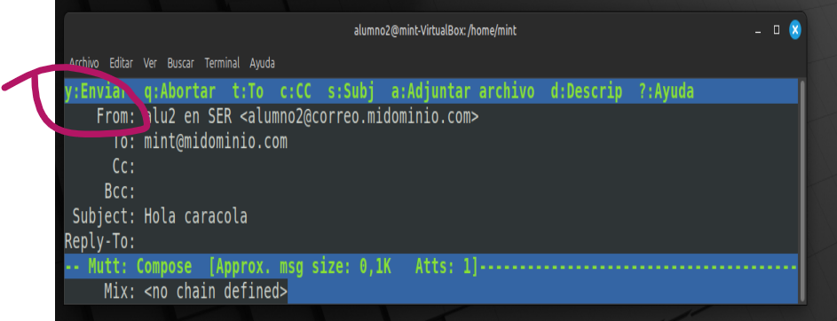

# [01](../SR0701_mailinux/SR0701_lin.md) - [02](../SR0702_MUA/SR0702_mutt.md) - [03](../SR0703_cliente/SR0703_CliSer.md)


# **02.** Instalación de un cliente ligero para comprobar que **dovecot** funciona correctamente utilizando IMAP

### **1. Instalar Mutt**
Si aún no lo tienes instalado, puedes hacerlo con el siguiente comando:

```bash
sudo apt update && sudo apt install mutt -y
```

---

### **2. Configurar Mutt para IMAP en local**
Como **Dovecot está configurado sin cifrado** y usa `Maildir`, crearemos una configuración mínima para conectarnos vía **IMAP sin TLS/SSL**.

Edita (o crea) el archivo de configuración de Mutt para los usuarios con los que deseas probar:

```bash
nano ~/.muttrc
```

Añade lo siguiente:

```ini
# Configuración básica de Mutt para IMAP sin cifrado
set mbox_type=Maildir
set folder="imaps://localhost/"
set spoolfile="imaps://localhost/INBOX"
set mail_check=60
set timeout=10
set imap_user="tu_usuario"
set imap_pass="tu_contraseña"
set realname="Tu Nombre"
set from="tu_usuario@tudominio.com"

# Para enviar correos (opcional, si Postfix está configurado)
set sendmail="/usr/sbin/sendmail -oi -t"

# Activar modo verboso si necesitas depuración
#set debug_level=2
```
> **
>  
> *(Reemplaza `tu_usuario` y `tu_contraseña` por las credenciales reales).*
>
> **

---

### **3. Iniciar Mutt y probar la conexión**
Guarda el archivo y ejecuta:

```bash
mutt
```
La primera vez, te pedirá que aceptes un certificado autofirmado. Pulsa a para aceptarlo para siempre.

Si todo está bien, deberías ver la bandeja de entrada y poder navegar entre los correos.


---

### **4. Enviar un correo de prueba**
Desde Mutt, pulsa `m` para redactar un correo, introduce un destinatario (`otro_usuario@correo.midominio.com`), escribe el asunto y el cuerpo del mensaje.
 
Cuando termines:
- Pulsa `Ctrl + X`, luego `Y` y `Enter` para finalizar la redacción.
- En la interfaz de mutt, pulsa y para enviar:



---

### **5. Recibir correos y verificar la entrega**
Para comprobar que el correo ha sido entregado correctamente:
1. Cierra Mutt (`q` para salir).
2. Inicia sesión con otro usuario y abre Mutt:

   ```bash
   mutt
   ```

3. Comprueba si el mensaje ha llegado correctamente.

---

### **6. Solución de problemas**
Si algo no funciona:
- **Verifica que Dovecot esté corriendo:**
  ```bash
  systemctl status dovecot
  ```
- **Comprueba que los buzones existen en `~/Maildir`:**
  ```bash
  ls -l ~/Maildir
  ```
  Si no existen, ejecuta:
  ```bash
  mkdir -p ~/Maildir/{cur,new,tmp}
  ```

- **Habilita registros detallados en Mutt** (añadiendo `set debug_level=2` en `~/.muttrc`).

---

### **Conclusión**
Con esta configuración, deberías poder:
✅ Acceder a tu buzón local con Mutt vía **IMAP** (sin cifrado).  
✅ Enviar y recibir correos entre usuarios del servidor usando **Postfix y Dovecot**.  

# [01](../SR0701_mailinux/SR0701_lin.md) - [02](../SR0702_MUA/SR0702_mutt.md) - [03](../SR0703_cliente/SR0703_CliSer.md)