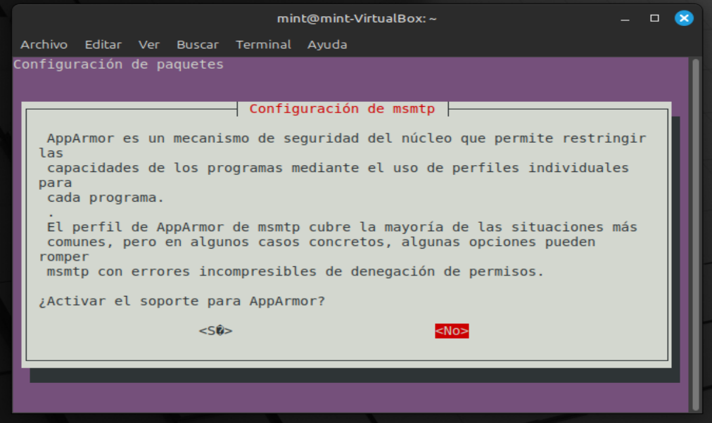
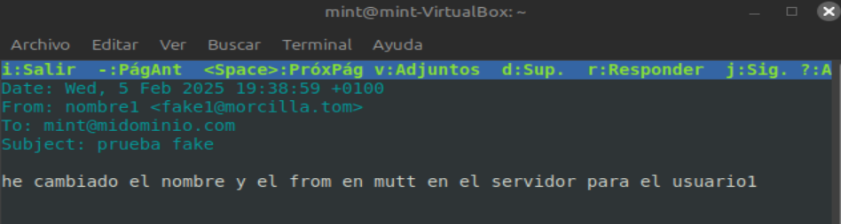

# [01](../SR0701_mailinux/SR0701_lin.md) - [02](../SR0702_MUA/SR0702_mutt.md) - [03](../SR0703_cliente/SR0703_CliSer.md)

# **03.** Configuración de un cliente Mutt para usar nuestro servidor de correo (IMAP y SMTP)

Esta guía explica cómo configurar **Mutt** en un equipo **distinto dentro de la misma** red para que se conecte al servidor de correo que hemos configurado con **Postfix y Dovecot**.  

Dado que **Mutt no soporta autenticación SMTP de forma nativa**, usaremos **msmtp** como MTA para gestionar el envío de correos.

Instalaremos servicios y modificaremos sus [archivos de configuración](./SR0703_archivos.md).
---

## 1. Configurar el **SERVIDOR** de correo (Postfix y Dovecot)
Antes de configurar el cliente, asegúrate de que el **servidor de correo** está listo:

1. **Dovecot está configurado para aceptar conexiones IMAP externas**:
   
   - En `/etc/dovecot/dovecot.conf`, busca o añade esta línea:
     ```ini
     listen = *, ::
     ```
   - En `/etc/dovecot/conf.d/10-master.conf`, debe estar activado el puerto 143:
     ```ini
     service imap-login {
         inet_listener imap {
             port = 143
         }
     }
     ```
   - En `/etc/dovecot/conf.d/10-mail.conf`, `mail_location` debe estar configurado para **Maildir**:
     ```ini
     mail_location = maildir:~/Maildir
     ```

2. **Postfix permite el envío desde la red local**:
   - En `/etc/postfix/main.cf`, añade o verifica:
     ```ini
     inet_interfaces = all
     mynetworks = 127.0.0.0/8, 192.168.1.0/24
     smtpd_recipient_restrictions = permit_mynetworks, permit_sasl_authenticated, reject_unauth_destination
     ```

3. **Abrir los puertos en el firewall**:
   ```bash
   sudo ufw allow 143/tcp   # IMAP
   sudo ufw allow 25/tcp    # SMTP
   sudo ufw allow 587/tcp   # Submission (si usas STARTTLS en el futuro)
   ```

4. **Reiniciar los servicios**:
   ```bash
   sudo systemctl restart dovecot postfix
   ```

---

## **2. Configurar el cliente Mutt en el equipo remoto**
En el equipo cliente, instalaremos **Mutt** para la gestión del correo y **msmtp** para el envío de correos.

### **2.1. Instalar Mutt y msmtp**
Ejecuta en el **cliente**:

```bash
sudo apt update && sudo apt install mutt msmtp -y
```
Elegir NO en la instalación de msmtp:


---

### 2.2. Configurar Mutt **PARA CADA UNO DE LOS USUARIOS**
Edita o crea el archivo `~/.muttrc`:

```bash
nano ~/.muttrc
```

Añade la siguiente configuración: [(ampliación)](./SR0703_configuraMutt.md)

```ini
# 📌 Configuración de Mutt para conectarse a nuestro servidor de correo

# Usar Maildir
set mbox_type=Maildir

# 📌 Configurar el servidor IMAP (ajustar IP del servidor)
set folder="imap://192.168.1.100/"
set spoolfile="imap://192.168.1.100/INBOX"

## ALTERNATIVA (CUANDO ESTAMOS EN EL SERVIDOR Y PODEMOS ACCEDER LOCALMENTE AL SISTEMA DE ARCHIVOS)
# 📌 Definir la ubicación del buzón principal en Maildir
# set folder="~/Maildir"
# set spoolfile="~/Maildir/"

# 📌 Opcional: Configurar carpetas para enviados y borradores
# set record="~/Maildir/Sent"
# set postponed="~/Maildir/Drafts"

# 📌 Credenciales de usuario en el servidor de correo
## Cambialas por las tuyas!!
set imap_user="usuario"
set imap_pass="contraseña"

# 📌 Nombre y dirección del remitente
set realname="Tu Nombre"
set from="usuario@tudominio.com"

# 📌 Usar msmtp para el envío
set sendmail="/usr/bin/msmtp"

# Opcional: Activar logs de depuración
#set debug_level=2
```

Guarda (`Ctrl + X`, `Y`, `Enter`).

---

### **2.3. Configurar msmtp**
Edita o crea el archivo `~/.msmtprc`:

```bash
nano ~/.msmtprc
```

Añade la siguiente configuración:

```ini
# 📌 Configuración de msmtp para enviar correos con Postfix en la red local

account default
# IP del servidor de correo
host 192.168.1.100
# Puerto sin cifrado (usar 587 si hay STARTTLS)     
port 25                
# Desactivar autenticación dentro de la red local
auth off
# Aquí el usuairo que corresponda               
from usuario@tudominio.com
logfile ~/.msmtp.log

# Si el servidor usa STARTTLS en el puerto 587:
# tls on
# tls_starttls on
# tls_certcheck off

```

Guarda y dale los permisos adecuados para seguridad:

```bash
chmod 600 ~/.msmtprc
```

---

## **3. Probar la conexión**
### **3.1. Probar el acceso IMAP con Mutt**
Ejecuta:

```bash
mutt
```

Deberías ver los correos almacenados en el servidor. Si no ves nada:
- Asegúrate de que el servidor **Dovecot está corriendo** (`sudo systemctl status dovecot`).
- Revisa si `~/Maildir` del usuario en el servidor contiene correos (`ls -l ~/Maildir/new/`).

---

### **3.2. Probar el envío de correos**
Antes de probar con Mutt, verifica si **msmtp funciona** correctamente:

```bash
echo "Prueba de correo desde msmtp" | msmtp -d -a default usuario@localhost
```

Si no hay errores, prueba desde Mutt enviando un correo:

```bash
mutt -s "Prueba desde Mutt con msmtp" usuario@localhost < /dev/null
```

Si el correo llega correctamente, ¡todo está funcionando! 🎉

> #
> 
> acede a mutt y prueba a enviar y recibir correos desde el servidos y el cliente.
>
> #



---

## **4. Solución de problemas**
Si **no puedes recibir correos** en Mutt:
- Asegúrate de que el servidor **Dovecot está en ejecución**:
  ```bash
  sudo systemctl status dovecot
  ```
- Verifica si Dovecot está escuchando en la IP del servidor:
  ```bash
  sudo ss -tulnp | grep dovecot
  ```

Si **no puedes enviar correos desde el cliente**:
- Prueba **conectar al puerto SMTP** desde el cliente:


  ```bash
  telnet 192.168.1.100 25

  # salida esperada
  220 mail.tudominio.com ESMTP Postfix

  telnet 192.168.1.100 143

  # salida esperada
  * OK [CAPABILITY IMAP4rev1 LITERAL+ SASL-IR LOGIN-REFERRALS ID ENABLE IDLE STARTTLS AUTH=PLAIN] Dovecot ready.
  ```
  Si no responde, revisa la configuración de Postfix y el firewall.

- Si Mutt da error con msmtp, revisa los permisos del archivo de configuración:
  ```bash
  ls -l ~/.msmtprc
  ```
  Debe tener permisos `-rw-------` (600). Si no, corrige con:
  ```bash
  chmod 600 ~/.msmtprc
  ```

---

## **Conclusión**
✅ **Hemos configurado Mutt para recibir correos vía IMAP desde el servidor Dovecot.**  
✅ **Hemos configurado msmtp como MTA para que Mutt pueda enviar correos a través de Postfix.**  
✅ **Hemos probado el envío y recepción con Mutt y solucionado posibles errores.**  

# [01](../SR0701_mailinux/SR0701_lin.md) - [02](../SR0702_MUA/SR0702_mutt.md) - [03](../SR0703_cliente/SR0703_CliSer.md)