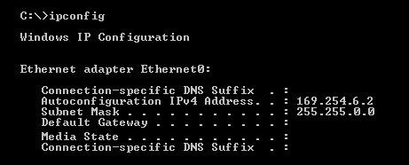

APIPA significa **Automatic Private IP Addressing**.

Es un mecanismo de Windows (y otros sistemas) que se activa cuando un equipo tiene configurado **obtener IP automáticamente** pero **no encuentra un servidor DHCP** que se la proporcione.

En ese caso, el sistema operativo se asigna a sí mismo una dirección del rango **169.254.1.0–169.254.254.255**, con prefijo **/16** y máscara **255.255.0.0**.

Consecuencias:

* Permite que varios equipos en la misma red local se comuniquen entre ellos **sin necesidad de DHCP**.
* No se configura una puerta de enlace para esa dirección y el tráfico APIPA no se encamina hacia otras redes.

En la práctica, si un equipo que debía configurarse mediante DHCP muestra una dirección `169.254.x.x`, normalmente significa que **no recibió respuesta de un servidor DHCP**. Antes de concluir que toda la red falla, puede comprobarse si se comunica con otros equipos APIPA del mismo enlace.

Sugerencia de imagen: recorte de ipconfig en windows mostrando una IP generada por APIPA
