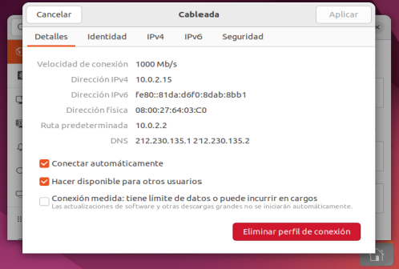

# Configurar la red en Ubuntu Desktop

## 1. Abrir la configuración de red

1. Haz clic en el icono de red de la barra superior.
2. Abre **Configuración** y selecciona **Red**.
3. Pulsa el engranaje de la conexión cableada que quieras configurar.

Antes de cambiarla, identifica qué adaptador de VirtualBox corresponde a cada conexión. Puedes comparar las direcciones MAC mostradas por Ubuntu y por VirtualBox.

## 2. Configurar IPv4

En la pestaña **IPv4** elige el modo adecuado:

- **Automático (DHCP)**: para un adaptador NAT, permite obtener automáticamente dirección, ruta predeterminada y DNS.
- **Manual**: para una red interna o Host-Only, introduce la dirección y el prefijo indicados en el escenario.

Por ejemplo, en un adaptador Host-Only:

- Dirección: `192.168.56.20`
- Prefijo o máscara: `/24` o `255.255.255.0`, según lo solicite la interfaz
- Puerta de enlace: dejar en blanco
- DNS: dejar en blanco

En una red aislada no debe inventarse una puerta de enlace ni configurarse un DNS público. Esos datos solo se añaden si el escenario incluye realmente un router y un servidor DNS accesibles por esa interfaz.

> Guarda los cambios y desactiva y vuelve a activar la conexión para aplicarlos.

## 3. Comprobar la configuración

Abre una terminal y ejecuta:

```bash
ip link show
ip addr show
ip route show
ping <IP-del-otro-equipo>
```

Sustituye `<IP-del-otro-equipo>` por la dirección de otra máquina del escenario.

Comprueba, por este orden:

1. Que la interfaz está activa.
2. Que la dirección y el prefijo son correctos.
3. Que no existe una ruta predeterminada incorrecta por la interfaz aislada.
4. Que hay comunicación con las otras máquinas.
5. Si se solicita, que funciona el servicio correspondiente, por ejemplo SSH.

Solo si el escenario incluye acceso al exterior se comprueban después la puerta de enlace, una dirección pública y la resolución de nombres.

Consulta también [Comprobar una red interna o Host-Only](../diagnostico_red_virtual.md).
