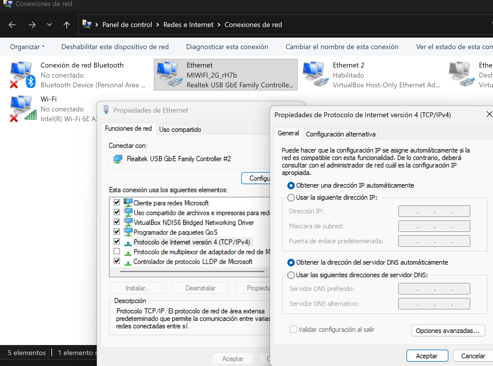

# Configurar la red en Windows Server 2019

## 1. Abrir las conexiones de red

1. Abre **Administrador del servidor**.
2. Selecciona **Servidor local**.
3. Haz clic en el enlace de **Ethernet**.
4. Abre las propiedades de la tarjeta que quieras configurar.

Antes de cambiarla, identifica qué adaptador de VirtualBox corresponde a cada conexión. Puedes comparar las direcciones MAC mostradas por Windows y por VirtualBox.

## 2. Configurar IPv4

Selecciona **Protocolo de Internet versión 4 (TCP/IPv4)** y abre sus propiedades.

- Para un adaptador NAT, selecciona **Obtener una dirección IP automáticamente** y **Obtener la dirección del servidor DNS automáticamente**.
- Para una red interna o Host-Only, selecciona **Usar la siguiente dirección IP** e introduce la dirección y la máscara indicadas en el escenario.

Por ejemplo, en un adaptador Host-Only:

- Dirección IP: `192.168.56.30`
- Máscara de subred: `255.255.255.0`
- Puerta de enlace predeterminada: dejar en blanco
- Servidor DNS preferido: dejar en blanco

En una red aislada no debe inventarse una puerta de enlace ni configurarse un DNS público. Esos datos solo se añaden si el escenario incluye realmente un router y un servidor DNS accesibles por esa interfaz.

Acepta los cambios y cierra las ventanas de configuración.

## 3. Comprobar la configuración

Abre PowerShell y ejecuta:

```powershell
Get-NetAdapter
ipconfig /all
route print
ping <IP-del-otro-equipo>
```

Sustituye `<IP-del-otro-equipo>` por la dirección de otra máquina del escenario.

Comprueba, por este orden:

1. Que la interfaz está activa.
2. Que la dirección y la máscara son correctas.
3. Que no existe una ruta predeterminada incorrecta por la interfaz aislada.
4. Que hay comunicación con las otras máquinas.
5. Si se solicita, que funciona el servicio correspondiente, por ejemplo SSH.

Solo si el escenario incluye acceso al exterior se comprueban después la puerta de enlace, una dirección pública y la resolución de nombres.

Consulta también [Comprobar una red interna o Host-Only](../diagnostico_red_virtual.md).
