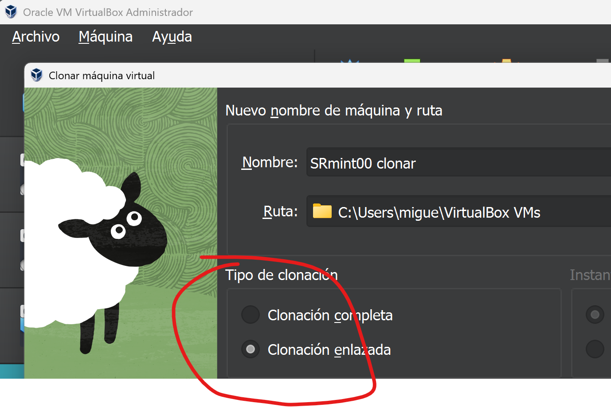
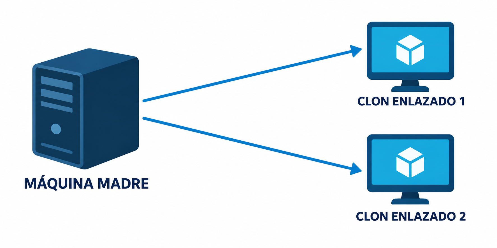

# Sesión 1. Preparar el entorno virtual

El objetivo es disponer de máquinas madre comprobadas y de clones enlazados sobre los que trabajar. No configures todavía las direcciones del escenario.

## 1. Preparar las máquinas madre

Para cada sistema proporcionado:

1. Crea o registra la máquina virtual utilizando el disco VDI indicado.
2. Asigna un nombre que permita reconocer el sistema y su condición de máquina madre.
3. Comprueba memoria, almacenamiento y adaptadores antes de arrancar.
4. Inicia la máquina y verifica que el sistema operativo carga correctamente.
5. Comprueba que puedes iniciar sesión.
6. Apágala desde el sistema operativo.

La máquina madre debe mantenerse como base limpia. Las prácticas se realizarán sobre clones.

## 2. Crear un clon enlazado

Con la máquina apagada:

1. Selecciona la máquina madre.
2. Inicia la operación de clonación.
3. Elige **clon enlazado** cuando aparezca esa opción.
4. Solicita que VirtualBox genere nuevas direcciones MAC para los adaptadores del clon.
5. Asigna al clon un nombre que lo identifique como máquina de trabajo.
6. Inicia el clon y comprueba que funciona.

Un clon enlazado ocupa menos espacio porque depende de los discos de la máquina madre. No muevas ni elimines la máquina madre ni sus discos mientras utilices el clon.

## 3. Repetir para los tres sistemas

Al terminar debe existir una máquina madre y al menos un clon de trabajo para cada sistema:

- Ubuntu Desktop;
- Ubuntu Server;
- Windows Server.

Registra las máquinas y comprueba sus MAC con el [inventario y lista de comprobación](./02_inventario_y_comprobacion.md).

## Si surge un problema

- Si la VDI no aparece, comprueba que has seleccionado **usar un disco existente**.
- Si una máquina no arranca, revisa el orden de arranque y que el disco esté conectado.
- Si dos clones muestran la misma MAC, apágalos y genera una nueva MAC antes de configurar la red.
- Si un clon deja de encontrar su disco, comprueba que no se ha movido ni eliminado la máquina madre.
