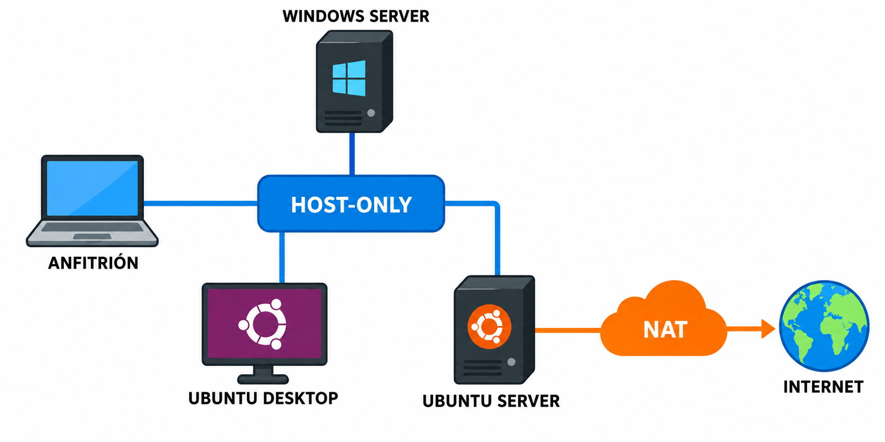

# Sesión 2. Red NAT y Host-Only

El objetivo es que las máquinas puedan comunicarse dentro del escenario y, cuando sea necesario, acceder también al exterior.

## Modos de red que utilizaremos

| Modo | Comunicación principal | Uso en estas prácticas |
|---|---|---|
| NAT | La máquina virtual accede al exterior mediante el equipo anfitrión | Actualizaciones y acceso a Internet |
| Host-Only | Las máquinas virtuales se comunican entre sí y con el anfitrión | Red privada del escenario |
| Red interna | Solo se comunican las máquinas conectadas a una red interna con el mismo nombre | Escenarios completamente aislados |

Otros modos de VirtualBox existen, pero no son necesarios para completar esta sesión.

## Escenario con dos adaptadores

La configuración habitual de Ubuntu Server será:

| Adaptador | Modo de VirtualBox | Configuración IP | Puerta de enlace y DNS |
|---|---|---|---|
| 1 | NAT | DHCP | Proporcionados automáticamente |
| 2 | Host-Only | Dirección estática del escenario | En blanco |

El adaptador NAT aporta la ruta predeterminada. La interfaz Host-Only sirve para comunicarse con las otras máquinas y no debe añadir otra ruta predeterminada.

## Preparar VirtualBox

Con las máquinas apagadas:

1. Abre la configuración de red de cada clon.
2. Activa el número de adaptadores que requiera el escenario.
3. Selecciona NAT para el adaptador de salida.
4. Selecciona la misma red Host-Only o el mismo nombre de red interna en todas las máquinas que deban comunicarse.
5. Comprueba que la opción de cable conectado está activada.
6. Anota la MAC de cada adaptador.

Si la red Host-Only tiene un servidor DHCP de VirtualBox y el escenario utiliza direcciones estáticas, emplea las direcciones previstas por el docente para evitar duplicados.

## Configurar los sistemas

1. Arranca las máquinas.
2. Relaciona cada interfaz del sistema con su adaptador de VirtualBox mediante la MAC.
3. Configura las direcciones indicadas.
4. Comprueba que solo la interfaz con salida exterior aporta una ruta predeterminada.

Consulta [Configurar interfaces](./04_configurar_interfaces.md) para acceder a la guía de cada sistema.

Después sigue [Comprobar conectividad y SSH](./05_comprobar_conectividad_y_ssh.md).
