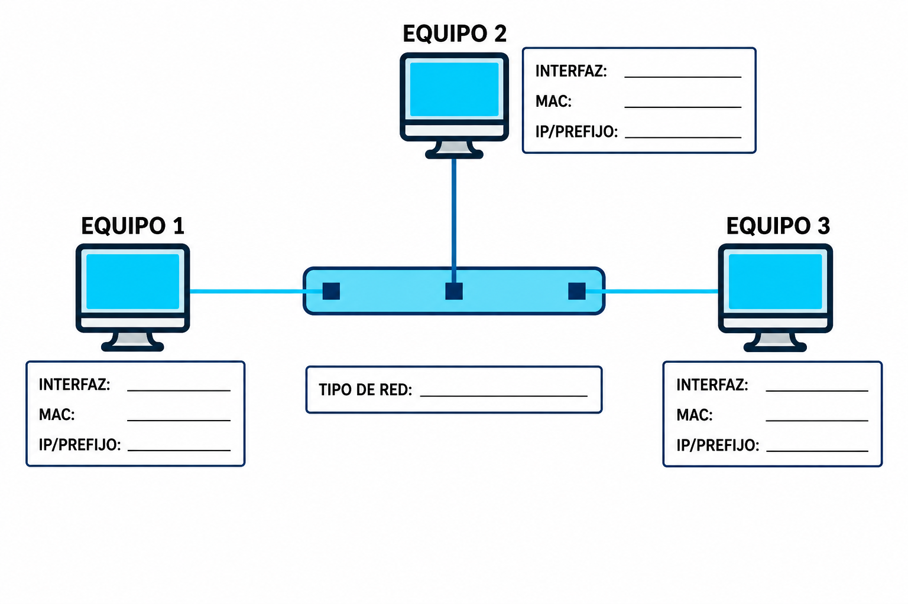

# Sesión 3. Escenarios de red

El objetivo es configurar un escenario con mayor autonomía, comprobarlo y explicar el procedimiento seguido.

## Procedimiento

1. Lee qué máquinas deben comunicarse y si necesitan salida exterior.
2. Dibuja o describe la red antes de configurar.
3. Completa únicamente los datos que falten en el escenario.
4. Selecciona los adaptadores adecuados en VirtualBox.
5. Relaciona cada adaptador con la interfaz del sistema mediante la MAC.
6. Configura las direcciones y los prefijos.
7. Comprueba interfaces, rutas y comunicación local.
8. Prueba el servicio solicitado.
9. Si algo falla, cambia una causa cada vez y repite la prueba.
10. Conserva las evidencias que permitan explicar el resultado.

## Escenarios progresivos

Utiliza [Practicar escenarios de red y ping](../UT01/escenariosRedPing.md).

Los primeros escenarios aportan más información. En los últimos tendrás que calcular o decidir algunos datos. No es obligatorio entregar cálculos o datos adicionales que no se hayan solicitado.

## Tiempo de la sesión

- Preparación e interpretación: aproximadamente 10 minutos.
- Configuración: aproximadamente 50 minutos.
- Comprobaciones y diagnóstico: aproximadamente 35 minutos.
- Selección de evidencias y cierre: aproximadamente 15 minutos.

Si una máquina no arranca o un clon ha perdido su disco, resuelve primero el entorno virtual. Ese problema no se corrige cambiando direcciones IP.

Utiliza [Diagnóstico y evidencias](./07_diagnostico_y_evidencias.md) cuando una prueba no produzca el resultado esperado.
