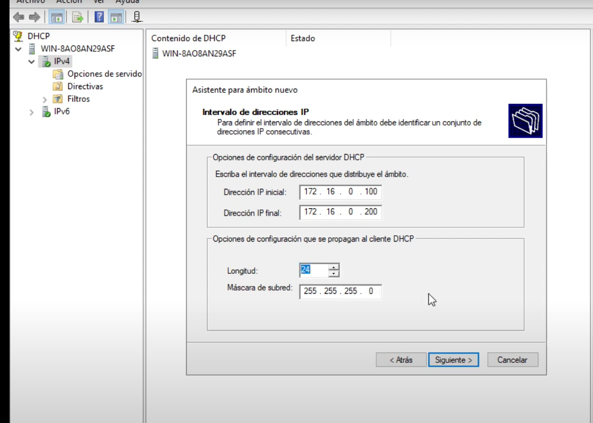
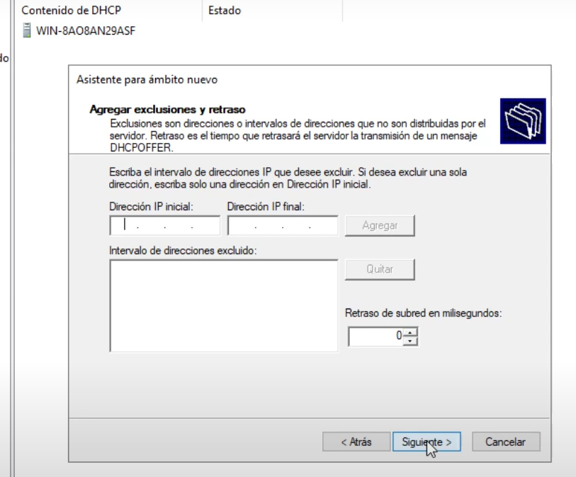
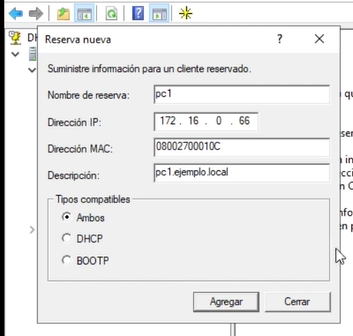

# UT02 TA09
Este manual cubrirá la instalación y configuración del servicio DHCP (Dynamic Host Configuration Protocol) en Windows Server 2019, utilizando **PowerShell** y **Administrador del servidor**.

### **Índice**
0. Configuración ip fija
1. Instalación de DHCP con PowerShell
2. Instalación de DHCP con el Administrador del servidor
3. Configuración del DHCP
   - Creación de un ámbito (scope)
   - Configuración de exclusiones y reservas
   - Activación del ámbito

---

## Configurar ip fija

Para que las interfaces de red no dependan de otro DHCP.

[configurar ip fija](./SR0209_ip_estatica.md)

## Alternativa 1 - Instalación de DHCP con PowerShell

### **Paso 1: Abrir PowerShell como administrador**
- Ve al **Menú Inicio** y busca **Windows PowerShell**.
- Haz clic derecho en **Windows PowerShell** y selecciona **Ejecutar como administrador**.

### **Paso 2: Comando de instalación**
Ejecuta el siguiente comando para instalar el rol DHCP:

```powershell
Install-WindowsFeature -Name DHCP -IncludeManagementTools
```


Esto instalará tanto el servicio DHCP como las herramientas de administración necesarias.

### **Paso 3 (*opcional*): Autorizar el servidor DHCP en Active Directory**
*Si tu servidor forma parte de un dominio*, es necesario autorizarlo en **Active Directory**:

```powershell
Add-DhcpServerInDC -DnsName "NombreDelServidor" -IpAddress "DirecciónIPDelServidor"
```

Reemplaza `"NombreDelServidor"` y `"DirecciónIPDelServidor"` con los valores correspondientes.

### **Paso 4: Verificar la instalación**
Puedes verificar que el servicio DHCP se ha instalado correctamente con el siguiente comando:

```powershell
Get-WindowsFeature -Name DHCP*
```

Deberías ver que el servicio está instalado y habilitado.

*Podría ser necesario reiniciar el servidor*

---

## Alternativa 2 - Instalación de DHCP con el Administrador del Servidor

### **Paso 1: Abrir el Administrador del servidor**
- Ve al **Menú Inicio** y selecciona **Administrador del servidor**.

### **Paso 2: Agregar roles y características**
- En la ventana del Administrador del servidor, selecciona **Administrar** (esquina superior derecha) y elige **Agregar roles y características**.
- Haz clic en **Siguiente** hasta llegar a la selección del **Tipo de instalación** y selecciona **Instalación basada en características o en roles**.

### **Paso 3: Selección del servidor**
- En la ventana de **Selección de servidor**, elige el servidor donde deseas instalar el rol DHCP y haz clic en **Siguiente**.

### **Paso 4: Selección del rol DHCP**
- En la lista de roles, marca la opción **Servidor DHCP**.
- Se abrirá una ventana para agregar características necesarias, haz clic en **Agregar características** y luego en **Siguiente**.

### **Paso 5: Instalación**
- Haz clic en **Instalar** y espera a que se complete el proceso. Al final, tendrás la opción de **Cerrar**.

### **Paso 6: Configurar el rol DHCP**
- Tras la instalación, aparecerá una ventana para **completar la configuración DHCP**.
- Haz clic en **Completar la configuración DHCP** y luego selecciona **Autorizar el servidor**.

---

## 3. Configuración detallada del DHCP

En este caso, nos basaremos en la configuración de dos subredes y algunas reservas de direcciones IP. A continuación, te detallo cada paso con los valores específicos.

### Paso 1: Abrir la Consola DHCP
1. Abre la consola DHCP desde el Administrador del Servidor o ejecuta el comando `dhcpmgmt.msc` en el cuadro de búsqueda de Inicio.
2. En la consola, expande el nodo de tu servidor en el panel izquierdo.
3. Trabajaremos con **IPv4** en este ejemplo, ya que es la configuración relevante.


### Paso 2: Crear un Ámbito (Scope)

Primero crearemos los dos ámbitos, uno para cada subred.

#### Subred 1
1. Haz clic derecho en **IPv4** y selecciona **Nuevo Ámbito**.
2. En el Asistente para Nuevo Ámbito, introduce la siguiente información:
   - **Nombre del Ámbito**: Subred-1
   - **Descripción**: Primer ámbito de la red.
   - **Rango de Direcciones IP**: 
     - **IP de inicio**: 172.16.0.100
     - **IP de fin**: 172.16.0.200
   - **Longitud de la máscara de subred**: 255.255.255.0 (Clase C).

3. En **Agregar Exclusiones**, si lo deseas, excluye cualquier dirección fuera del rango. Si no, puedes omitir este paso.
   1. 
4. En **Duración de las concesiones**, dejamos los valores predeterminados o ajustamos según la configuración deseada:
   - **Por defecto**: 10 minutos
   - **Máximo**: 2 horas
   - 
5. Haz clic en **Siguiente** para continuar.

#### Subred 2
1. Repite los pasos anteriores para crear un segundo ámbito con la siguiente información:
   - **Nombre del Ámbito**: Subred-2
   - **Descripción**: Segundo ámbito de la red.
   - **Rango de Direcciones IP**: 
     - **IP de inicio**: 172.16.1.100
     - **IP de fin**: 172.16.1.200
   - **Longitud de la máscara de subred**: 255.255.255.0 (Clase C).
2. No hay exclusiones adicionales. Continúa configurando el tiempo de concesión:
   - **Por defecto**: 10 minutos
   - **Máximo**: 2 horas.

### Paso 3: Configurar la Puerta de Enlace (Gateway) y DNS

1. Para **Subred 1**:
   - **Gateway**: 172.16.0.1
   - 
   - **Servidores DNS**: 172.16.0.4, 172.16.0.5
   - 
2. Para **Subred 2**:
   - **Gateway**: 172.16.1.1
   - **Servidores DNS**: Los mismos que Subred 1 (172.16.0.4, 172.16.0.5).

Esto permitirá que los clientes en ambas subredes se comuniquen a través de sus respectivas puertas de enlace y utilicen los servidores DNS especificados.

### Paso 4: Configurar Reservas

Se configurarán dos dispositivos con direcciones IP reservadas basadas en sus direcciones MAC.

1. Haz clic derecho en **Reservas** bajo el ámbito correspondiente y selecciona **Nueva Reserva**.



   
#### PC 1
- **Nombre de la reserva**: PC1
- **Dirección IP reservada**: 172.16.0.66
- **Dirección MAC**: 08:00:27:00:01:0C


#### PC 2
- **Nombre de la reserva**: PC2
- **Dirección IP reservada**: 172.16.1.244
- **Dirección MAC**: 08:00:27:D2:2E:33


Una vez completada la configuración de las reservas, haz clic en **Agregar** para asegurarte de que los dispositivos siempre reciban la misma IP asignada.

### Paso 5: Activar los Ámbitos

1. Después de configurar ambos ámbitos y reservas, es necesario activarlos.
2. En la consola DHCP, haz clic derecho sobre cada ámbito y selecciona **Activar**.
3. El servidor DHCP estará ahora listo para asignar direcciones IP a los dispositivos en las dos subredes configuradas.

### Paso 6: Desactivar las actualizaciones dinámicas del DNS
Click derecho - propiedades (pestaña DNS)


---


