# 🧩 TA0209 – Instalación básica de DHCP en Windows Server 2019

En esta práctica aprenderás a **instalar y configurar el servicio DHCP (Dynamic Host Configuration Protocol)** en **Windows Server 2019** utilizando el **Administrador del servidor**.
El objetivo es que el servidor asigne direcciones IP automáticamente a los equipos clientes dentro de una **red local interna**.

---

## ⚙️ 0. Preparación del entorno en VirtualBox

Antes de comenzar la instalación del servicio, debemos asegurarnos de que la máquina virtual tenga **acceso a Internet**, ya que durante la instalación del rol DHCP Windows Server puede necesitar descargar componentes adicionales.

### 🪄 Paso 1: Activar conexión a Internet

1. Apaga la máquina virtual (si está encendida).
2. Abre la **configuración** de la máquina virtual en VirtualBox.
3. En el menú **Red → Adaptador 1**, selecciona:

   * **Conectado a:** Adaptador puente
   * **Nombre:** el adaptador de red física de tu equipo (por ejemplo, Ethernet o Wi-Fi).
4. Inicia la máquina virtual.
5. Comprueba que tiene acceso a Internet (abre el navegador o ejecuta en PowerShell:

   ```powershell
   ping 8.8.8.8
   ```

   )

> 💡 En este modo, la máquina obtiene automáticamente una dirección IP del router de tu red local (mediante DHCP del router).

---

## 🧰 1. Instalación del rol DHCP

Realizaremos la instalación del rol **mientras el servidor tiene conexión a Internet** (modo puente).

### Paso 1: Abrir el Administrador del servidor

* Ve al **Menú Inicio** → **Administrador del servidor**.

### Paso 2: Iniciar el asistente de roles

* En la esquina superior derecha, haz clic en **Administrar** → **Agregar roles y características**.
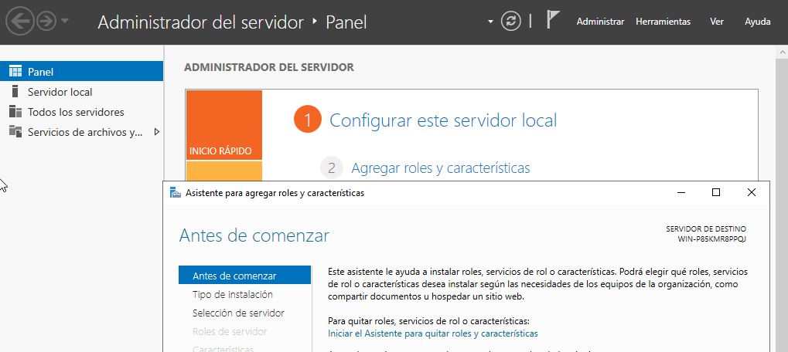
* Pulsa **Siguiente** varias veces hasta llegar a **Selección de roles de servidor**.

### Paso 3: Seleccionar el rol DHCP

* Marca la casilla **Servidor DHCP**.
* Acepta la instalación de las características adicionales si se solicitan.
* Haz clic en **Siguiente** → **Instalar**.
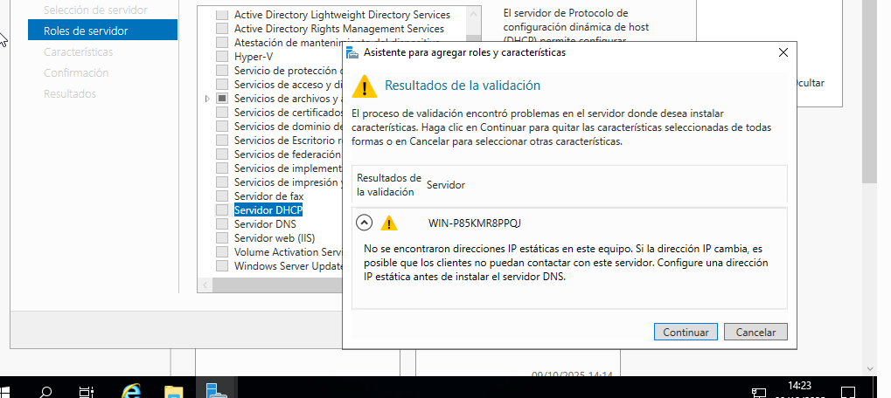

### Paso 4: Completar la instalación

* Espera a que finalice el proceso.
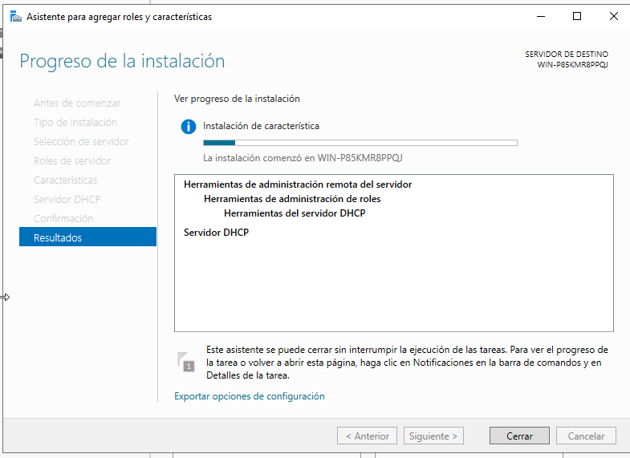
* **SI APARECE** la ventana de confirmación, selecciona **Completar configuración DHCP**.
* **SI APARECE** en la nueva ventana, haz clic en **Siguiente** hasta llegar a **Autorizar** → **Finalizar**.

> 💡 Si el servidor no forma parte de un dominio, la autorización se realiza localmente y no requiere Active Directory.

---

## 🌐 2. Cambiar a red interna y configurar IP fija

Una vez instalado el rol DHCP, ya no es necesaria la conexión a Internet.
Trabajaremos ahora dentro de una **red interna** donde el servidor actuará como **servidor DHCP** para los clientes del aula.

### 🧱 Paso 1: Cambiar el modo de red en VirtualBox

1. Apaga la máquina virtual.
2. Abre su configuración → **Red → Adaptador 1**.
3. Cambia la opción **Conectado a:** → **Red interna**.
4. En el campo **Nombre**, escribe: `aula` (u otro nombre común para todos los equipos del grupo).
5. Inicia de nuevo el servidor.

---

### 🧩 Paso 2: Configurar IP fija en el servidor

Antes de crear el ámbito DHCP, el servidor debe tener una **dirección IP fija**.
De lo contrario, si dependiera de otro DHCP, podría cambiar su dirección y los clientes no podrían encontrarlo.

> 🔹 **Motivo:** el servidor DHCP necesita una IP estable para que los clientes puedan comunicarse siempre con él.

#### 📘 Pasos para configurar IP fija

1. Abre el **Centro de redes y recursos compartidos**.
2. Haz clic en **Cambiar configuración del adaptador**.
3. Haz clic derecho sobre la tarjeta de red → **Propiedades**.
4. Selecciona **Protocolo de Internet versión 4 (TCP/IPv4)** → **Propiedades**.
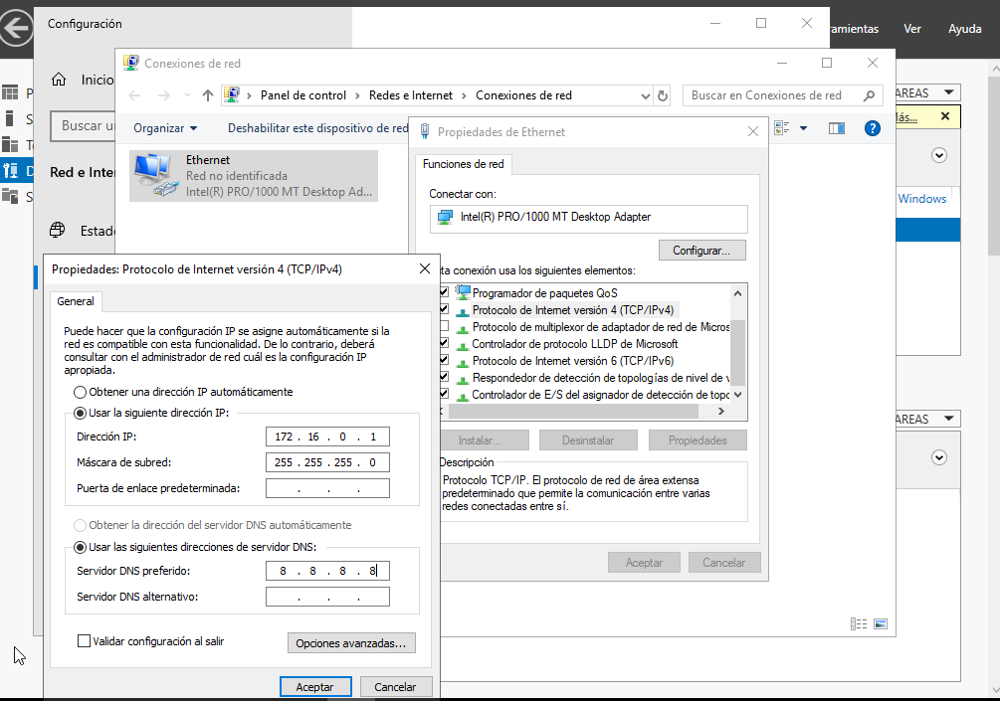
5. Marca **Usar la siguiente dirección IP** y escribe:

   * **Dirección IP:** 172.16.0.1
   * **Máscara de subred:** 255.255.255.0
   * **Puerta de enlace predeterminada:** *(dejar en blanco)*
   * **Servidor DNS preferido:** *(dejar en blanco o 127.0.0.1)*
6. Guarda los cambios.
7. Verifica con:

   ```powershell
   ipconfig
   ```

   que la IP asignada es **172.16.0.1**.

> ⚠️ En este punto no tendrás acceso a Internet, ya que la red interna no está conectada al exterior. Es lo esperado.

---

## 🧮 3. Configuración del servicio DHCP

### Paso 1: Abrir la consola DHCP

1. Desde el **Administrador del servidor**, abre la herramienta **DHCP**.
   (También puedes ejecutar `dhcpmgmt.msc` desde el menú Inicio.)
2. Expande el nombre del servidor y selecciona **IPv4**.

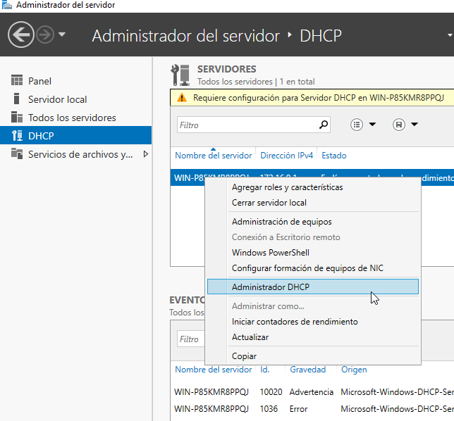

---

### Paso 2: Crear un nuevo ámbito (Scope)

1. Haz clic derecho sobre **IPv4** → **Nuevo ámbito**.
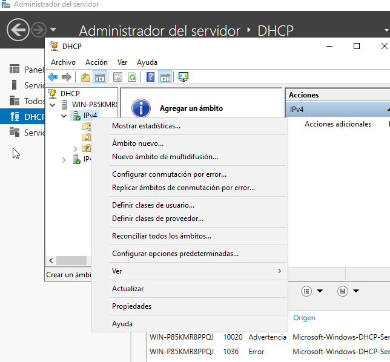
2. En el asistente, introduce los siguientes datos:

   * **Nombre del ámbito:** Red-Aula
   * **Descripción:** Asignación automática de IP a clientes del aula.
   * **Rango de direcciones IP:**

     * **Inicio:** 172.16.0.100
     * **Fin:** 172.16.0.200
   * **Máscara de subred:** 255.255.255.0
   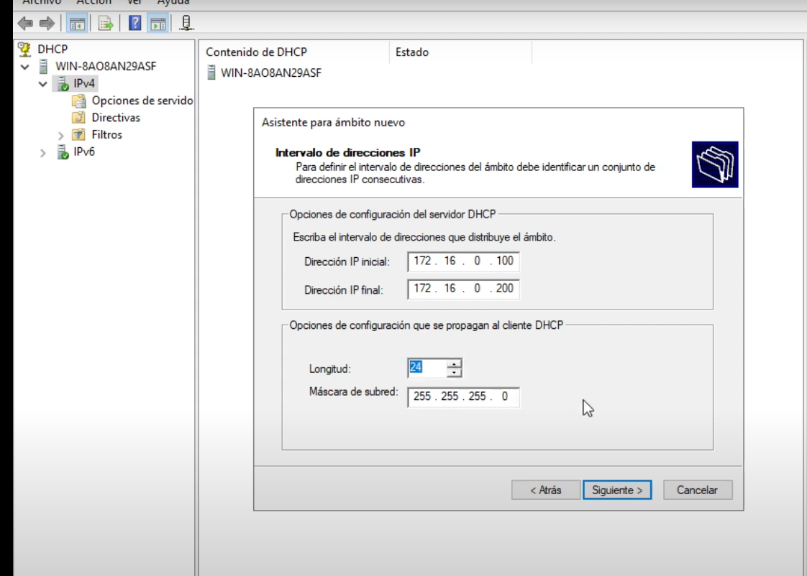
   * **Exclusiones:** opcional, por ejemplo 172.16.0.1–172.16.0.20 (reservadas para servidores).
   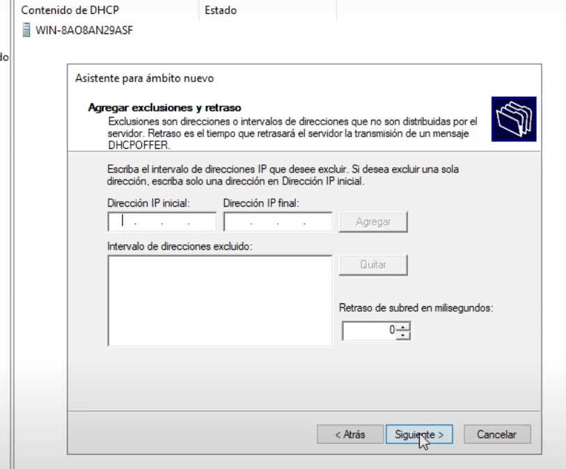
  
   * **Duración de la concesión:** 8 horas (valor por defecto adecuado para pruebas).
   - 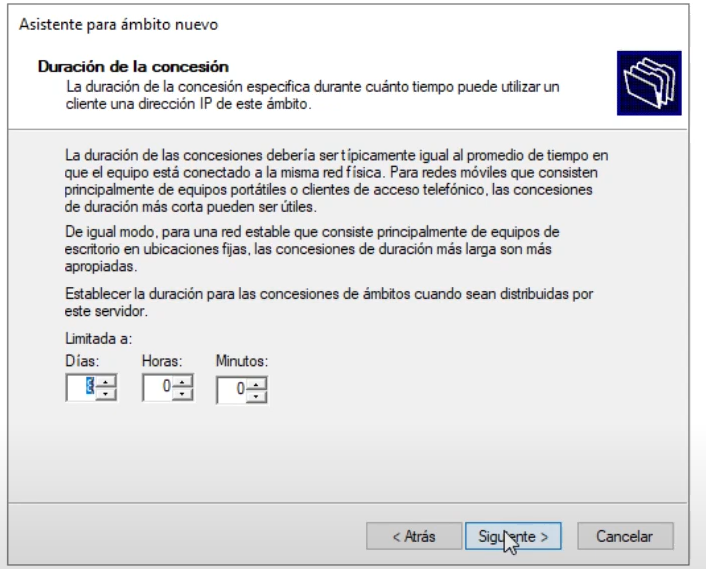

3. Pulsa **Siguiente** hasta completar el asistente.

---

### Paso 3: Configurar las opciones del ámbito

Selecciona **Sí, deseo configurar estas opciones ahora**.

1. **Puerta de enlace (Gateway):**

   * Dirección: 172.16.0.1
   * Pulsa **Agregar** → **Siguiente**.
   - 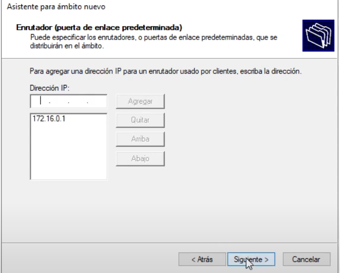

2. **Servidor DNS:**

   * Dirección preferida: 172.16.0.1 (para pruebas locales).
   * Si no hay DNS configurado, deja el campo vacío.
   * Pulsa **Agregar** → **Siguiente**.
   - 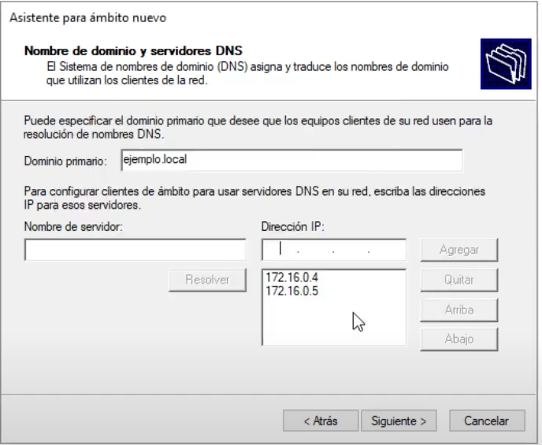

3. **WINS:** déjalo vacío → **Siguiente**.

4. Cuando se pregunte si deseas activar el ámbito, selecciona **Sí, activar este ámbito ahora** → **Finalizar**.

---

## ✅ 4. Verificación del funcionamiento

1. Comprueba en la consola DHCP que el ámbito aparece **activo** (icono verde).
2. Inicia un **cliente** (por ejemplo, una máquina virtual con Windows 10 o Linux) conectada también a la **misma red interna de VirtualBox**.
3. Configura la tarjeta del cliente para **obtener dirección IP automáticamente**.
4. En el cliente, abre la consola y ejecuta:

   ```bash
   ipconfig /all
   ```

   (Windows)
   o

   ```bash
   ip a
   ```

   (Linux)

   Verifica que recibe una IP dentro del rango **172.16.0.100–172.16.0.200**, con puerta de enlace **172.16.0.1**.

---

## 🧩 Resultado esperado

Al finalizar la práctica:

* El servidor DHCP asigna IP automáticamente a los clientes.
* Solo hay **una interfaz de red** y **un ámbito IPv4 activo**.
* No hay conexión a Internet, pero sí comunicación local entre el servidor y los clientes.

---

### Paso: Activar los Ámbitos

1. Después de configurar ambos ámbitos y reservas, es necesario activarlos.
2. En la consola DHCP, haz clic derecho sobre cada ámbito y selecciona **Activar**.
3. El servidor DHCP estará ahora listo para asignar direcciones IP a los dispositivos en las dos subredes configuradas.

### Paso: Desactivar las actualizaciones dinámicas del DNS
Click derecho - propiedades (pestaña DNS)
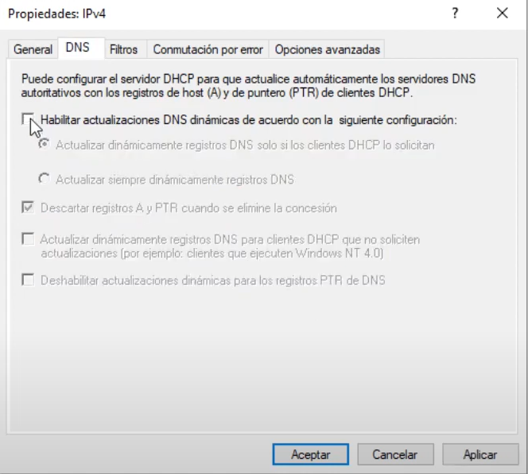


## 💡 Ampliaciones posibles

* Reservar IPs fijas para ciertos equipos (reservas).
  * Configurar Reservas

1. Haz clic derecho en **Reservas** bajo el ámbito correspondiente y selecciona **Nueva Reserva**.

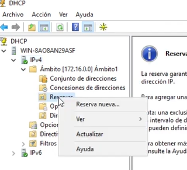
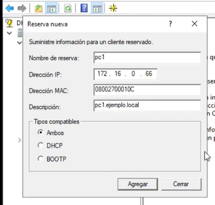

* Añadir una segunda interfaz de red y un segundo ámbito (modo avanzado).
* Repetir la instalación mediante PowerShell (modo avanzado).

---

