# 🧩 TA0209 – Instalación básica de DHCP en Windows Server 2019

**Índice de la práctica**

- [0. Preparación del entorno en VirtualBox](#paso-0)
- [1. Instalación del rol DHCP](#paso-1)
- [2. Cambiar a red interna y configurar IP fija](#paso-2)
- [3. Configuración del servicio DHCP](#paso-3)
- [4. Verificación del funcionamiento](#paso-4)
- [5. Comprobar la concesión y las opciones](#paso-5)
- [6. Reserva para el cliente](#paso-6)
- [7. Reconfiguración y APIPA](#paso-7)
- [Evidencias de la práctica](#evidencias)
- [Si el cliente no recibe la IP esperada](#diagnostico)

En esta práctica aprenderás a **instalar y configurar el servicio DHCP (Dynamic Host Configuration Protocol)** en **Windows Server 2019** utilizando el **Administrador del servidor**.
El objetivo es que el servidor asigne direcciones IP automáticamente a los equipos clientes dentro de una **red local interna**.

---

<a id="paso-0"></a>

## ⚙️ 0. Preparación del entorno en VirtualBox

Utiliza los clones de trabajo preparados en UT01B. Para descargar componentes, si fueran necesarios, usa NAT. Después trabajarás con un único adaptador conectado a una red interna. Desactiva los adaptadores adicionales durante la prueba DHCP. Las capturas antiguas sirven para localizar ventanas: utiliza los valores del texto actualizado.

### 🪄 Paso 1: Activar conexión a Internet

1. Apaga la máquina virtual (si está encendida).
2. Abre la **configuración** de la máquina virtual en VirtualBox.
3. En el menú **Red → Adaptador 1**, selecciona:

   * **Conectado a:** NAT

4. Inicia la máquina virtual.
5. Comprueba que tiene acceso a Internet (abre el navegador o ejecuta en PowerShell:

   ```powershell
   ping 8.8.8.8
   ```

   )

> 💡 En modo NAT, la máquina obtiene configuración del DHCP de VirtualBox. Esta conexión solo se usa para preparar el equipo.

---

<a id="paso-1"></a>

## 🧰 1. Instalación del rol DHCP

Realizaremos la instalación del rol **mientras el servidor tiene conexión a Internet** (modo NAT).

### Paso 1: Abrir el Administrador del servidor

* Ve al **Menú Inicio** → **Administrador del servidor**.

### Paso 2: Iniciar el asistente de roles

* En la esquina superior derecha, haz clic en **Administrar** → **Agregar roles y características**.
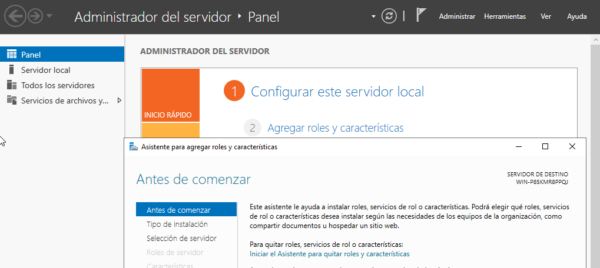
* Pulsa **Siguiente** varias veces hasta llegar a **Selección de roles de servidor**.

### Paso 3: Seleccionar el rol DHCP

* Marca la casilla **Servidor DHCP**.
* Acepta la instalación de las características adicionales si se solicitan.
* Haz clic en **Siguiente** → **Instalar**.
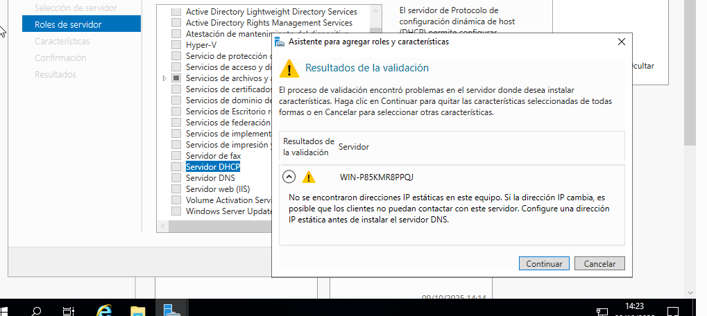

### Paso 4: Completar la instalación

* Espera a que finalice el proceso.
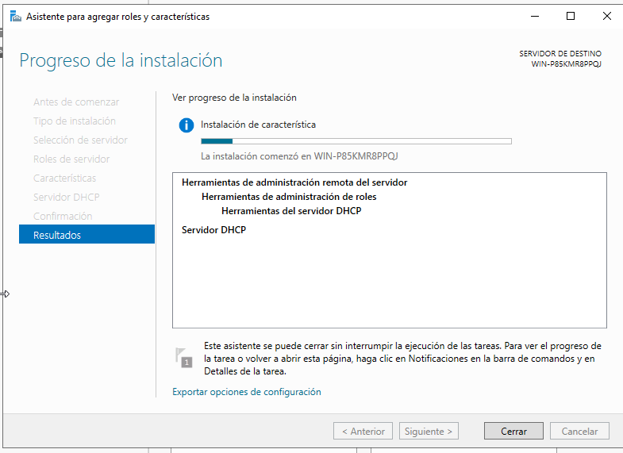
* **SI APARECE** la ventana de confirmación, selecciona **Completar configuración DHCP**.
* Completa el asistente. Si el servidor está en un grupo de trabajo, omite la autorización en Active Directory cuando se ofrezca esa opción. Si pertenece a un dominio, la autorización requiere una cuenta con permisos.

> 💡 La autorización en Active Directory solo corresponde a servidores integrados en un dominio. No necesitas crear un dominio para este laboratorio.

---

<a id="paso-2"></a>

## 🌐 2. Cambiar a red interna y configurar IP fija

Una vez instalado el rol DHCP, ya no es necesaria la conexión a Internet.
Trabajaremos ahora dentro de una **red interna** donde el servidor actuará como **servidor DHCP** para los clientes del aula.

### 🧱 Paso 1: Cambiar el modo de red en VirtualBox

1. Apaga la máquina virtual.
2. Abre su configuración → **Red → Adaptador 1**.
3. Cambia la opción **Conectado a:** → **Red interna**.
4. En el campo **Nombre**, escribe: `aula` (exactamente el mismo nombre en servidor y cliente del mismo ordenador anfitrión).
5. Inicia de nuevo el servidor.

---

### 🧩 Paso 2: Configurar IP fija en el servidor

Antes de crear el ámbito DHCP, el servidor debe tener una **dirección IP fija**.
De lo contrario, si dependiera de otro DHCP, podría cambiar su dirección y los clientes no podrían encontrarlo.

> 🔹 **Motivo:** el servidor DHCP necesita una IP estable para que los clientes puedan comunicarse siempre con él.

#### 📘 Pasos para configurar IP fija

1. Abre el **Centro de redes y recursos compartidos**.
2. Haz clic en **Cambiar configuración del adaptador**.
3. Haz clic derecho sobre la tarjeta de red → **Propiedades**.
4. Selecciona **Protocolo de Internet versión 4 (TCP/IPv4)** → **Propiedades**.
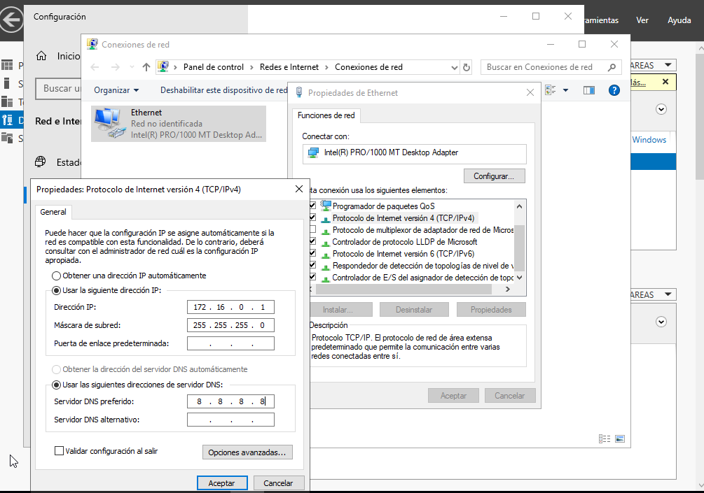
5. Marca **Usar la siguiente dirección IP** y escribe:

   * **Dirección IP:** 172.16.0.1
   * **Máscara de subred:** 255.255.255.0
   * **Puerta de enlace predeterminada:** *(dejar en blanco)*
   * **Servidor DNS preferido:** *(dejar en blanco; no hay un DNS instalado)*
6. Guarda los cambios.
7. Verifica con:

   ```powershell
   ipconfig
   ```

   que la IP asignada es **172.16.0.1**.

> ⚠️ En este punto no tendrás acceso a Internet, ya que la red interna no está conectada al exterior. Es lo esperado.

---

<a id="paso-3"></a>

## 🧮 3. Configuración del servicio DHCP

### Paso 1: Abrir la consola DHCP

1. Desde el **Administrador del servidor**, abre la herramienta **DHCP**.
   (También puedes ejecutar `dhcpmgmt.msc` desde el menú Inicio.)
2. Expande el nombre del servidor y selecciona **IPv4**.

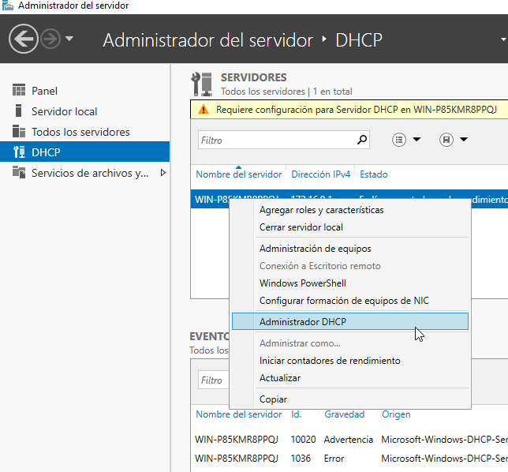

---

### Paso 2: Crear un nuevo ámbito (Scope)

1. Haz clic derecho sobre **IPv4** → **Nuevo ámbito**.
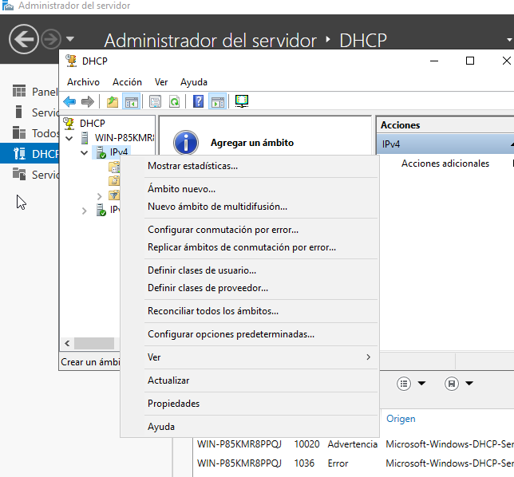
2. En el asistente, introduce los siguientes datos:

   * **Nombre del ámbito:** Red-Aula
   * **Descripción:** Asignación automática de IP a clientes del aula.
   * **Rango de direcciones IP:**

     * **Inicio:** 172.16.0.100
     * **Fin:** 172.16.0.200
   * **Máscara de subred:** 255.255.255.0
   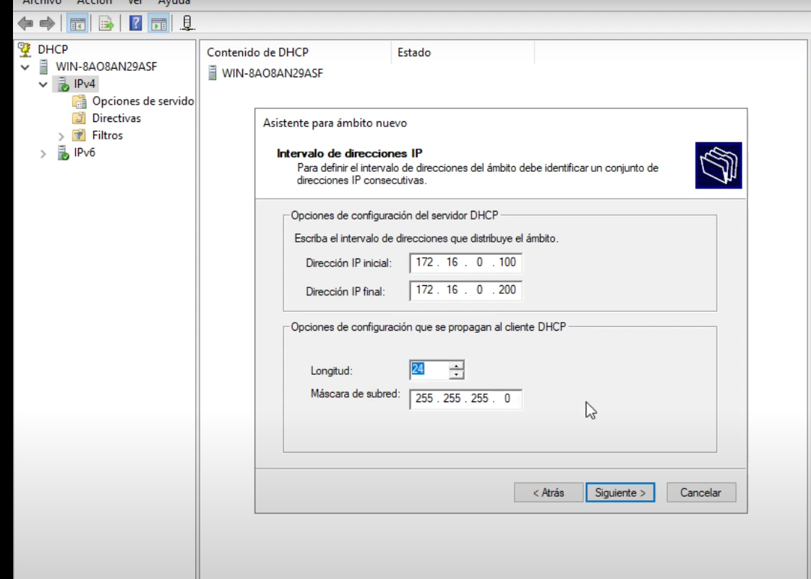
   * **Exclusiones:** 172.16.0.150–172.16.0.159. Están dentro del rango y no se ofrecerán a clientes. La IP fija del servidor (.1) ya queda fuera del rango.
   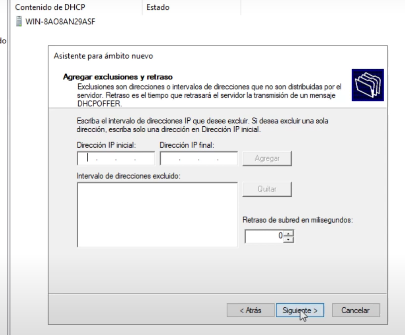
  
   * **Duración de la concesión:** 8 horas (valor elegido para esta práctica; introdúcelo expresamente).
   - 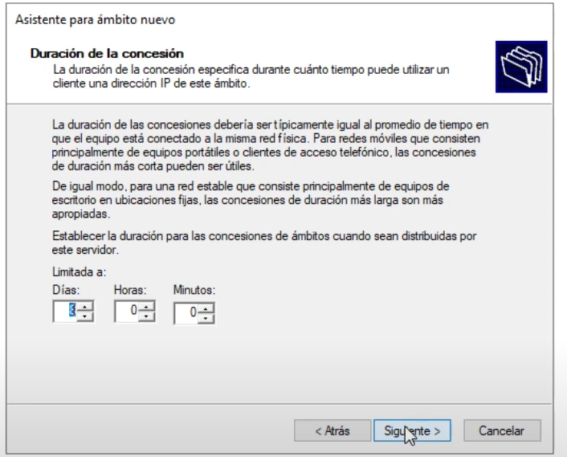

3. Pulsa **Siguiente** hasta completar el asistente.

---

### Paso 3: Configurar las opciones del ámbito

Selecciona **Sí, deseo configurar estas opciones ahora**.

1. **Puerta de enlace:** deja la lista vacía. Este servidor no es un router.
2. **DNS y WINS:** deja las direcciones vacías. No hay esos servicios en el laboratorio.
3. Activa el ámbito al terminar el asistente.
4. En **Opciones de ámbito → Configurar opciones**, marca **015 Nombre de dominio DNS** y escribe `ut02.test`. Es un sufijo que el cliente recibirá por DHCP; no crea un servidor DNS ni un dominio de Active Directory.

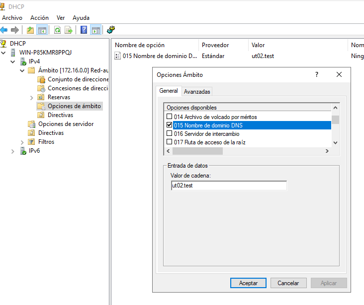

---

<a id="paso-4"></a>

## ✅ 4. Verificación del funcionamiento

1. Comprueba en la consola DHCP que el ámbito aparece **activo** (icono verde).
   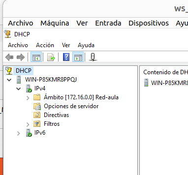
2. Inicia un **cliente** (por ejemplo, una máquina virtual con Windows 10 o Linux) conectada también a la **misma red interna de VirtualBox**.
3. Configura la tarjeta del cliente para **obtener dirección IP automáticamente**.
4. En el cliente, abre la consola y ejecuta:

   ```bash
   ipconfig /all
   ```

   (Windows)
   o

   ```bash
   ip a
   ```

   (Linux)

   Verifica que recibe una IP dentro del rango **172.16.0.100–172.16.0.200**, fuera de la exclusión **.150–.159**, sin puerta de enlace.

---

<a id="paso-5"></a>

## 5. Comprobar la concesión y las opciones

En **Concesiones de direcciones**, busca el cliente.

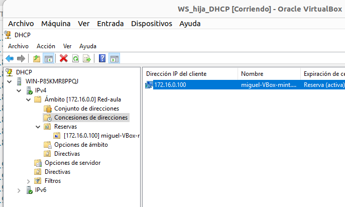

Relaciona IP, nombre y MAC/identificador con `ipconfig /all` del cliente Windows. Deben aparecer DHCP habilitado, servidor DHCP **172.16.0.1** y sufijo de conexión **ut02.test**. Un cliente Windows Server puede actuar como cliente: no necesita otro rol.

En Ubuntu Desktop puedes usar `hostname`, `ip -br link`, `ip -4 address` y `nmcli device show`. Busca también las opciones DHCP y el identificador del servidor. Mostrar solo `ip a` no prueba quién asignó la dirección.

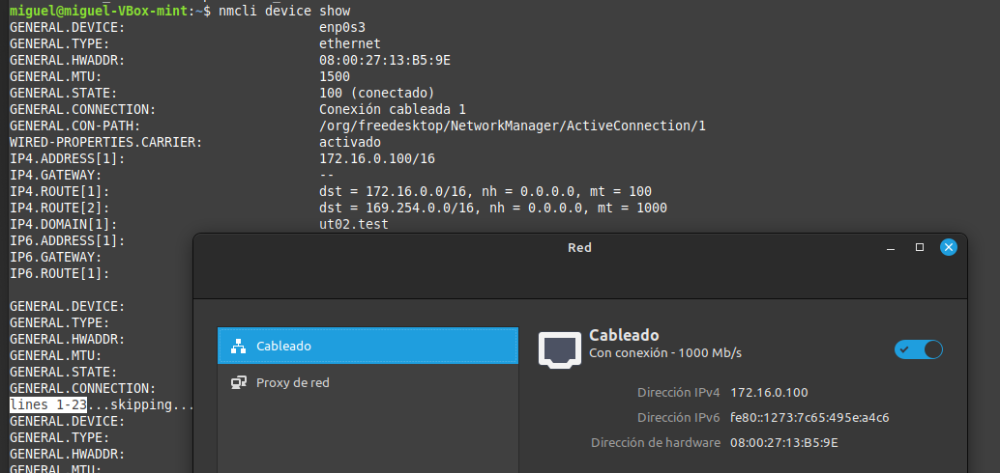

<a id="paso-6"></a>

## 6. Reserva para el cliente

1. Anota la MAC de la interfaz conectada a `aula`.
2. En **Reservas → Nueva reserva**, introduce nombre del cliente, **172.16.0.200** y su MAC real. No copies la MAC de una captura.
3. En el cliente Windows ejecuta `ipconfig /release` y después `ipconfig /renew`.
4. Comprueba que el cliente recibe **172.16.0.200** y que el servidor muestra la reserva en uso en las concesiones. El cliente sigue configurado en automático.

<a id="paso-7"></a>

## 7. Reconfiguración y APIPA

**Cambio de subred:** guarda primero las evidencias. Para practicar /25, elimina el ámbito de laboratorio y créalo de nuevo para **172.16.0.0/25**; cambia también la máscara del servidor a **255.255.255.128**. Usa rango **.10–.126**, exclusión **.50–.59** y reserva **.126** para el cliente. Renueva y comprueba la nueva máscara e IP. La máscara de un ámbito existente no se cambia simplemente editando el rango.

**APIPA:** conecta el cliente Windows a otra red interna llamada `apipa`, sin servidor DHCP y con el cable virtual conectado. Mantén la configuración automática, libera y renueva; espera la autoconfiguración. Puede aparecer un error de contacto con DHCP. Comprueba en `ipconfig /all` una dirección de autoconfiguración **169.254.x.x/16**. No la escribas manualmente. Devuelve después el cliente a `aula` y renueva.

<a id="evidencias"></a>

## Evidencias de la práctica

Conserva cuatro evidencias legibles:
* RF 1: rango y exclusión iniciales; 
* RF 2: concesión y opción recibida;
* RF 3: reserva en uso junto al cliente;
* RF 5: APIPA.

Añade una frase que explique qué demuestra cada una. En las capturas deben verse los nombres de las máquinas virtuales. Guarda la configuración final /25 como ensayo de reconfiguración.

<a id="diagnostico"></a>

## Si el cliente no recibe la IP esperada

Revisa, por este orden: misma red interna y cable conectado, MAC de la interfaz, IP/máscara del servidor, servicio y ámbito activos, direcciones disponibles, reserva y renovación. Mantén un único servidor DHCP activo en esa red. Para la práctica Linux, detén el servicio DHCP de Windows.

Referencia: [ámbitos DHCP de Windows](https://learn.microsoft.com/en-us/windows-server/networking/technologies/dhcp/dhcp-scopes).
