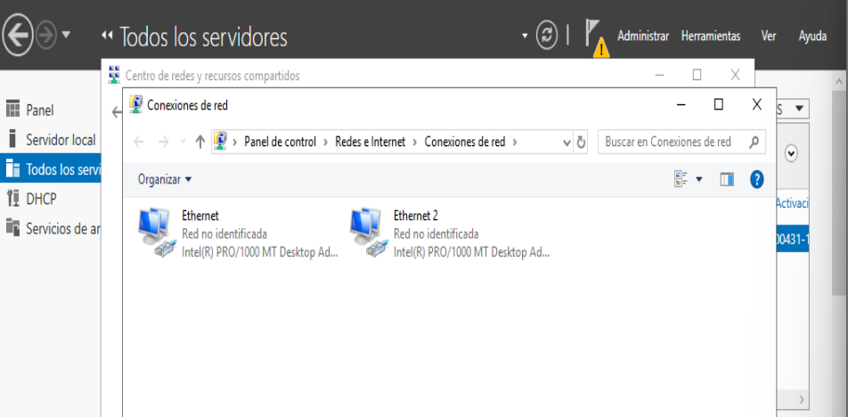
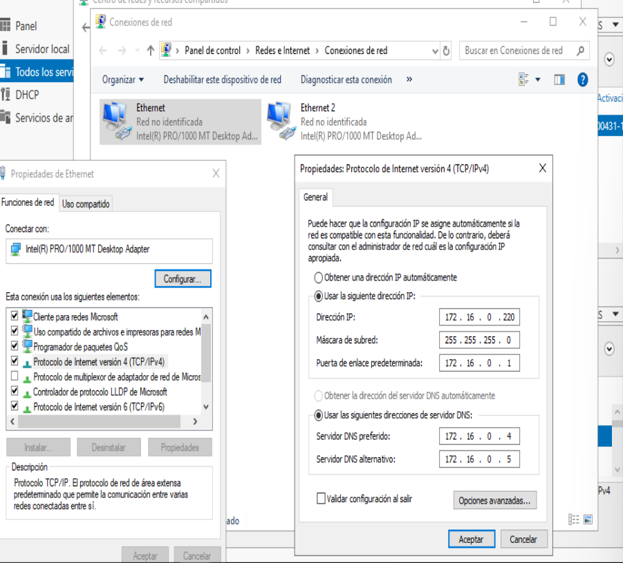

Para asignar dos direcciones IP estáticas a las interfaces de red en un servidor con Windows Server 2019, debes seguir estos pasos. Cada interfaz de red recibirá una dirección IP estática diferente, basándonos en las dos subredes mencionadas en la tabla: 172.16.0.220/24 y 172.16.1.220/24.

### Pasos para asignar direcciones IP estáticas a las interfaces de red:

Usar el Administrador de conexiones de red

1. **Abrir las Conexiones de Red**:
   - Ve al **Menú Inicio, Panel de control, Tareas de red, Configuración del adaptador: Conexiones de red**, donde verás las interfaces de red disponibles.



2. **Seleccionar la primera interfaz de red**:
   - Identifica la interfaz que deseas configurar con la dirección **172.16.0.220**. Normalmente, las interfaces están nombradas como "Ethernet 1", "Ethernet 2", etc. Puedes hacer clic derecho sobre la interfaz y seleccionar **Propiedades** para ver detalles y confirmar que es la correcta.

3. **Configurar la IP estática en la primera interfaz**:
   - Haz clic derecho sobre la primera interfaz de red y selecciona **Propiedades**.
   - En la lista de opciones, selecciona **Protocolo de Internet versión 4 (TCP/IPv4)** y luego haz clic en **Propiedades**.
   - Selecciona la opción **Usar la siguiente dirección IP** y luego introduce la siguiente configuración:
     - **Dirección IP**: 172.16.0.220
     - **Máscara de subred**: 255.255.255.0
     - **Puerta de enlace predeterminada**: 172.16.0.1
   - En **Servidores DNS preferidos**, introduce los DNS configurados, por ejemplo:
     - **DNS principal**: 172.16.0.4
     - **DNS alternativo**: 172.16.0.5
   - Haz clic en **Aceptar** para guardar los cambios.
   - 


4. **Seleccionar la segunda interfaz de red**:
   - Repite el mismo proceso, pero esta vez selecciona la segunda interfaz de red, que configuraremos con la dirección IP de la segunda subred (172.16.1.220).

5. **Configurar la IP estática en la segunda interfaz**:
   - Haz clic derecho sobre la segunda interfaz de red y selecciona **Propiedades**.
   - Selecciona **Protocolo de Internet versión 4 (TCP/IPv4)** y luego **Propiedades**.
   - Configura los siguientes valores:
     - **Dirección IP**: 172.16.1.220
     - **Máscara de subred**: 255.255.255.0
     - **Puerta de enlace predeterminada**: 172.16.1.1
   - En los **Servidores DNS**, puedes utilizar los mismos valores DNS que para la primera interfaz:
     - **DNS principal**: 172.16.0.4
     - **DNS alternativo**: 172.16.0.5
   - Haz clic en **Aceptar** para guardar los cambios.

6. **Verificar la configuración**:
   - Después de configurar las dos interfaces de red, puedes verificar que las IPs están correctamente asignadas abriendo **Símbolo del sistema** y ejecutando el comando:
     ```bash
     ipconfig /all
     ```
   - Esto mostrará el estado de cada interfaz y las IPs asignadas.
   - 

