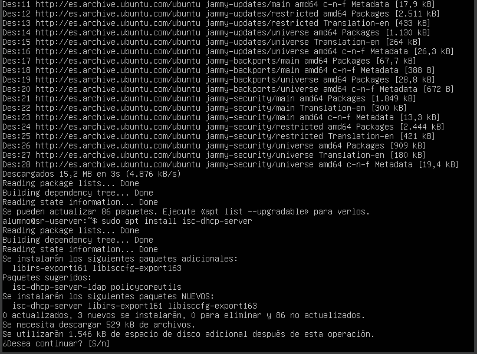
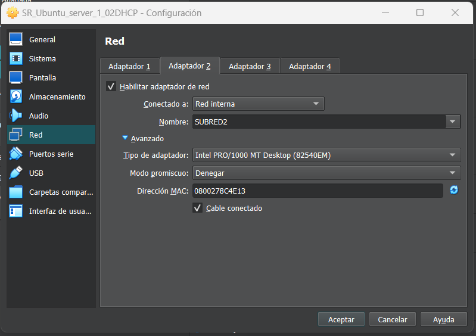
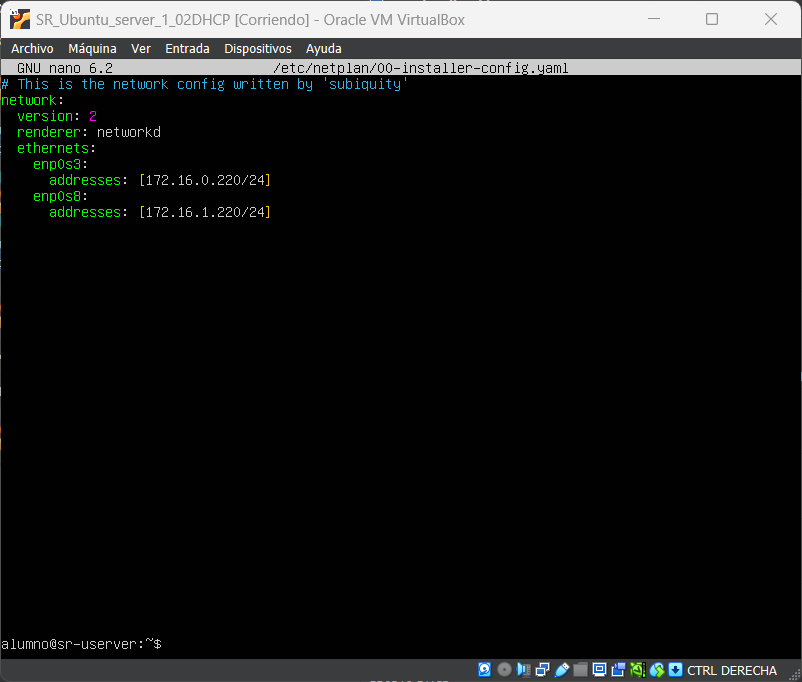
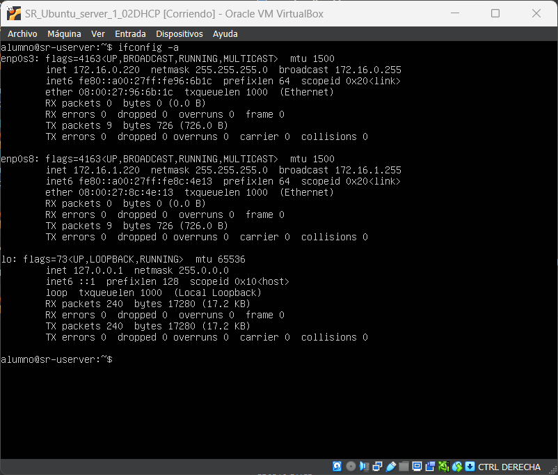
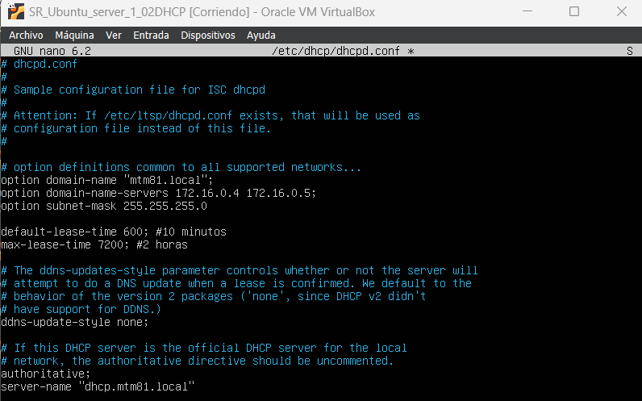
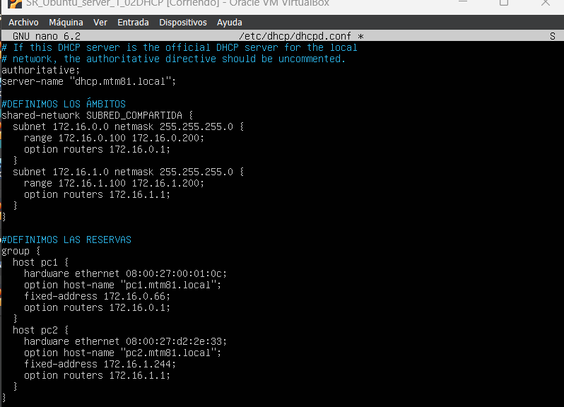
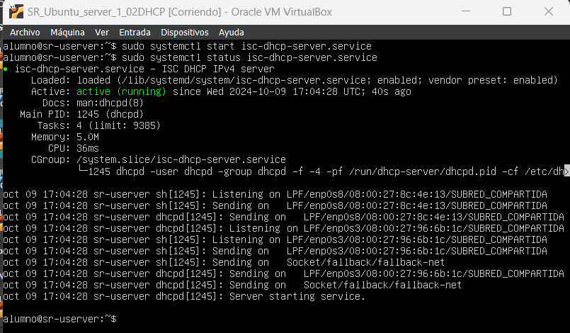
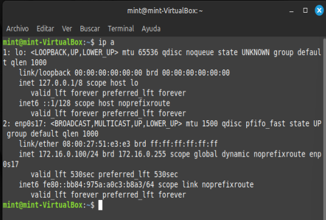
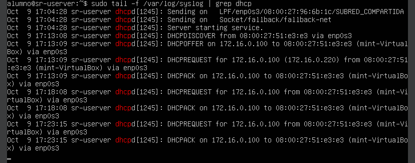
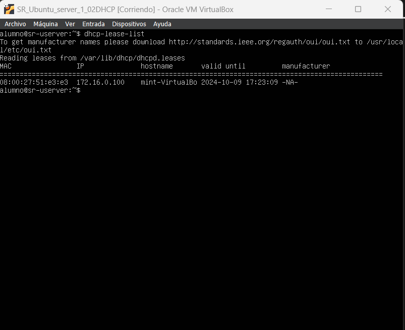

Este ejercicio puede realizarse utilizando una máquina virtual o un entorno de laboratorio con acceso a un servidor DHCP y varios dispositivos cliente (pueden ser PCs, portátiles o máquinas virtuales).

### Objetivos del ejercicio:
1. Comprender el proceso de asignación dinámica de direcciones IP a través de DHCP.
2. Configurar un servidor DHCP básico.
3. Observar cómo un cliente obtiene su configuración de red utilizando DHCP.
4. Entender el concepto de tiempo de arrendamiento y renovación.

#### Material necesario:
- 1 Servidor Linux (puede ser una máquina virtual) para actuar como servidor DHCP.
- 1 o 2 dispositivos cliente (pueden ser PCs o máquinas virtuales con sistemas operativos como Windows o Linux).
- Una red local (puede ser una red virtual o física).

---

### Paso 1: Configuración del servidor DHCP

En este ejercicio, tus alumnos configurarán un servidor DHCP en una máquina Linux (por ejemplo, una máquina con Ubuntu Server).

1. **Instalar el servidor DHCP:**

   En la máquina que actuará como servidor, tus alumnos deben instalar el servidor DHCP. En Ubuntu Server, por ejemplo, pueden ejecutar:

   ```bash
   sudo apt update
   sudo apt install isc-dhcp-server
   poweroff
   ```

   

   Apagamos el equipo para poder modificar la configuración física en vBox.

   1.1 **Configurar las interfaces de red físicamente (vBox)**

   En virtual box, configuramos dos adaptadores de red, **en modo red interna**, uno en la red llamada *subred1* y otro en la llamada *subred2*.

   

   1.2 **Configurar la red logicamente (linux)**

   Con ips fijas:

   En linux, editamos el archivo de configuración `/etc/netplan/00-installer-config.yaml`:

   

   Comprobamos la configuración con `sudo netplan apply` y `ifconfig -a`:

   


2. **Configurar el archivo de configuración del DHCP:**

   El archivo de configuración del servidor DHCP se encuentra en `/etc/dhcp/dhcpd.conf`. Los alumnos deben editarlo para definir un rango de direcciones IP que el servidor DHCP asignará a los clientes.

   Ejemplo de configuración mínima sin ámbitos: (se recomienda guardar una copia con `cp`)

   ```bash
   subnet 192.168.1.0 netmask 255.255.255.0 {
       range 192.168.1.10 192.168.1.50;
       option routers 192.168.1.1;
       option domain-name-servers 8.8.8.8, 8.8.4.4;
       default-lease-time 600;
       max-lease-time 7200;
   }
   ```

   **Explicación:**
   - **subnet** define la red que se está utilizando (en este caso, 192.168.1.0/24).
   - **range** define el rango de direcciones IP que el servidor DHCP asignará a los clientes (desde 192.168.1.10 hasta 192.168.1.50).
   - **option routers** especifica la dirección IP de la puerta de enlace predeterminada (gateway).
   - **option domain-name-servers** establece los servidores **DNS** que se proporcionarán a los clientes.
   - **default-lease-time** y **max-lease-time** definen el tiempo de arrendamiento de la IP (en segundos).
  
  **Para nuestro ejemplo:**

  
   
   

3. **Iniciar el servicio DHCP:**

   Una vez que hayan configurado el archivo, deben iniciar el servidor DHCP.

   ```bash
   sudo systemctl start isc-dhcp-server
   sudo systemctl enable isc-dhcp-server  # Para que se inicie automáticamente en cada arranque
   ```

   También pueden verificar el estado del servidor con:

   ```bash
   sudo systemctl status isc-dhcp-server
   ```
   

   **En caso de error:**

   `sudo dhcpd -t -cd /etc/dhcp/dhcpd.conf`
   
   revisa el archivo de configuración
   
   o
   
   `cat /var/log/syslog | grep dhcpd`

   revisa las anotaciones en el log del sistema.

   Nos dará una explicación del error y la línea del archivo de configuración en la que se encuentra éste.

   Errores comunes:
      - mala tabulación -> utiliza 2 espacios `__`
      - no poner `;` al final de las líneas que lo necesitan

   [Editar archivos de configuración en linux: consejos](../UT00_editar_conf.md)

   [Solucionar errores DHCP](../UT02_DHCP/SR02TA10_errorres.md)
---

### Paso 2: Configuración de los clientes

En este paso, los alumnos configurarán los dispositivos cliente (pueden ser PCs o máquinas virtuales) para que utilicen DHCP.

1. **Configurar un cliente Linux:**

   En un sistema Linux, deben asegurarse de que la interfaz de red esté configurada para obtener una IP automáticamente con DHCP. Si están usando Ubuntu o Debian, pueden editar el archivo `/etc/network/interfaces` o usar `netplan`.

   Ejemplo para `netplan` (Ubuntu 18.04 en adelante):

   ```yaml
   network:
     version: 2
     ethernets:
       enp0s3:
         dhcp4: true
   ```

   Luego aplicar la configuración:

   ```bash
   sudo netplan apply
   ```

2. **Configurar un cliente Windows:**

   En Windows, deben ir al **Panel de Control > Centro de redes y recursos compartidos > Cambiar configuración del adaptador**. Luego deben hacer clic derecho sobre la interfaz de red, seleccionar **Propiedades**, y habilitar la opción **Obtener una dirección IP automáticamente**.

---

### Paso 3: Verificación del proceso DHCP

Una vez configurado el servidor y los clientes, los alumnos pueden verificar el proceso de obtención de una IP por parte de los clientes y ver los mensajes que intercambian con el servidor.

0. **Configuración física (vBox)**
   - Configurar el adaptador de red en modo red interna, en la misma red en la que está trabajando el servidor dhcp.

1. **En el cliente:**
   - En Linux, pueden usar `ip a` para ver si la interfaz de red ha obtenido una dirección IP. También pueden usar `dhclient -v` para observar el proceso de solicitud de IP.
  
      

   - En Windows, pueden usar `ipconfig` para ver la dirección IP asignada. También pueden usar `ipconfig /renew` para forzar la renovación de la IP.

2. **En el servidor:**
   - Pueden revisar los logs del servidor DHCP en `/var/log/syslog` o `/var/log/dhcpd.log` para observar las solicitudes y asignaciones de IP en tiempo real.
   
   Comando para ver los logs en tiempo real:

   ```bash
   sudo tail -f /var/log/syslog | grep dhcp
   ```
       En la imagen observamos cómo, al conectarse por primera vez, el cliente comienza el intercambio de mensajes con DHCPDISCOVER.
   Sin embargo, al reiniciar el cliente, como la concesión sigue activa, el cliente envía un DHCPREQUEST y el servidor responde con un DHCPACK.

   - Pueden comprobar la lista de ips prestadas con:
   ```bash
   dhcp-lease-list
   ```
      

---

### Paso 4: Experimentación con la renovación del arrendamiento

Para que los alumnos comprendan cómo funciona la renovación de la IP, pueden reducir el tiempo de arrendamiento en el servidor y observar cómo los clientes intentan renovar sus IPs antes de que expire el lease.

1. **Modificar el tiempo de arrendamiento en el servidor:**

   Cambia el **default-lease-time** en `/etc/dhcp/dhcpd.conf` a un valor más bajo, por ejemplo, 60 segundos.

   ```bash
   default-lease-time 60;
   ```

   Reinicia el servidor para aplicar los cambios:

   ```bash
   sudo systemctl restart isc-dhcp-server
   ```

2. **Observar el comportamiento en los clientes:**
   Los alumnos pueden observar cómo, antes de que pasen los 60 segundos, el cliente envía una solicitud de renovación de IP al servidor.

---

### Conclusión y reflexión:

Al final del ejercicio, los alumnos deben ser capaces de:
- Entender cómo funciona el protocolo DHCP y qué mensajes intercambian cliente y servidor.
- Configurar un servidor DHCP básico y observar el proceso de asignación y renovación de IP.
- Reflexionar sobre la importancia del tiempo de arrendamiento y cómo afecta a la gestión de direcciones IP en una red.

## Resumen de archivos de configuración y comandos:

1. **/etc/netplan/00-installer-config.yaml**  
   - Configuración de red, IP estática

2. **/etc/dhcp/dhcpd.conf**  
   - Rango IP, Configuración DHCP

3. **/etc/network/interfaces** (en algunos casos de clientes Linux)  
   - Configuración DHCP, Cliente de red

4. **/var/log/syslog**  
   - Registros, Diagnóstico DHCP

### Comandos de Linux:
1. **sudo apt update && sudo apt install isc-dhcp-server**  
   - Actualización, Instalación DHCP

2. **sudo netplan apply**  
   - Aplicar configuración, Red

3. **ifconfig -a** o **ip a**  
   - Información red, Estado interfaces

4. **sudo systemctl start isc-dhcp-server**  
   - Iniciar servicio, DHCP

5. **sudo systemctl enable isc-dhcp-server**  
   - Inicio automático, DHCP

6. **sudo systemctl status isc-dhcp-server**  
   - Estado servicio, DHCP

7. **cat /var/log/syslog | grep dhcpd**  
   - Diagnóstico, Filtrar registros

8. **dhclient -v**  
   - Solicitud IP, Cliente DHCP

9. **sudo tail -f /var/log/syslog | grep dhcp**  
   - Monitoreo en tiempo real, DHCP

10. **sudo systemctl restart isc-dhcp-server**  
    - Reiniciar servicio, DHCP

11. **dhcp-lease-list**  
    - Lista IP, Concesiones activas

