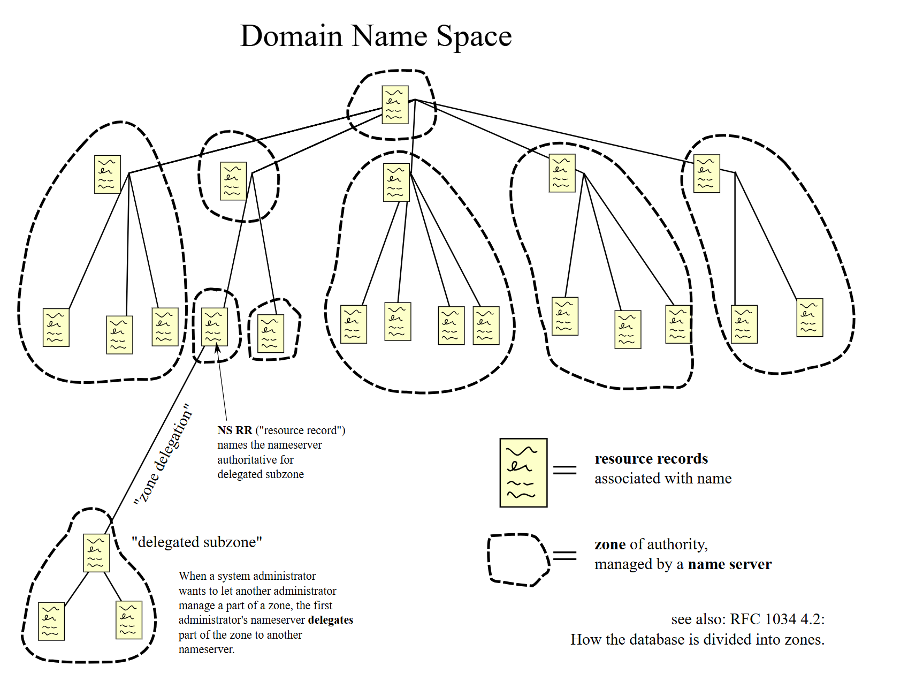

[DNS inicio](./SR03.md)

### **3. Sistemas de Nombres Jerárquicos**

A diferencia de los sistemas de nombres planos, los **sistemas de nombres jerárquicos** organizan los nombres de los dispositivos y recursos de manera estructurada, formando una jerarquía. Esta estructura facilita la gestión de nombres en redes de gran tamaño y ofrece una mayor flexibilidad y escalabilidad. El principal sistema de nombres jerárquico utilizado en Internet y en la mayoría de redes privadas es el **DNS (Domain Name System)**.

 [Public Domain](https://commons.wikimedia.org/w/index.php?curid=387678)

#### Características de los Sistemas de Nombres Jerárquicos:

1. **Estructura jerárquica**: Los nombres en estos sistemas están organizados en varios niveles o jerarquías. Cada nivel representa un dominio o subdominio, formando una estructura de árbol invertido, en la que los nodos superiores son los más generales y los inferiores los más específicos.
   
2. **Escalabilidad**: La naturaleza jerárquica permite que los sistemas de nombres jerárquicos escalen eficientemente a medida que las redes crecen en tamaño. Los dominios pueden dividirse en subdominios gestionados por diferentes entidades, permitiendo una gestión distribuida.

3. **Delegación**: La estructura jerárquica permite delegar partes del espacio de nombres a diferentes entidades. Por ejemplo, un dominio de nivel superior (TLD) como `.com` puede delegar la gestión de subdominios como `google.com` a Google.

---

### **3.1. Introducción al Protocolo DNS**

El **Domain Name System (DNS)** es el sistema jerárquico más utilizado para la resolución de nombres en Internet. DNS permite traducir nombres de dominio en direcciones IP, facilitando el acceso a los recursos de red sin que los usuarios tengan que recordar las direcciones IP numéricas.

El protocolo DNS fue desarrollado en 1984 para resolver la creciente necesidad de un sistema eficiente que gestionara la enorme cantidad de nombres de dominio en Internet. Antes de la adopción de DNS, los sistemas utilizaban un archivo `hosts` centralizado para mapear nombres a direcciones IP, pero este método no escalaba bien.

##### 3.1.1. Funcionamiento Básico de DNS

DNS opera a través de una estructura jerárquica, donde cada nivel de la jerarquía está gestionado por una entidad diferente. Los servidores DNS contienen bases de datos que asocian nombres de dominio a direcciones IP y pueden reenviar consultas a otros servidores si no tienen la información solicitada.

Los servidores DNS pueden dividirse en varios tipos:
- **Servidores raíz**: Son los servidores más altos en la jerarquía DNS y gestionan las consultas iniciales sobre los dominios de nivel superior (TLD). Existen 13 servidores raíz distribuidos geográficamente y gestionados por diferentes organizaciones.
- **Servidores TLD (Top Level Domain)**: Estos servidores gestionan los dominios de nivel superior, como `.com`, `.org`, `.es`, etc.
- **Servidores autoritativos**: Estos son los servidores responsables de gestionar la resolución de nombres en un dominio específico, como `google.com`.

---

### **3.2. Funcionamiento Detallado del Protocolo DNS**

#### 3.2.2. Estructura Jerárquica de DNS

DNS utiliza una estructura jerárquica y distribuida. El sistema se organiza como un **árbol invertido**, donde:
- La **raíz** del árbol está representada por el carácter “.” (punto). Esta es gestionada por los **servidores raíz**.
- Justo debajo de la raíz se encuentran los **dominios de nivel superior (TLD)**, que incluyen:
  - **Dominios genéricos** (gTLD): como `.com`, `.org`, `.net`.
  - **Dominios geográficos** (ccTLD): como `.es` para España, `.uk` para Reino Unido.

Cada dominio puede tener múltiples **subdominios**, que se gestionan de manera independiente. Por ejemplo, `google.com` es un subdominio de `.com`, y `mail.google.com` es un subdominio de `google.com`.

 By <a href="//commons.wikimedia.org/w/index.php?title=User:Jane_Kruch&amp;action=edit&amp;redlink=1" class="new" title="User:Jane Kruch (page does not exist)">Jane Kruch</a> - Own work, <a href="https://creativecommons.org/licenses/by-sa/3.0" title="Creative Commons Attribution-Share Alike 3.0">CC BY-SA 3.0</a>, <a href="https://commons.wikimedia.org/w/index.php?curid=30106365">Link</a>

#### 3.2.3. Espacio de Nombres

El **espacio de nombres** en DNS es la estructura que define cómo los nombres de dominio se organizan en niveles. Cada nombre de dominio completo se denomina **FQDN (Fully Qualified Domain Name)**. Un FQDN incluye:
- **Nombre del host**: El nombre del dispositivo o servicio (por ejemplo, `www` en `www.google.com`).
- **Nombre de dominio**: El nombre del dominio que aloja el recurso (por ejemplo, `google.com`).
  
Un ejemplo de un FQDN sería `www.google.com.`. El punto final representa la raíz del árbol DNS, aunque en la práctica, a menudo se omite en las consultas normales.

#### 3.2.4. Zonas DNS y Transferencias [+](./SR0303+.md)

El espacio de nombres en DNS se divide en **zonas**, que son porciones del árbol DNS gestionadas por un servidor autoritativo. Una **zona** puede abarcar uno o varios subdominios.

La información de una zona se almacena en un servidor primario (maestro) y puede replicarse en uno o más servidores secundarios (esclavos) para redundancia y equilibrio de carga. Para mantener la coherencia entre los servidores primario y secundario, se utilizan **transferencias de zona**. Estas transferencias pueden ser:
- **Transferencia completa (AXFR)**: Copia todo el contenido de la zona.
- **Transferencia incremental (IXFR)**: Solo copia los cambios desde la última transferencia.

---
